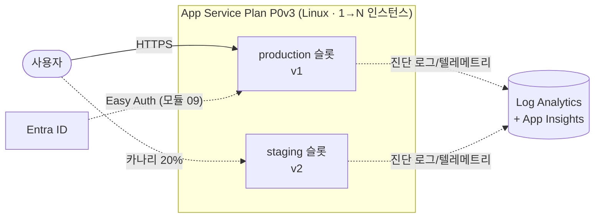

# Azure App Service 기본 핸즈온 워크숍

> Azure App Service의 핵심 라이프사이클을 **Cloud Shell + az CLI만으로** 체험하는 한국어 핸즈온 워크숍입니다(코어 약 2시간, 선택 모듈 포함 시 최대 약 2시간 30분 — 시간표는 리허설 후 확정). Python(Flask) 앱을 zip 배포(Oryx 빌드)로 올리고, 앱 설정 → 슬롯 스왑 → 카나리 → 오토스케일 → 관측 → Easy Auth까지 단계별로 실습합니다. 선택 모듈에서는 **사이드카 컨테이너**와 **Auto-heal & 진단**을 추가로 체험할 수 있습니다.

---

## 아키텍처

---

## 학습 목표

이 워크숍을 완료하면 다음을 할 수 있습니다.

1. App Service Plan과 Web App을 az CLI로 프로비저닝할 수 있다.
2. zip deploy + Oryx 빌드로 Python 앱을 배포하고 외부에서 접속할 수 있다.
3. 앱 설정(환경변수)을 추가·변경하고 재시작 동작을 이해할 수 있다.
4. 배포 슬롯을 생성하고 무중단 swap 및 롤백을 수행할 수 있다.
5. 슬롯 트래픽 분할로 카나리 배포를 정량 관찰할 수 있다.
6. Automatic scaling을 구성하고 부하에 따른 확장·축소를 확인할 수 있다.
7. 진단 설정을 통해 Log Analytics KQL 조회와 App Insights 텔레메트리를 활용할 수 있다.
8. Easy Auth(Entra ID)로 인증 게이트를 구성하고 `/.auth/me`로 클레임을 확인할 수 있다.
9. 사용한 리소스를 모두 정리하고 비용 발생을 종료할 수 있다.
10. (선택) sitecontainers API로 Redis 사이드카를 부착하고 `/cache` 동작을 확인할 수 있다.
11. (선택) Auto-heal 규칙을 구성하고 자동 재활용 이벤트를 로그에서 확인할 수 있다.

---

## 사전 요구사항

| 항목 | 설명 |
|------|------|
| Azure 구독 | 소유자 또는 기여자 역할 보유 |
| Cloud Shell | Azure Portal의 Bash Cloud Shell(별도 설치 불필요) — 영구 스토리지 마운트 권장 |
| 웹앱 기본 개념 | HTTP 요청·응답, 환경변수 개념 이해(컨테이너·Kubernetes 지식 불필요) |
| 비용 | 실습 완료 후 정리 모듈(12) 수행 권장(예상 비용: 아래 비용 개요 참조) |

> **💡 kubectl·Docker 불필요** — 모든 모듈은 표준 `az` CLI 명령만 사용합니다. 컨테이너나 Kubernetes 지식이 없어도 진행할 수 있습니다.

---

## 모듈 목차

**코어 모듈 (01–09, 12)** — 순서대로 진행하세요. 이전 모듈의 산출물(리소스 그룹·Plan·Web App·슬롯)을 다음 모듈이 사용합니다.

| # | 모듈 | 한 줄 설명 |
|---|------|------------|
| 00 | (현재 문서) | 워크숍 전체 개요·목표·시간표 |
| 01 | [사전 준비](docs/01-prerequisites.md) | Cloud Shell 영구 스토리지 마운트, az CLI 버전 확인, 리포지토리 클론 |
| 02 | [환경 준비](docs/02-environment-setup.md) | 리소스 그룹 → App Service Plan(P0v3) → Web App(Python) → LAW·App Insights 생성 |
| 03 | [코드 배포 & 외부 접속](docs/03-deploy-code.md) | zip deploy(Oryx 빌드) → 브라우저/curl 접속 확인 → 로그 스트리밍 |
| 04 | [앱 설정·환경변수](docs/04-app-settings.md) | 앱 설정 추가·변경으로 동작 전환, 설정 변경 = 재시작 체감 |
| 05 | [배포 슬롯 & 스왑](docs/05-deployment-slots-swap.md) | staging 슬롯 생성 → v2 배포 → 슬롯 URL 확인 → 무중단 swap → 롤백(재 swap) |
| 06 | [슬롯 트래픽 분할 카나리](docs/06-traffic-split-canary.md) | staging 20% 라우팅 → curl 100회 반복 정량 관찰 → 100% 승격 |
| 07 | [오토스케일](docs/07-autoscale.md) | Automatic scaling 구성 → `hey` 부하 → 확장 관찰 → 부하 제거 후 축소 관찰 |
| 08 | [관측](docs/08-observability.md) | 진단 설정 → LAW KQL 조회, App Insights 커넥션 스트링 주입 → 요청 텔레메트리 |
| 09 | [인증 (Easy Auth)](docs/09-easy-auth.md) | Entra 앱 등록 → `az webapp auth` 구성 → 로그인 게이트 → `/.auth/me` |
| 12 | [정리](docs/12-cleanup.md) | RG 삭제 + Entra 앱 등록 삭제 + 과금 종료 확인 |

**선택 모듈 (10–11)** — 코어(09)를 마친 뒤 관심 있는 것만 골라 진행하고, 마지막에 12 정리로 이동하세요.

| # | 모듈 | 한 줄 설명 |
|---|------|------------|
| 10 | [(선택) 사이드카 컨테이너](docs/10-sidecar-option.md) | sitecontainers API로 Redis 사이드카 부착 → `/cache` 방문 카운터 동작 확인 |
| 11 | [(선택) Auto-heal & 진단](docs/11-autoheal-option.md) | `/slow` 반복 → Auto-heal 재활용 규칙 → 재활용 이벤트 확인, 진단 블레이드 소개 |

> **📌 선택 모듈 유의 사항** — 모듈 09(Easy Auth)를 활성화한 상태에서 선택 모듈을 진행하면 curl 기반 트리거가 401로 차단됩니다. 각 선택 모듈 첫 단계에서 Easy Auth 일시 비활성화(`az webapp auth update --enabled false`) 안내를 따르세요.

---

## 시간표

> ⏱️ 시간표는 라이브 리허설 후 실측 범위로 확정 예정입니다.

| 모듈 | 제목 | 예상 시간 |
|------|------|-----------|
| 00 | 개요 | ~5분 |
| 01 | 사전 준비 | ~10분 |
| 02 | 환경 준비 | 10–15분 |
| 03 | 코드 배포 & 외부 접속 | 8–12분 |
| 04 | 앱 설정·환경변수 | 5–8분 |
| 05 | 배포 슬롯 & 스왑 | 10–15분 |
| 06 | 슬롯 트래픽 분할 카나리 | 8–12분 |
| 07 | 오토스케일 | 12–18분 |
| 08 | 관측 | 10–15분 |
| 09 | 인증 (Easy Auth) | 10–15분 |
| 10 | (선택) 사이드카 컨테이너 | 8–12분 |
| 11 | (선택) Auto-heal & 진단 | 8–12분 |
| 12 | 정리 | 5–8분 |
| | **코어 (01–09 + 12)** | **≈ 1시간 28분–2시간 8분** |
| | **전체 (01–12)** | **≈ 1시간 44분–2시간 32분** |

---

## 비용 개요

> 실습 후 반드시 [12 정리](docs/12-cleanup.md) 모듈을 수행하여 불필요한 과금을 방지하세요.

| 리소스 | 과금 방식 | 비고 |
|--------|-----------|------|
| App Service Plan P0v3 (Linux) | 인스턴스 실행 시간 기준 시간 단위 과금 | 슬롯 추가 과금 없음(같은 Plan 공유) |
| Log Analytics Workspace | 수집 데이터 GB 단위 과금 | 실습 수준 데이터 소량 |
| Application Insights (workspace-based) | 수집 데이터 GB 단위 과금 | 실습 수준 소량 |
| Entra ID 앱 등록 | 무료 | 12 정리에서 삭제 필수 |

전체 실습(약 2시간 32분) 기준 예상 비용: **USD $1 미만** (리허설 실측 후 확정). 실습 종료 즉시 정리(12) 수행을 권장합니다.

---

## 태깅 범례

이 워크숍 문서 전체에서 아래 태그를 사용합니다.

| 태그 | 의미 |
|------|------|
| 🟢 **실행** | 직접 입력하거나 수행해야 하는 명령·단계 |
| 👁️ **예시** | 눈으로만 읽는 개념 설명 또는 코드 발췌(직접 실행 불필요) |
| 📋 **예상 출력** | 명령 실행 결과와 비교하기 위한 출력 예시(입력 불필요) |
| 🖼️ **예상 화면** | Portal 또는 Cloud Shell의 예상 스크린샷 |

---

## 트러블슈팅 색인

> 각 모듈 문서 끝의 **트러블슈팅** 섹션으로 바로 이동하려면 아래 표의 링크를 사용하세요.

| 증상 | 참조 모듈 |
|------|-----------|
| Cloud Shell 영구 스토리지 마운트·az 확장 오류 | [01 사전 준비](docs/01-prerequisites.md#트러블슈팅) |
| 리소스 그룹·Plan·Web App 생성 오류 | [02 환경 준비](docs/02-environment-setup.md#트러블슈팅) |
| 배포 후 앱이 응답하지 않음 | [03 코드 배포 & 외부 접속](docs/03-deploy-code.md#트러블슈팅) |
| 앱 설정 변경 후 동작이 바뀌지 않음 | [04 앱 설정·환경변수](docs/04-app-settings.md#트러블슈팅) |
| sed 치환·스왑 문제 | [05 배포 슬롯 & 스왑](docs/05-deployment-slots-swap.md#트러블슈팅) |
| 트래픽 분할 비율이 안 보임 | [06 슬롯 트래픽 분할 카나리](docs/06-traffic-split-canary.md#트러블슈팅) |
| 인스턴스가 확장/축소되지 않음 | [07 오토스케일](docs/07-autoscale.md#트러블슈팅) |
| KQL 쿼리 결과 없음 | [08 관측](docs/08-observability.md#트러블슈팅) |
| 로그인 리디렉션이 안 됨 | [09 인증 (Easy Auth)](docs/09-easy-auth.md#트러블슈팅) |
| `/cache`가 계속 unavailable | [10 (선택) 사이드카 컨테이너](docs/10-sidecar-option.md#트러블슈팅) |
| Auto-heal 재활용이 안 일어남 | [11 (선택) Auto-heal & 진단](docs/11-autoheal-option.md#트러블슈팅) |
| 리소스 삭제 후 과금 지속 | [12 정리](docs/12-cleanup.md#트러블슈팅) |

---

## 참고 자료

- [Azure App Service 개요](https://learn.microsoft.com/azure/app-service/overview)
- [배포 슬롯](https://learn.microsoft.com/azure/app-service/deploy-staging-slots)
- [Automatic scaling](https://learn.microsoft.com/azure/app-service/manage-automatic-scaling)
- [진단 로그](https://learn.microsoft.com/azure/app-service/troubleshoot-diagnostic-logs)
- [Easy Auth (인증·권한 부여)](https://learn.microsoft.com/azure/app-service/overview-authentication-authorization)
- [사이드카 컨테이너](https://learn.microsoft.com/azure/app-service/overview-sidecar)
