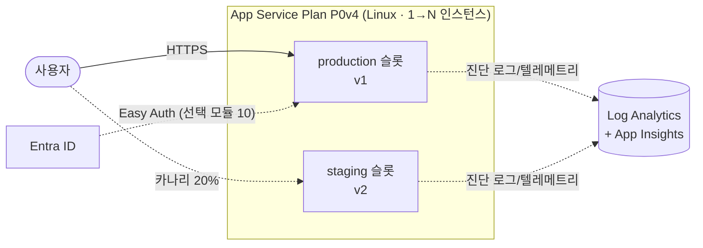

# Azure App Service 기본 핸즈온 워크숍

> Azure App Service의 핵심 라이프사이클을 **Cloud Shell 중심**으로 체험하는 한국어 핸즈온 워크숍입니다(코어 약 1시간 16분–1시간 50분, 09–12 선택 모듈 포함 시 약 2시간 4분–3시간 2분). Python(Flask) 앱을 zip 배포(Oryx 빌드)로 올리고, 앱 설정 → 슬롯 스왑 → 카나리 → **Autoscale CPU 규칙** → 관찰 가능성까지 단계별로 실습합니다. 선택 모듈에서는 **Automatic Scaling · Prewarmed A/B**, **인증(Easy Auth)**, **사이드카 컨테이너**, **Auto-heal & 진단**을 추가로 체험할 수 있습니다.

---

## 아키텍처

---

## 학습 목표

이 워크숍을 완료하면 다음을 할 수 있습니다.

1. App Service Plan과 Web App을 az CLI로 프로비저닝할 수 있다.
2. zip deploy + Oryx 빌드로 Python 앱을 배포하고 외부에서 접속할 수 있다.
3. 앱 설정(환경변수)을 추가·변경하고 재시작 동작을 이해할 수 있다.
4. 배포 슬롯을 생성하고 무중단 swap 및 롤백을 수행할 수 있다.
5. 슬롯 트래픽 분할로 카나리 배포를 정량 관찰할 수 있다.
6. Azure Monitor Autoscale의 CPU 규칙을 구성하고 Plan scale-out을 관찰할 수 있다.
7. 진단 설정을 통해 Log Analytics KQL 조회와 App Insights 텔레메트리를 활용할 수 있다.
8. 사용한 리소스를 모두 정리하고 비용 발생을 종료할 수 있다.
9. (선택) Autoscale을 Automatic Scaling으로 전환하고 Prewarmed 0/1에서 부하 시작 후 새 인스턴스 최초 응답까지 걸린 시간을 비교할 수 있다.
10. (선택) Easy Auth(Entra ID)로 코드 수정 없이 인증 게이트를 구성하고 `/.auth/me`로 클레임을 확인할 수 있다.
11. (선택) sitecontainers API로 Redis 사이드카를 부착하고 `/cache` 동작을 확인할 수 있다.
12. (선택) Auto-heal 규칙을 구성하고 자동 재활용 이벤트를 로그에서 확인할 수 있다.

---

## 사전 요구사항

| 항목 | 설명 |
|------|------|
| Azure 구독 | 소유자 또는 기여자 역할 보유 |
| Cloud Shell | Azure Portal의 Bash Cloud Shell(별도 설치 불필요) |
| 웹앱 기본 개념 | HTTP 요청·응답, 환경변수 개념 이해(컨테이너·Kubernetes 지식 불필요) |
| 비용 | 실습 완료 후 정리 모듈(13) 수행 권장(예상 비용: 아래 비용 개요 참조) |

> **💡 kubectl·Docker 불필요** — 실습은 Cloud Shell에서 `az` CLI를 중심으로 진행하며 `curl`, `jq`, `hey`, 일부 Python 관찰 스크립트를 함께 사용합니다. 컨테이너나 Kubernetes 지식이 없어도 진행할 수 있습니다.

---

## 모듈 목차

**코어 모듈 (01–08, 13)** — 순서대로 진행하세요. 이전 모듈의 산출물(리소스 그룹·Plan·Web App·슬롯)을 다음 모듈이 사용합니다.

| # | 모듈 | 한 줄 설명 |
|---|------|------------|
| 00 | (현재 문서) | 워크숍 전체 개요·목표·시간표 |
| 01 | [사전 준비](docs/01-prerequisites.md) | Cloud Shell 접속·구독 선택, az CLI 버전·확장 확인, 리포지토리 클론 |
| 02 | [환경 준비](docs/02-environment-setup.md) | 리소스 그룹 → App Service Plan(P0v4) → Web App(Python) → LAW·App Insights 생성 |
| 03 | [코드 배포 & 외부 접속](docs/03-deploy-code.md) | zip deploy(Oryx 빌드) → 브라우저/curl 접속 확인 → 로그 스트리밍 |
| 04 | [앱 설정·환경변수](docs/04-app-settings.md) | 앱 설정 추가·변경으로 동작 전환, 설정 변경 = 재시작 체감 |
| 05 | [배포 슬롯 & 스왑](docs/05-deployment-slots-swap.md) | staging 슬롯 생성 → v2 배포 → 슬롯 URL 확인 → 무중단 swap → 롤백(재 swap) |
| 06 | [슬롯 트래픽 분할 카나리](docs/06-traffic-split-canary.md) | staging 20% 라우팅 → curl 100회 반복 정량 관찰 → 100% 승격 |
| 07 | [Autoscale](docs/07-autoscale.md) | CPU 규칙과 capacity 1–3 구성 → `/load` 부하 → Plan scale-out 관찰 |
| 08 | [관찰 가능성](docs/08-observability.md) | 진단 설정 → LAW KQL 조회, App Insights 커넥션 스트링 주입 → 요청 텔레메트리 |
| 13 | [정리](docs/13-cleanup.md) | RG 삭제 + Entra 앱 등록 삭제 + 과금 종료 확인 |

**선택 모듈 (09–12)** — 09는 코어 07 직후를 권장하며, 10–12는 코어 08을 마친 뒤 관심 있는 것만 골라 진행하세요. 마지막에는 13 정리로 이동합니다.

| # | 모듈 | 한 줄 설명 |
|---|------|------------|
| 09 | [(선택) Automatic Scaling · Prewarmed A/B](docs/09-prewarmed-ab.md) | Autoscale 제거 → Automatic Scaling 활성화 → Prewarmed 0/1 응답 지연 비교 |
| 10 | [(선택) 인증 (Easy Auth)](docs/10-easy-auth.md) | Entra 앱 등록 → `az webapp auth` 구성 → 로그인 게이트 → `/.auth/me` |
| 11 | [(선택) 사이드카 컨테이너](docs/11-sidecar-option.md) | sitecontainers API로 Redis 사이드카 부착 → `/cache` 방문 카운터 동작 확인 |
| 12 | [(선택) Auto-heal & 진단](docs/12-autoheal-option.md) | `/slow` 반복 → Auto-heal 재활용 규칙 → 재활용 이벤트 확인, 진단 블레이드 소개 |

### 선택 모듈, 무엇을 고를까?

**09 Automatic Scaling · Prewarmed A/B**는 07의 규칙 기반 Autoscale을 App Service의 HTTP 기반 Automatic Scaling으로 전환하고 Prewarmed를 깊게 관찰하는 실험입니다. 30초 시작 지연을 적용한 뒤 Prewarmed 0과 Microsoft 권장 기본값 1에서 부하 시작부터 새 인스턴스 최초 응답까지 걸린 시간을 `hey`, 두 Python observer, Azure Monitor `InstanceCount`로 비교하며 약 22–38분이 걸립니다. 07 직후 수행하면 상태 전환이 가장 명확합니다.

10–12 세 모듈은 순서 의존성 없이 **어떤 조합으로든** 건너뛰거나 골라 진행할 수 있습니다(단, 10 수행 후 11·12 진행 시 첫 단계에서 Easy Auth를 비활성화하며, 이 상태는 13 정리까지 유지됩니다).

| | 10 인증 (Easy Auth) | 11 사이드카 | 12 Auto-heal & 진단 |
|---|---|---|---|
| **주제** | 코드 수정 없는 Entra ID 로그인 게이트 | Redis 사이드카로 localhost 캐시 | 슬로우 요청 자동 감지·프로세스 재활용 |
| **이런 분께** | 코드 변경 없이 앱 앞단에 인증을 붙이고 싶다 | 앱 옆에 보조 컨테이너를 붙이는 패턴이 궁금하다 | 운영 중 자가 복구·진단 도구가 궁금하다 |
| **도구** | az CLI (webapp auth) + 브라우저 | az CLI (sitecontainers) | az resource update + curl |
| **상태** | GA | GA | GA |
| **소요 시간** | 10–15분 | 8–12분 | 8–12분 |
| **유의 사항** | Entra 앱 등록 권한 필요; 이후 11·12 진행 시 인증 비활성 상태로 전환 | 모듈 10 수행 시 첫 단계에서 Easy Auth 비활성화(13 정리까지 유지) | 모듈 10 수행 시 첫 단계에서 Easy Auth 비활성화(13 정리까지 유지); 재활용 관찰 대기 약 90초 |

---

## 시간표

| 모듈 | 제목 | 예상 시간 | 주 소요 요인(예상) |
|------|------|-----------|--------------------|
| 00 | 개요 | ~5분 | — |
| 01 | 사전 준비 | ~10분 | Cloud Shell 최초 기동·구독 확인·확장 설치 |
| 02 | 환경 준비 | 10–15분 | 리소스 프로비저닝 대기 2–3분 |
| 03 | 코드 배포 & 외부 접속 | 8–12분 | Oryx 빌드 대기 2–3분 |
| 04 | 앱 설정·환경변수 | 5–8분 | 설정 변경 후 재시작 전파 ~40초 |
| 05 | 배포 슬롯 & 스왑 | 10–15분 | 슬롯 생성 + v2 Oryx 빌드 대기 |
| 06 | 슬롯 트래픽 분할 카나리 | 8–12분 | curl 100회 반복 관찰 |
| 07 | Autoscale(CPU 규칙 기반 확장) | 10–15분 | CPU 부하 약 180초 + scale-out 최대 6분 관찰 |
| 08 | 관찰 가능성 | 10–15분 | 진단 로그 적재 대기 5–10분 |
| 09 | (선택) Automatic Scaling · Prewarmed A/B | 22–38분 | 방식 전환 2–3분 + 동일 부하 A/B + 시험 사이 scale-in |
| 10 | (선택) 인증 (Easy Auth) | 10–15분 | 인증 설정 전파 + 브라우저 로그인 |
| 11 | (선택) 사이드카 컨테이너 | 8–12분 | 사이드카 부착 후 재시작 대기 ~60초 |
| 12 | (선택) Auto-heal & 진단 | 8–12분 | 트리거 후 재활용 관찰 ~90초 |
| 13 | 정리 | 5–8분 | RG 삭제 요청(비동기) |
| | **코어 (01–08 + 13)** | **≈ 1시간 16분–1시간 50분** | |
| | **전체 (01–13)** | **≈ 2시간 4분–3시간 2분** | |

---

## 비용 개요

> 실습 후 반드시 [13 정리](docs/13-cleanup.md) 모듈을 수행하여 불필요한 과금을 방지하세요.

| 리소스 | 과금 방식 | 비고 |
|--------|-----------|------|
| App Service Plan P0v4 (Linux) | 활성·Prewarmed 인스턴스 할당 시간 기준 과금 | 슬롯 추가 과금 없음(같은 Plan 공유); 09에서 Prewarmed 1이 할당되면 해당 시간은 초 단위로 청구 |
| Log Analytics Workspace | 수집 데이터 GB 단위 과금 | 실습 수준 데이터 소량 |
| Application Insights (workspace-based) | 수집 데이터 GB 단위 과금 | 실습 수준 소량 |
| Entra ID 앱 등록 | 무료 | 13 정리에서 삭제 필수 |

전체 실습(01–13)의 약 2시간 4분–3시간 2분 기준 예상 비용은 **USD $1 미만** 수준입니다. 코어 07은 Autoscale 최대 3개, 선택 09는 Automatic Scaling 최대 5개를 수 분 동안 사용할 수 있다는 조건을 포함한 대략치입니다. 실습 종료 즉시 정리(13)를 수행하세요. 요금은 리전·통화·시점에 따라 변동될 수 있습니다.

---

## 태깅 범례

이 워크숍 문서 전체에서 아래 태그를 사용합니다.

| 태그 | 의미 |
|------|------|
| 🟢 **실행** | 직접 입력하거나 수행해야 하는 명령·단계 |
| 👁️ **예시** | 눈으로만 읽는 개념 설명 또는 코드 발췌(직접 실행 불필요) |
| 📋 **예상 출력** | 명령 실행 결과와 비교하기 위한 출력 예시(입력 불필요) |
| 🖼️ **예상 화면** | Portal 또는 브라우저에서 확인하는 예상 화면(서술형 안내) |

---

## 트러블슈팅 색인

자주 발생하는 문제를 빠르게 찾을 수 있도록 각 모듈의 대표 증상을 아래에 정리합니다.

| 증상 | 모듈 |
|------|------|
| Azure CLI 확장 설치가 실패함 | [Module 01](docs/01-prerequisites.md#트러블슈팅) |
| `az account show`에 사용할 구독이 아닌 다른 구독이 표시됨 | [Module 01](docs/01-prerequisites.md#트러블슈팅) |
| `The app name 'app-appsvcworkshop-XXXXX' is not available` 오류가 발생함 | [Module 02](docs/02-environment-setup.md#트러블슈팅) |
| Korea Central에서 P0v4 SKU를 만들 수 없음 | [Module 02](docs/02-environment-setup.md#트러블슈팅) |
| `az monitor app-insights` 명령을 찾을 수 없음 | [Module 02](docs/02-environment-setup.md#트러블슈팅) |
| `--track-status` 출력에 `Failed` 또는 빌드 오류가 표시됨 | [Module 03](docs/03-deploy-code.md#트러블슈팅) |
| 배포 직후 첫 요청에서 502 게이트웨이 오류가 발생함 | [Module 03](docs/03-deploy-code.md#트러블슈팅) |
| 배포 zip에 `tests/`가 포함됨 | [Module 03](docs/03-deploy-code.md#트러블슈팅) |
| 앱 설정을 변경했지만 새 메시지가 표시되지 않음 | [Module 04](docs/04-app-settings.md#트러블슈팅) |
| 한글·공백·특수문자가 포함된 설정값에서 구문 오류가 발생함 | [Module 04](docs/04-app-settings.md#트러블슈팅) |
| `jq` 명령을 찾을 수 없음 | [Module 04](docs/04-app-settings.md#트러블슈팅) |
| `sed` 실행 후에도 `grep '^VERSION' app.py`가 `VERSION = "v1"`을 표시함 | [Module 05](docs/05-deployment-slots-swap.md#트러블슈팅) |
| 스테이징 슬롯의 `curl` 응답이 느리거나 502 오류가 발생함 | [Module 05](docs/05-deployment-slots-swap.md#트러블슈팅) |
| 슬롯 스왑 명령이 오랫동안 완료되지 않음 | [Module 05](docs/05-deployment-slots-swap.md#트러블슈팅) |
| 트래픽 분포가 0/100으로 나타나 v1 또는 v2 요청이 전혀 없음 | [Module 06](docs/06-traffic-split-canary.md#트러블슈팅) |
| 브라우저에서 요청해도 버전 비율이 바뀌지 않음 | [Module 06](docs/06-traffic-split-canary.md#트러블슈팅) |
| 스왑 후에도 일부 트래픽이 구 버전으로 라우팅됨 | [Module 06](docs/06-traffic-split-canary.md#트러블슈팅) |
| 부하를 생성해도 scale-out이 관찰되지 않음 | [Module 07](docs/07-autoscale.md#트러블슈팅) |
| Autoscale rule 생성이 실패함 | [Module 07](docs/07-autoscale.md#트러블슈팅) |
| `hey` 설치가 실패하거나 명령을 찾을 수 없음 | [Module 07](docs/07-autoscale.md#트러블슈팅) |
| KQL 쿼리 결과가 0건임 | [Module 08](docs/08-observability.md#트러블슈팅) |
| `AppRequests` 테이블이 0건임 | [Module 08](docs/08-observability.md#트러블슈팅) |
| `az monitor log-analytics query` 명령을 찾을 수 없음 | [Module 08](docs/08-observability.md#트러블슈팅) |
| Cloud Shell에서 credential problem 또는 MSI token audience 오류가 발생함 | [Module 08](docs/08-observability.md#트러블슈팅) |
| `az monitor app-insights component show` 명령을 찾을 수 없음 | [Module 08](docs/08-observability.md#트러블슈팅) |
| `observe_instances.py`가 2로 종료되거나 `observations` 배열이 비어 있음 | [Module 09](docs/09-prewarmed-ab.md#트러블슈팅) |
| 시험 A 후 약 15분이 지나도 단일 인스턴스로 축소되지 않음 | [Module 09](docs/09-prewarmed-ab.md#트러블슈팅) |
| `load_to_first_response_seconds`가 두 시험에서 비슷함 | [Module 09](docs/09-prewarmed-ab.md#트러블슈팅) |
| Trial A/B 실패 후 실험 이전의 기본 상태로 돌아가야 함 | [Module 09](docs/09-prewarmed-ab.md#트러블슈팅) |
| `hey` 설치가 실패하거나 명령을 찾을 수 없음 | [Module 09](docs/09-prewarmed-ab.md#트러블슈팅) |
| P0v4에서 Premium V2/V3 SKU만 지원한다는 CLI 오류가 발생함 | [Module 09](docs/09-prewarmed-ab.md#트러블슈팅) |
| 브라우저 접속 시 로그인 리디렉션 없이 앱이 바로 표시됨 | [Module 10](docs/10-easy-auth.md#트러블슈팅) |
| AADSTS 리디렉션 URI 불일치 오류가 발생함 | [Module 10](docs/10-easy-auth.md#트러블슈팅) |
| Entra 앱 등록 생성이 권한 부족으로 실패함 | [Module 10](docs/10-easy-auth.md#트러블슈팅) |
| `az webapp auth microsoft update` 명령을 찾을 수 없음 | [Module 10](docs/10-easy-auth.md#트러블슈팅) |
| 사이드카 부착 후 `/cache`가 계속 `unavailable`을 반환함 | [Module 11](docs/11-sidecar-option.md#트러블슈팅) |
| Redis 이미지 pull 실패 또는 컨테이너 기동 오류가 발생함 | [Module 11](docs/11-sidecar-option.md#트러블슈팅) |
| `az webapp sitecontainers` 명령을 찾을 수 없음 | [Module 11](docs/11-sidecar-option.md#트러블슈팅) |
| Auto-heal 후에도 `started_at`이 바뀌지 않음 | [Module 12](docs/12-autoheal-option.md#트러블슈팅) |
| `/api/info` 또는 `/slow`가 403을 반환함 | [Module 12](docs/12-autoheal-option.md#트러블슈팅) |
| `az resource update` 오류가 발생하거나 Auto-heal 규칙이 적용되지 않음 | [Module 12](docs/12-autoheal-option.md#트러블슈팅) |
| `jq: error`가 발생하거나 응답에 `started_at`이 없음 | [Module 12](docs/12-autoheal-option.md#트러블슈팅) |
| `az group exists`가 계속 `true`를 반환함 | [Module 13](docs/13-cleanup.md#트러블슈팅) |
| Entra 앱 등록 삭제가 권한 오류로 실패함 | [Module 13](docs/13-cleanup.md#트러블슈팅) |
| 정리할 리소스의 `SUFFIX`를 잊어버림 | [Module 13](docs/13-cleanup.md#트러블슈팅) |

---

## 참고 자료

- [Azure App Service 개요](https://learn.microsoft.com/azure/app-service/overview)
- [Premium v4 계층 구성 및 지원 리전](https://learn.microsoft.com/azure/app-service/app-service-configure-premium-v4-tier)
- [배포 슬롯](https://learn.microsoft.com/azure/app-service/deploy-staging-slots)
- [Automatic scaling](https://learn.microsoft.com/azure/app-service/manage-automatic-scaling)
- [진단 로그](https://learn.microsoft.com/azure/app-service/troubleshoot-diagnostic-logs)
- [Easy Auth (인증·권한 부여)](https://learn.microsoft.com/azure/app-service/overview-authentication-authorization)
- [사이드카 컨테이너](https://learn.microsoft.com/azure/app-service/overview-sidecar)
