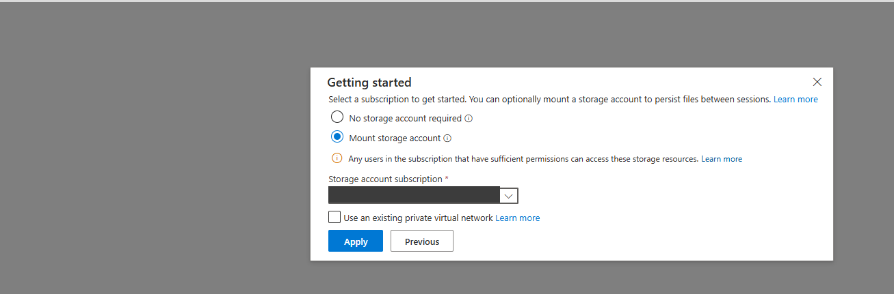
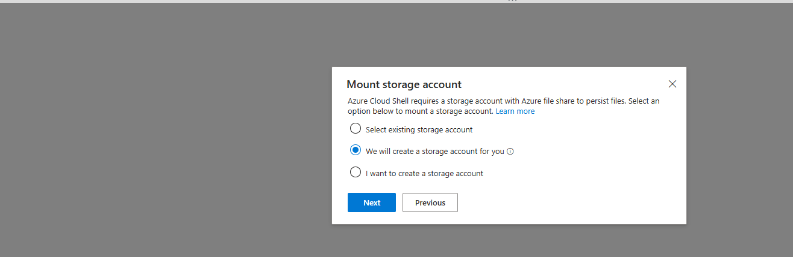
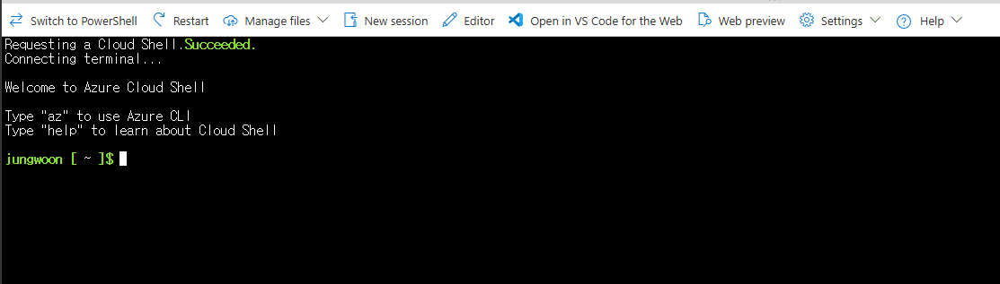

# 01. 사전 준비

> 🟢 **실행** = 직접 입력·수행 · 👁️ **예시** = 눈으로만(개념/발췌) · 📋 **예상 출력** = 비교용(입력 불필요)

---

## 목표

이 모듈에서는 워크숍 전반에 걸쳐 사용할 Azure Cloud Shell 환경을 준비합니다.

- 실습에 사용할 Azure 구독을 확인합니다.
- Cloud Shell을 영구 스토리지와 연결해 실습 파일이 세션 간 유지되도록 준비합니다.
- 실습에 필요한 CLI 확장(`application-insights`, `authV2`, `log-analytics`)을 설치합니다.
- 워크숍 리포지토리를 `git clone`으로 가져옵니다.

---

## Cloud Shell 최초 준비

Azure Portal에서 Cloud Shell을 처음 실행한다면 **Bash**와 영구 스토리지를 먼저 준비합니다. 영구 스토리지를 연결하면 Cloud Shell 세션이 다시 만들어져도 홈 디렉터리에 클론한 워크숍 파일이 유지됩니다.

> ⚠️ **이 워크숍에서는 `Mount storage account`를 권장합니다.** `No storage account required`는 임시 스토리지를 사용하므로 세션이 재생성되면 클론한 파일이 사라질 수 있습니다.

1. [Azure Portal](https://portal.azure.com) 상단의 Cloud Shell(`>_`) 아이콘을 선택하고 **Bash**를 선택합니다.

   

2. **Getting started** 화면에서 **Mount storage account**를 선택하고, **Storage account subscription**에서 실습에 사용할 구독을 선택한 뒤 **Apply**를 선택합니다.

   

3. **Mount storage account** 화면에서 **We will create a storage account for you**를 선택하고 **Next**를 선택합니다. 이 작업에는 대상 구독에서 리소스를 만들 수 있는 권한이 필요합니다.

   

4. `Requesting a Cloud Shell.Succeeded.` 메시지 뒤에 Bash 프롬프트가 나타나면 준비가 완료된 것입니다.

   

> 이미 임시 스토리지로 시작했다면 Cloud Shell의 **Settings(⚙️) → Reset User Settings**를 선택한 후 Cloud Shell을 다시 열어 위 절차를 진행합니다.

---

## 1단계 — Cloud Shell 접속 및 구독 선택

준비된 Cloud Shell에서 **Bash**가 선택되어 있는지 확인합니다. Cloud Shell은 [https://shell.azure.com](https://shell.azure.com) 에서도 직접 열 수 있습니다.

Cloud Shell은 Azure Portal에 로그인된 계정으로 자동 인증되므로 별도 `az login`은 필요하지 않습니다. 아래 명령으로 현재 구독과 CLI 버전을 확인합니다.

🟢 **실행**

```bash
# 현재 로그인한 구독과 Azure CLI 버전을 확인합니다.
az account show -o table
az version
```

👁️ **확인** — 출력된 `Name` 및 `SubscriptionId` 값이 실습에 사용할 구독인지 확인합니다.

구독이 여러 개이거나 다른 구독으로 전환해야 한다면 아래 명령을 실행합니다.

🟢 **실행** (구독 전환이 필요한 경우에만)

```bash
# 워크숍 리소스를 만들 구독으로 전환한 뒤 선택 결과를 확인합니다.
az account set --subscription "<구독 ID 또는 이름>"
az account show -o table
```

📋 **예상 출력**

```text
Name                  CloudName    SubscriptionId                        State    IsDefault
--------------------  -----------  ------------------------------------  -------  -----------
<구독 이름>            AzureCloud   xxxxxxxx-xxxx-xxxx-xxxx-xxxxxxxxxxxx  Enabled  True
```

---

## 2단계 — CLI 확장 설치

이 워크숍은 `application-insights`, `authV2`, `log-analytics` 확장을 사용합니다.
`--upgrade` 플래그로 멱등 설치하므로 이미 설치된 경우 최신 버전으로 업그레이드됩니다.

🟢 **실행**

```bash
# 워크숍에서 사용할 Application Insights, Easy Auth, Log Analytics 확장을 설치합니다.
az extension add --name application-insights --upgrade --only-show-errors
az extension add --name authV2 --upgrade --only-show-errors
az extension add --name log-analytics --upgrade --only-show-errors
```

---

## 3단계 — 워크숍 리포지토리 클론

샘플 애플리케이션 소스 코드와 실습 스크립트를 내려받습니다.

🟢 **실행**

```bash
# 워크숍 리포지토리를 복제하고 작업 디렉터리로 이동합니다.
git clone https://github.com/jungwoonlee_microsoft/ms-appservice-basic-workshop01.git
cd ms-appservice-basic-workshop01
```

---

## 트러블슈팅

| 증상 | 원인 | 해결 방법 |
|------|------|-----------|
| Azure CLI 확장 설치가 실패함 | 네트워크 오류나 일시적인 타임아웃이 발생했을 수 있습니다. | `az extension add --name application-insights --upgrade --only-show-errors`, `az extension add --name authV2 --upgrade --only-show-errors`, `az extension add --name log-analytics --upgrade --only-show-errors`를 다시 실행합니다.<br>계속 실패하면 `az upgrade`로 CLI를 업그레이드한 뒤 재시도합니다. |
| Cloud Shell에 다시 접속했더니 클론한 저장소가 사라짐 | Cloud Shell을 `No storage account required` 임시 스토리지로 시작했거나 세션의 홈 디렉터리가 유지되지 않았습니다. | **Settings(⚙️) → Reset User Settings**를 선택한 뒤 Cloud Shell을 다시 열어 **Mount storage account**로 설정하고 저장소를 다시 클론합니다. |
| `az account show`에 사용할 구독이 아닌 다른 구독이 표시됨 | 로그인한 계정에 여러 Azure 구독이 연결되어 있습니다. | `az account set --subscription "<구독 ID 또는 이름>"`으로 전환한 뒤 `az account show -o table`로 확인합니다. |

---

이전 모듈: [00. 소개](../README.md) · 다음 모듈: [02. 환경 준비](02-environment-setup.md)
