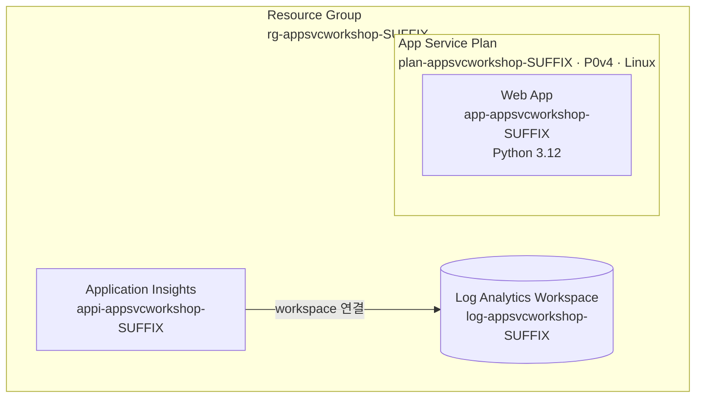
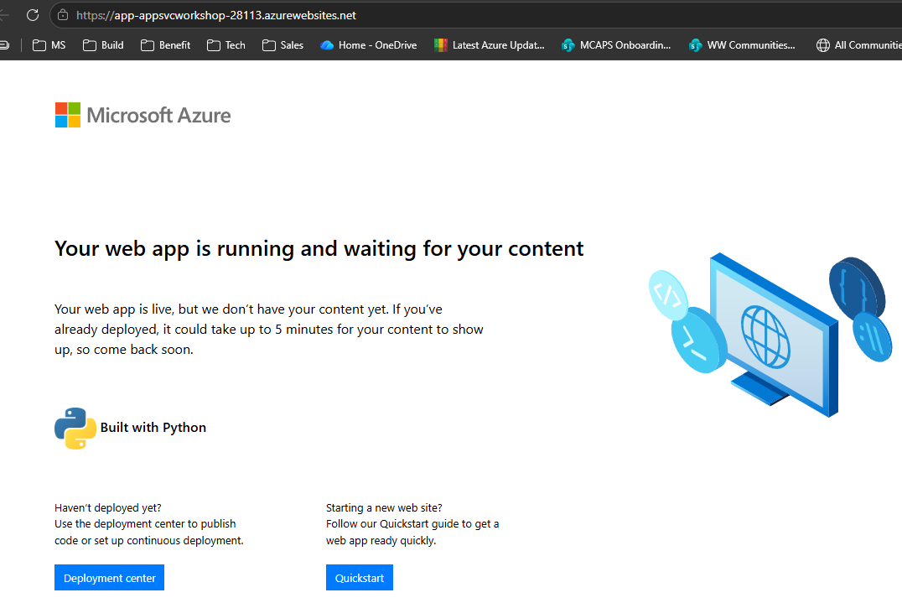

# 02. 환경 준비

> 🟢 **실행** = 직접 입력·수행 · 👁️ **예시** = 눈으로만(개념/발췌) · 📋 **예상 출력** = 비교용(입력 불필요) · 🖼️ **예상 화면** = 브라우저/포털 스크린샷 참고

---

## 목표

이 모듈에서는 워크숍 전반에 걸쳐 사용할 Azure 리소스를 생성합니다.

- 환경 변수(`SUFFIX`, `RG`, `PLAN`, `APP`, `LAW`, `APPI`)를 정의합니다.
- **리소스 그룹**, **App Service Plan(P0v4)**, **Web App(Python 3.12)** 을 프로비저닝합니다.
- **Log Analytics Workspace** 와 **Application Insights 컴포넌트** 를 연결합니다.
- 기본 호스트네임(`APP_URL`)을 조회하여 앱 엔드포인트를 확인합니다.

1단계 완료 후 생성되는 리소스 구조는 다음과 같습니다.



---

## 1단계 — 환경 변수 정의 및 리소스 생성

`SUFFIX`는 여러 참가자의 리소스 이름이 겹치지 않도록 구분하는 값입니다. 아래 명령은 **5자리 난수**를 자동으로 생성합니다.

생성된 값은 이후 모든 모듈에서 다시 사용하므로 `echo`로 출력된 값을 반드시 메모해 두세요. 예를 들어 `SUFFIX=04271`처럼 표시됩니다.

🟢 **실행**

```bash
SUFFIX=$(printf "%05d" $(( (RANDOM * 32768 + RANDOM) % 100000 )))
LOC=koreacentral
RG=rg-appsvcworkshop-$SUFFIX
PLAN=plan-appsvcworkshop-$SUFFIX
APP=app-appsvcworkshop-$SUFFIX
LAW=log-appsvcworkshop-$SUFFIX
APPI=appi-appsvcworkshop-$SUFFIX
echo "SUFFIX=$SUFFIX"   # ⚠️ 이후 모듈에서 재사용

# 1. 모든 워크숍 리소스를 담을 리소스 그룹 생성
az group create -n $RG -l $LOC

# 2. Linux 기반 Premium V4 App Service Plan 생성
#    P0V4는 1 vCPU·2GB 메모리의 Premium V4 최소 SKU
az appservice plan create -g $RG -n $PLAN --is-linux --sku P0V4

# 3. 위 Plan에 Python 3.12 런타임을 사용하는 Web App 생성
az webapp create -g $RG -n $APP --plan $PLAN --runtime "PYTHON:3.12"

# 4. App Service 로그와 메트릭을 수집할 Log Analytics Workspace 생성
az monitor log-analytics workspace create -g $RG -n $LAW -l $LOC

# 5. Application Insights 연결에 사용할 Workspace 리소스 ID 조회
#    명령 결과를 LAW_ID 셸 변수에 저장
LAW_ID=$(az monitor log-analytics workspace show -g $RG -n $LAW --query id -o tsv)

# 6. Application Insights 관리 명령을 제공하는 CLI 확장 설치·업그레이드
az extension add --name application-insights --upgrade --only-show-errors

# 7. Log Analytics Workspace와 연결된 Application Insights 컴포넌트 생성
az monitor app-insights component create -g $RG --app $APPI -l $LOC --workspace $LAW_ID

# 8. Web App의 Azure 기본 호스트 이름을 조회해 HTTPS 접속 URL 구성
APP_URL="https://$(az webapp show -g $RG -n $APP --query defaultHostName -o tsv)"

# 9. 브라우저와 이후 모듈에서 사용할 앱 URL 출력
echo $APP_URL
```

---

> 👁️ **개념 — App Service Plan과 SKU**
>
> | 구분 | 설명 |
> |---|---|
> | **App Service Plan** | Web App이 실행되는 컴퓨트 경계입니다. 리전, 운영체제, 인스턴스 수, 확장 범위와 과금 단위를 결정합니다. |
> | **SKU** | Plan에 할당할 하드웨어 크기와 가격 계층입니다. CPU·메모리·로컬 스토리지·지원 기능·시간당 비용을 결정합니다. |
> | **Web App** | Plan 위에 배포되는 논리적 애플리케이션입니다. 여러 Web App과 배포 슬롯이 같은 Plan의 인스턴스와 비용을 공유할 수 있습니다. |
>
> **`P0V4` 이름의 의미**
>
> | 구성 | 의미 |
> |---|---|
> | `P` | Premium 가격 계층 |
> | `0` | Premium V4의 최소 범용 크기(1 vCPU·2GB 메모리) |
> | `V4` | 4세대 Premium 하드웨어 계층 |
>
> 이번 워크숍에서 **P0v4**를 선택한 이유:
> - 배포 슬롯, Automatic scaling, Linux 사이드카 등 전체 실습을 하나의 Plan에서 진행할 수 있습니다.
> - Premium V4는 이전 세대보다 빠른 프로세서와 NVMe 로컬 스토리지를 제공합니다.
> - P0v4는 Premium V4의 최소 범용 SKU이므로 워크숍 비용을 낮추면서 핵심 기능을 실습하기 적합합니다.
> - Premium V4는 **Korea Central**에서 지원됩니다. 다만 구독과 App Service 배포 단위에 따라 SKU가 표시되지 않을 수 있습니다.
>
> ⚠️ **Premium V4 아웃바운드 IP** — Premium V4는 고정 아웃바운드 IP를 제공하지 않습니다. 이 워크숍은 고정 아웃바운드 IP에 의존하지 않으므로 영향이 없습니다. 운영 환경에서 고정 IP가 필요하면 NAT Gateway 통합을 사용해야 합니다.
>
> **기본 도메인**(`defaultHostName`)은 Web App 생성 시 Azure가 전역 고유 이름으로 자동 할당합니다.
> 직접 입력하지 않고 반드시 `az webapp show … --query defaultHostName` 조회로 가져오십시오.

---

📋 **예상 출력 — `az appservice plan create`**

```text
{
  "id": "/subscriptions/.../resourceGroups/rg-appsvcworkshop-XXXXX/providers/Microsoft.Web/serverfarms/plan-appsvcworkshop-XXXXX",
  "kind": "linux",
  "name": "plan-appsvcworkshop-XXXXX",
  "provisioningState": "Succeeded",
  "sku": {
    "name": "P0V4",
    "tier": "PremiumV4"
  },
  ...
}
```

📋 **예상 출력 — `az webapp create`**

```text
{
  "defaultHostName": "app-appsvcworkshop-XXXXX.azurewebsites.net",
  "name": "app-appsvcworkshop-XXXXX",
  "provisioningState": "Succeeded",
  "state": "Running",
  ...
}
```

📋 **예상 출력 — `echo $APP_URL`**

```text
https://app-appsvcworkshop-XXXXX.azurewebsites.net
```

👁️ **브라우저 확인** — `$APP_URL` 값을 브라우저 주소창에 붙여넣습니다. 아직 애플리케이션 코드를 배포하지 않았으므로 Azure App Service의 Python 기본 시작 페이지가 표시됩니다.

🖼️ **예상 화면** — App Service Python 기본 시작 페이지



---

## 검증

🟢 **실행**

```bash
az webapp show -g $RG -n $APP --query state -o tsv
```

📋 **예상 출력**

```text
Running
```

---

## 트러블슈팅

### (1) 앱 이름 전역 중복 오류

Web App 이름(`$APP`)은 `azurewebsites.net` 도메인에서 **전 세계적으로 고유** 해야 합니다.
`The app name 'app-appsvcworkshop-XXXXX' is not available` 오류가 발생하면 새 난수를 생성하여 변수 전체를 재정의하고 명령을 재실행합니다.

```bash
SUFFIX=$(printf "%05d" $(( (RANDOM * 32768 + RANDOM) % 100000 )))
RG=rg-appsvcworkshop-$SUFFIX
PLAN=plan-appsvcworkshop-$SUFFIX
APP=app-appsvcworkshop-$SUFFIX
LAW=log-appsvcworkshop-$SUFFIX
APPI=appi-appsvcworkshop-$SUFFIX
echo "SUFFIX=$SUFFIX"
```

### (2) P0v4 SKU를 사용할 수 없음

Premium V4는 일부 리전과 App Service 배포 단위에서만 제공됩니다. 아래 명령으로 Linux P0v4 지원 리전을 확인합니다(Azure CLI 2.73.0 이상).

```bash
az appservice list-locations --linux-workers-enabled --sku P0V4 -o table
```

목록에 **Korea Central**이 없거나 `P0V4` 생성이 실패하면, 출력에 표시된 지원 리전을 선택하고 새로운 `SUFFIX`로 리소스 이름을 다시 정의한 뒤 1단계를 재실행합니다.

```bash
SUFFIX=$(printf "%05d" $(( (RANDOM * 32768 + RANDOM) % 100000 )))
LOC=eastasia     # 예시: 위 명령에서 확인한 지원 리전
RG=rg-appsvcworkshop-$SUFFIX
PLAN=plan-appsvcworkshop-$SUFFIX
APP=app-appsvcworkshop-$SUFFIX
LAW=log-appsvcworkshop-$SUFFIX
APPI=appi-appsvcworkshop-$SUFFIX
```

### (3) `application-insights` 확장 명령 없음

`az monitor app-insights` 명령을 찾을 수 없는 경우 확장이 설치되지 않은 것입니다.

```bash
az extension add --name application-insights --upgrade --only-show-errors
```

설치 후 명령을 재실행합니다.

---

이전 모듈: [01. 사전 준비](01-prerequisites.md) · 다음 모듈: [03. 코드 배포](03-deploy-code.md)
