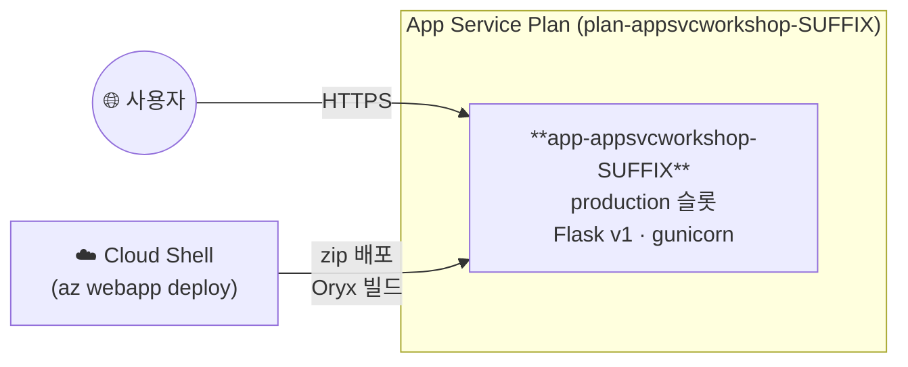
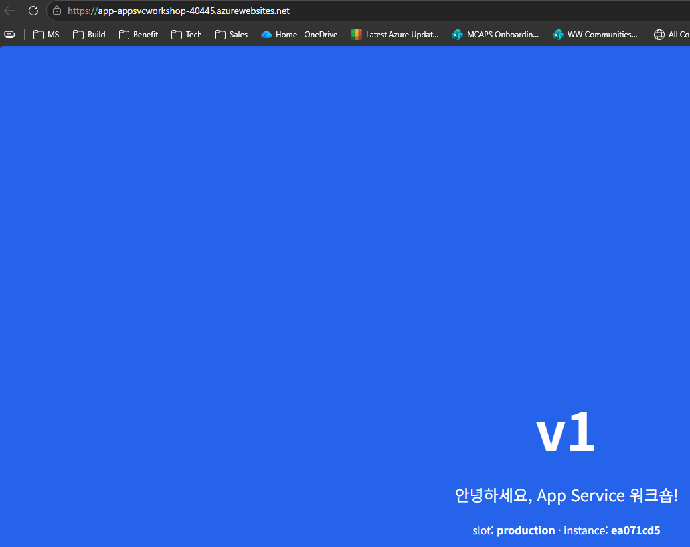

# 03. 코드 배포

> 🟢 **실행** = 직접 입력·수행 · 👁️ **예시** = 눈으로만(개념/발췌) · 📋 **예상 출력** = 비교용(입력 불필요) · 🖼️ **예상 화면** = 브라우저/포털 스크린샷 참고

---

## 목표

이 모듈에서는 Flask 애플리케이션(v1)을 zip 배포 방식으로 Azure App Service에 업로드하고 외부에서 접속합니다.

- Oryx 빌드(`SCM_DO_BUILD_DURING_DEPLOYMENT=true`)를 활성화하여 서버 측 pip install을 수행합니다.
- zip 아카이브를 생성하고 `az webapp deploy`로 프로덕션 슬롯에 배포합니다.
- `/health`·`/api/info` 엔드포인트로 배포 성공 여부를 검증합니다.
- 로그 스트림을 통해 실시간 요청·에러 로그를 확인합니다.

완성 후의 구조는 다음과 같습니다.



---

<details>
<summary>🔄 0단계 — 변수 재설정 (새 터미널/세션에서 시작하는 경우)</summary>

> ⏭️ **02 모듈에서 이어서 같은 터미널로 진행 중이라면 이 단계는 건너뛰세요.**
> 새 터미널 세션을 열었거나 Cloud Shell이 재시작되어 변수가 사라진 경우에만 실행합니다.
> `SUFFIX` 는 **02 모듈에서 사용한 값과 동일하게** 입력하세요.

🟢 **실행**

```bash
# 이전 모듈의 리소스 변수를 복원하고 현재 Web App URL을 다시 계산합니다.
SUFFIX=<이전에_메모한_값>
LOC=koreacentral
RG=rg-appsvcworkshop-$SUFFIX
PLAN=plan-appsvcworkshop-$SUFFIX
APP=app-appsvcworkshop-$SUFFIX
LAW=log-appsvcworkshop-$SUFFIX
APPI=appi-appsvcworkshop-$SUFFIX
APP_URL="https://$(az webapp show -g $RG -n $APP --query defaultHostName -o tsv)"
echo "APP_URL=$APP_URL"
```

📋 **예상 출력**

```
APP_URL=https://app-appsvcworkshop-<SUFFIX>.azurewebsites.net
```

</details>

---

## 1단계 — Oryx 빌드 설정

🟢 **실행**

```bash
# zip 배포 시 App Service가 requirements.txt를 사용해 서버 측 Oryx 빌드를 수행하도록 설정합니다.
az webapp config appsettings set -g $RG -n $APP \
  --settings SCM_DO_BUILD_DURING_DEPLOYMENT=true
```

> 👁️ **개념 — Oryx 빌드**
>
> Oryx는 App Service가 소스 기반 배포 패키지를 실행 가능한 Python 앱으로 준비하는 빌드 시스템입니다. `SCM_DO_BUILD_DURING_DEPLOYMENT=true`는 의존성을 zip에 미리 포함하는 대신, 배포 중 App Service 서버에서 다음 과정을 수행하도록 설정합니다.
>
> 1. **애플리케이션 감지** — zip 최상위의 `requirements.txt`와 `app.py`를 찾아 Python 앱으로 인식합니다.
> 2. **의존성 설치** — 빌드 환경에서 `pip install -r requirements.txt`를 실행해 필요한 패키지를 설치합니다.
> 3. **배포 결과 생성** — 설치된 의존성과 앱 소스를 런타임 컨테이너가 사용할 배포 결과로 준비합니다.
> 4. **애플리케이션 시작** — 컨테이너 시작 시 Linux App Service가 `app.py`를 감지하고 gunicorn의 `app:app` 대상으로 Flask 앱을 실행합니다.
>
> 첫 빌드는 패키지 다운로드와 환경 준비를 포함해 **1–3분**, 이후 콜드스타트에 추가 수십 초가 걸릴 수 있습니다.

---

## 2단계 — zip 아카이브 생성 및 배포

배포할 애플리케이션은 Python **Flask 기반의 v1 웹앱**입니다. 홈 화면과 함께 상태 확인용 `/health`, 앱 버전·슬롯·인스턴스 정보를 반환하는 `/api/info` 엔드포인트를 제공하며, 이후 모듈에서 앱 설정·슬롯 스왑·트래픽 분할·자동 스케일 동작을 관찰하는 데 사용합니다.

👁️ **배포할 애플리케이션 구조**

```text
app/
├── app.py
└── requirements.txt
```

| 파일 | 역할 |
|------|------|
| `app.py` | Flask 앱과 홈 화면을 정의하고 `/health`, `/api/info`, 이후 모듈에서 사용하는 `/load`, `/slow`, `/cache` 엔드포인트를 제공합니다. |
| `requirements.txt` | Oryx가 설치할 Flask, gunicorn, Redis Python 클라이언트의 버전 범위를 정의합니다. |

아래 명령은 `app/` 디렉터리 안에서 zip을 생성하므로 `app.py`와 `requirements.txt`가 zip 최상위에 들어갑니다. Oryx는 이 위치에서 애플리케이션과 의존성 파일을 감지합니다.

`app.py`와 의존성 목록인 `requirements.txt`를 zip 파일로 묶어 App Service에 배포합니다.

🟢 **실행**

```bash
# Flask 앱을 zip으로 묶고 App Service에 배포합니다.
cd ~/ms-appservice-basic-workshop01/app
zip -r /tmp/app-v1.zip . -x "tests/*" -x "__pycache__/*" -x "*.pyc"
az webapp deploy -g $RG -n $APP --src-path /tmp/app-v1.zip --type zip --track-status
```

📋 **예상 출력** (배포 ID와 시각은 실행할 때마다 달라집니다)

```text
  adding: requirements.txt (deflated 1%)
  adding: app.py (deflated 49%)
Note: 'az webapp deploy' does not run build automation (dependency installation,
compilation, etc.) by default for Linux web apps. If your package is not pre-built,
set the app setting SCM_DO_BUILD_DURING_DEPLOYMENT=true to enable builds during deployment.
Initiating deployment
Deploying from local path: /tmp/app-v1.zip
Warming up Kudu before deployment.
Warmed up Kudu instance successfully.
Polling the status of sync deployment. Start Time: <배포 시작 시각> UTC
Status: Build successful. Time: 1(s)
Status: Site started successfully. Time: 16(s)
Deployment has completed successfully
You can visit your app at: http://app-appsvcworkshop-<SUFFIX>.azurewebsites.net
{
  "id": "/subscriptions/<subscription-id>/resourceGroups/rg-appsvcworkshop-<SUFFIX>/providers/Microsoft.Web/sites/app-appsvcworkshop-<SUFFIX>/deploymentStatus/<deployment-id>",
  "location": "Korea Central",
  "name": "<deployment-id>",
  "properties": {
    "deploymentId": "<deployment-id>",
    "errors": null,
    "failedInstancesLogs": null,
    "numberOfInstancesFailed": 0,
    "numberOfInstancesInProgress": 0,
    "numberOfInstancesSuccessful": 1,
    "status": "RuntimeSuccessful"
  },
  "resourceGroup": "rg-appsvcworkshop-<SUFFIX>",
  "type": "Microsoft.Web/sites/deploymentStatus"
}
```

> 👁️ `Build successful`, `Site started successfully`, `Deployment has completed successfully`, `"status": "RuntimeSuccessful"`이 표시되면 배포가 완료된 것입니다. 출력의 Note는 일반 안내이며, 1단계에서 `SCM_DO_BUILD_DURING_DEPLOYMENT=true`를 이미 설정했으므로 Oryx 빌드가 정상 실행됩니다.

> 👁️ **참고** — `-x "tests/*" -x "__pycache__/*" -x "*.pyc"` 옵션으로 테스트 파일과 캐시를 제외합니다.
> `tests/` 디렉터리가 포함되더라도 동작에는 영향이 없으나 zip 크기가 늘어납니다.

---

## 3단계 — 외부 접속 검증

🟢 **실행**

```bash
# 배포된 앱의 헬스 상태와 런타임 정보를 외부 URL에서 확인합니다.
curl -s $APP_URL/health
curl -s $APP_URL/api/info | jq
```

📋 **예상 출력 — `/health`**

```json
{"status":"ok"}
```

📋 **예상 출력 — `/api/info`**

```json
{
  "color": "#2563eb",
  "instance": "<instance-id>",
  "message": "App Service 워크숍에 오신 것을 환영합니다",
  "python": "3.12.x",
  "slot": "production",
  "started_at": "<UTC 시작 시각>",
  "version": "v1"
}
```

> 👁️ `instance`는 현재 요청을 처리한 App Service 인스턴스 식별자이며, `started_at`은 앱 프로세스가 시작된 UTC 시각입니다. 두 값과 Python 패치 버전은 실행 환경에 따라 달라집니다.

🖼️ **예상 화면** — 브라우저에서 `$APP_URL`을 열면 파란색 v1 페이지가 표시됩니다.



---

## 4단계 — 로그 스트림

App Service의 로그를 파일 시스템에 기록하도록 활성화한 뒤, Cloud Shell에서 실시간으로 스트리밍합니다.

| 로그 종류 | 설정 | 확인 내용 |
|---|---|---|
| **애플리케이션 로그** | `--application-logging filesystem` | Python·Flask·gunicorn이 표준 출력과 표준 오류에 기록한 시작·오류 메시지 |
| **웹 서버 로그** | `--web-server-logging filesystem` | HTTP 요청 경로, 응답 상태 코드 등 웹 요청 처리 정보 |

🟢 **실행**

```bash
# 애플리케이션 로그(verbose 수준)와 웹 서버 로그를 App Service 파일 시스템에 기록
az webapp log config -g $RG -n $APP \
  --application-logging filesystem --level verbose --web-server-logging filesystem

# 활성화된 로그를 현재 터미널에 실시간 출력
az webapp log tail -g $RG -n $APP
```

> 👁️ `--level`을 지정하지 않으면 기본값 `error`가 적용되어 정보성(INFO) 로그가 기록되지 않을 수 있습니다. 또한 파일 시스템 애플리케이션 로그는 디스크 보호를 위해 **활성화 후 12시간이 지나면 자동으로 비활성화**됩니다. 장기 보관이 필요하면 [08. 관찰 가능성](08-observability.md)의 Log Analytics 연동을 사용하십시오.

`az webapp log tail`은 새 로그를 기다리며 계속 실행되는 명령입니다. 이 Cloud Shell 탭은 그대로 두고 **새 Cloud Shell 탭**을 연 다음 요청을 전송합니다.

🟢 **실행** (새 Cloud Shell 탭)

```bash
# 새 터미널에서 요청을 보내 로그 스트림에 기록할 이벤트를 생성합니다.
curl -s $APP_URL/health
curl -s $APP_URL/api/info | jq
```

📋 **예상 출력** (로그 시각·인스턴스·메시지 형식은 달라질 수 있습니다)

```text
Connecting to log stream...
...
GET /health ... 200
GET /api/info ... 200
```

> 👁️ 요청 직후 로그가 보이지 않으면 약 30초 기다린 뒤 `curl`을 다시 실행하세요. 로그 버퍼링으로 애플리케이션 로그와 HTTP 로그의 출력 순서가 실제 요청 순서와 다를 수 있습니다.

로그 확인을 마치면 로그 스트림을 실행한 탭에서 **Ctrl+C**를 눌러 종료합니다. Azure Portal에서는 **App Service → Monitoring → Log stream**에서도 동일한 로그를 확인할 수 있습니다.

---

## 트러블슈팅

| 증상 | 원인 | 해결 방법 |
|------|------|-----------|
| `--track-status` 출력에 `Failed` 또는 빌드 오류가 표시됨 | `requirements.txt` 구문 오류나 패키지 이름 오타가 가장 흔한 원인입니다. | `az webapp log deployment show -g $RG -n $APP`로 배포 로그를 확인하고 잘못된 의존성을 수정한 뒤 다시 배포합니다. |
| 배포 직후 첫 요청에서 502 게이트웨이 오류가 발생함 | 콜드스타트 중이며 gunicorn 기동이 아직 완료되지 않았습니다. | 20–30초 후 재시도합니다.<br>로그 스트림에서 `Booting worker` 메시지가 보이면 기동이 완료된 것입니다. |
| 배포 zip에 `tests/`가 포함됨 | zip 생성 시 `-x "tests/*"` 제외 옵션을 지정하지 않았습니다. | 서비스 동작에는 문제가 없고 Oryx도 `tests/`를 무시합니다.<br>zip 크기를 줄이려면 다음 패키징부터 `-x "tests/*"`를 추가합니다. |

---

이전 모듈: [02. 환경 준비](02-environment-setup.md) · 다음 모듈: [04. 앱 설정](04-app-settings.md)
