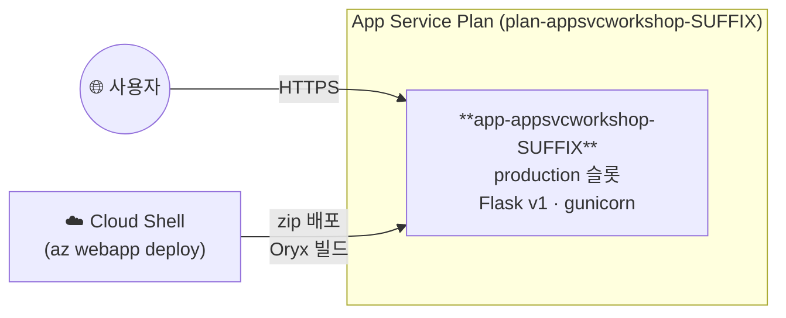

# 03. 코드 배포

> 🟢 **실행** = 직접 입력·수행 · 👁️ **예시** = 눈으로만(개념/발췌) · 📋 **예상 출력** = 비교용(입력 불필요) · 🖼️ **예상 화면** = 브라우저/포털 스크린샷 참고

---

## 목표

이 모듈에서는 Flask 애플리케이션(v1)을 zip 배포 방식으로 Azure App Service에 업로드하고 외부에서 접속합니다.

- Oryx 빌드(`SCM_DO_BUILD_DURING_DEPLOYMENT=true`)를 활성화하여 서버 측 pip install을 수행합니다.
- zip 아카이브를 생성하고 `az webapp deploy`로 프로덕션 슬롯에 배포합니다.
- `/health`·`/api/info` 엔드포인트로 배포 성공 여부를 검증합니다.
- 로그 스트림을 통해 실시간 요청·에러 로그를 확인합니다.

완성 후의 구조는 다음과 같습니다.



---

## 0단계 — (선택) 변수 재설정

> ⏭️ **02 모듈에서 이어서 같은 터미널로 진행 중이라면 이 단계는 건너뛰세요.**
> 새 터미널 세션을 열었거나 Cloud Shell이 재시작되어 변수가 사라진 경우에만 실행합니다.
> `SUFFIX` 는 **02 모듈에서 사용한 값과 동일하게** 입력하세요.

🟢 **실행**

```bash
SUFFIX=<이전에_메모한_값>
LOC=koreacentral
RG=rg-appsvcworkshop-$SUFFIX
PLAN=plan-appsvcworkshop-$SUFFIX
APP=app-appsvcworkshop-$SUFFIX
LAW=log-appsvcworkshop-$SUFFIX
APPI=appi-appsvcworkshop-$SUFFIX
APP_URL="https://$(az webapp show -g $RG -n $APP --query defaultHostName -o tsv)"
echo "APP_URL=$APP_URL"
```

📋 **예상 출력**

```
APP_URL=https://app-appsvcworkshop-<SUFFIX>.azurewebsites.net
```

---

## 1단계 — Oryx 빌드 설정

🟢 **실행**

```bash
az webapp config appsettings set -g $RG -n $APP \
  --settings SCM_DO_BUILD_DURING_DEPLOYMENT=true
```

> 👁️ **개념 — Oryx 빌드**
>
> `SCM_DO_BUILD_DURING_DEPLOYMENT=true`를 설정하면 Azure가 zip 안의 `requirements.txt`를 읽어 **서버 측 pip install**을 수행합니다.
> 빌드 완료 후 `app.py`의 `app` 객체를 **gunicorn**으로 자동 기동합니다.
> 첫 빌드는 패키지 다운로드 포함 **1–3분**, 이후 콜드스타트 추가 수십 초가 소요될 수 있습니다.

---

## 2단계 — zip 아카이브 생성 및 배포

🟢 **실행**

```bash
cd ~/ms-appservice-basic-workshop01/app
zip -r /tmp/app-v1.zip . -x "tests/*" -x "__pycache__/*" -x "*.pyc"
az webapp deploy -g $RG -n $APP --src-path /tmp/app-v1.zip --type zip --track-status
```

📋 **예상 출력** (배포 ID와 시각은 실행할 때마다 달라집니다)

```text
  adding: requirements.txt (deflated 1%)
  adding: app.py (deflated 49%)
Note: 'az webapp deploy' does not run build automation (dependency installation,
compilation, etc.) by default for Linux web apps. If your package is not pre-built,
set the app setting SCM_DO_BUILD_DURING_DEPLOYMENT=true to enable builds during deployment.
Initiating deployment
Deploying from local path: /tmp/app-v1.zip
Warming up Kudu before deployment.
Warmed up Kudu instance successfully.
Polling the status of sync deployment. Start Time: <배포 시작 시각> UTC
Status: Build successful. Time: 1(s)
Status: Site started successfully. Time: 16(s)
Deployment has completed successfully
You can visit your app at: http://app-appsvcworkshop-<SUFFIX>.azurewebsites.net
{
  "id": "/subscriptions/<subscription-id>/resourceGroups/rg-appsvcworkshop-<SUFFIX>/providers/Microsoft.Web/sites/app-appsvcworkshop-<SUFFIX>/deploymentStatus/<deployment-id>",
  "location": "Korea Central",
  "name": "<deployment-id>",
  "properties": {
    "deploymentId": "<deployment-id>",
    "errors": null,
    "failedInstancesLogs": null,
    "numberOfInstancesFailed": 0,
    "numberOfInstancesInProgress": 0,
    "numberOfInstancesSuccessful": 1,
    "status": "RuntimeSuccessful"
  },
  "resourceGroup": "rg-appsvcworkshop-<SUFFIX>",
  "type": "Microsoft.Web/sites/deploymentStatus"
}
```

> 👁️ `Build successful`, `Site started successfully`, `Deployment has completed successfully`, `"status": "RuntimeSuccessful"`이 표시되면 배포가 완료된 것입니다. 출력의 Note는 일반 안내이며, 1단계에서 `SCM_DO_BUILD_DURING_DEPLOYMENT=true`를 이미 설정했으므로 Oryx 빌드가 정상 실행됩니다.

> 👁️ **참고** — `-x "tests/*" -x "__pycache__/*" -x "*.pyc"` 옵션으로 테스트 파일과 캐시를 제외합니다.
> `tests/` 디렉터리가 포함되더라도 동작에는 영향이 없으나 zip 크기가 늘어납니다.

---

## 3단계 — 외부 접속 검증

🟢 **실행**

```bash
curl -s $APP_URL/health
curl -s $APP_URL/api/info | jq
```

📋 **예상 출력 — `/health`**

```json
{"status":"ok"}
```

📋 **예상 출력 — `/api/info`**

```json
{
  "version": "v1",
  "slot": "production",
  "instance": "..."
}
```

🖼️ **예상 화면** — 브라우저에서 `$APP_URL`을 열면 파란색 v1 페이지가 표시됩니다.

---

## 4단계 — 로그 스트림

🟢 **실행**

```bash
az webapp log config -g $RG -n $APP --application-logging filesystem --web-server-logging filesystem
az webapp log tail -g $RG -n $APP
# 다른 탭에서 curl $APP_URL/ 후 로그 확인, Ctrl+C로 종료
```

---

## 검증

🟢 **실행**

```bash
curl -s $APP_URL/api/info | jq
```

📋 **예상 출력**

```json
{
  "version": "v1",
  "slot": "production",
  "instance": "..."
}
```

`version`이 `v1`, `slot`이 `production`으로 확인되면 배포가 완료된 것입니다. `instance` 값은 이후 **슬롯 스왑**, **스케일아웃**, **트래픽 분산** 모듈에서 핵심 관찰 도구로 활용됩니다.

---

## 트러블슈팅

### (1) 배포 빌드 실패

`--track-status` 출력에서 `Failed` 또는 오류 메시지가 나타나면 배포 로그를 확인합니다.

```bash
az webapp log deployment show -g $RG -n $APP
```

`requirements.txt` 구문 오류 또는 패키지 이름 오타가 가장 흔한 원인입니다.

### (2) 502 게이트웨이 오류 / 콜드스타트

배포 직후 첫 요청에서 502가 발생하면 gunicorn 기동이 완료되지 않은 것입니다.
20–30초 후 재시도합니다. 로그 스트림에서 `Booting worker` 메시지를 확인하면 기동 완료입니다.

### (3) zip에 tests/ 포함

`-x "tests/*"` 옵션을 지정하지 않아도 서비스 동작에는 문제가 없습니다.
zip 크기가 다소 커질 뿐이며, Oryx 빌드는 `tests/`를 무시합니다.

---

이전 모듈: [02. 환경 준비](02-environment-setup.md) · 다음 모듈: [04. 앱 설정](04-app-settings.md)
