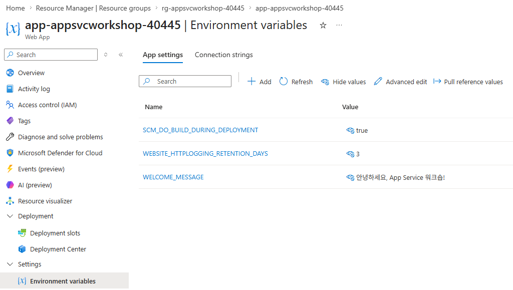

# 04. 앱 설정 · 환경변수

> 🟢 **실행** = 직접 입력·수행 · 👁️ **예시** = 눈으로만(개념/발췌) · 📋 **예상 출력** = 비교용(입력 불필요) · 🖼️ **예상 화면** = 브라우저/포털 스크린샷 참고

---

## 목표

이 모듈에서는 Azure App Service의 앱 설정(Application Settings)을 통해 환경변수를 주입하고, `message`와 `started_at` 값을 비교하여 동작 변경과 애플리케이션 재시작을 함께 확인합니다.

- `WELCOME_MESSAGE` 앱 설정을 추가하여 코드 수정 없이 홈 화면 메시지를 변경합니다.
- 앱 설정 변경 전후의 `message`와 `started_at`을 비교하여 메시지 반영과 재시작 여부를 검증합니다.
- **슬롯 고정 설정**(`--slot-settings`) 개념을 미리 파악하여 05 배포 슬롯 스왑에 대비합니다.

---

## 0단계 — (선택) 변수 재설정

> ⏭️ **03 모듈에서 이어서 같은 터미널로 진행 중이라면 이 단계는 건너뛰세요.**
> 새 터미널 세션을 열었거나 Cloud Shell이 재시작되어 변수가 사라진 경우에만 실행합니다.
> `SUFFIX` 는 **02 모듈에서 사용한 값과 동일하게** 입력하세요.

🟢 **실행**

```bash
# 이전 모듈의 리소스 변수를 복원하고 Web App URL을 다시 계산합니다.
SUFFIX=<이전에_메모한_값>
LOC=koreacentral
RG=rg-appsvcworkshop-$SUFFIX
PLAN=plan-appsvcworkshop-$SUFFIX
APP=app-appsvcworkshop-$SUFFIX
LAW=log-appsvcworkshop-$SUFFIX
APPI=appi-appsvcworkshop-$SUFFIX
APP_URL="https://$(az webapp show -g $RG -n $APP --query defaultHostName -o tsv)"
echo "APP_URL=$APP_URL"
```

📋 **예상 출력**

```
APP_URL=https://app-appsvcworkshop-<SUFFIX>.azurewebsites.net
```

---

## 1단계 — 변경 전 메시지와 프로세스 시작 시각 확인

🟢 **실행**

```bash
# 변경 전 기본 메시지와 프로세스 시작 시각 확인
curl -s $APP_URL/api/info | jq '{message, started_at}'
```

📋 **예상 출력**

```json
{
  "message": "App Service 워크숍에 오신 것을 환영합니다",
  "started_at": "2026-07-08T01:35:30+00:00"
}
```

> 👁️ 두 값을 메모해 둡니다. 설정 변경 후 `message`가 새 값으로 바뀌면 환경변수가 반영된 것이고, `started_at`이 달라지면 앱 프로세스가 재시작된 것입니다.

---

## 2단계 — 앱 설정 추가 (WELCOME_MESSAGE)

🟢 **실행**

```bash
# WELCOME_MESSAGE 앱 설정을 추가해 런타임 환경 변수를 변경합니다.
az webapp config appsettings set -g $RG -n $APP \
  --settings WELCOME_MESSAGE="안녕하세요, App Service 워크숍!"
```

> 👁️ CLI로 추가한 앱 설정은 **Azure Portal 관리 콘솔**에서도 확인할 수 있습니다.
> Web App 리소스에서 **Settings > Environment variables > App settings**로 이동한 뒤 **Refresh**를 선택하면 `WELCOME_MESSAGE`와 설정값이 표시됩니다.

🖼️ **예상 화면 — Azure Portal 앱 설정**



> 👁️ **개념 — 앱 설정과 환경변수**
>
> App Service의 **앱 설정**은 컨테이너 내부에서 **환경변수**로 주입됩니다.
> 코드를 수정하거나 재배포하지 않아도 동작을 변경할 수 있으며, Azure Portal·CLI·ARM 템플릿 모두에서 관리할 수 있습니다.
>
> **배포 슬롯(Deployment slot)**은 하나의 Web App 안에서 서로 다른 버전의 코드와 설정을 독립적으로 실행할 수 있는 별도 환경입니다. 현재 사용 중인 기본 환경은 **production 슬롯**이며, 05 모듈에서는 별도 URL을 가진 **staging 슬롯**을 추가하여 새 버전을 먼저 검증한 뒤 production과 교환합니다.
>
> | 설정 종류 | CLI 옵션 | 슬롯 스왑 시 동작 |
> |-----------|----------|-------------------|
> | 일반 설정 | `--settings` | 대상 슬롯으로 **함께 이동** |
> | 슬롯 고정 설정 | `--slot-settings` | 해당 슬롯에 **그대로 남음** |
>
> 슬롯 고정 설정(예: staging 전용 DB 연결 문자열)은 **05 배포 슬롯 스왑** 모듈에서 상세히 다룹니다.

---

## 3단계 — 반영 확인 및 재시작 관찰

> 👁️ **주의** — 설정 변경 직후 앱이 재시작됩니다. **30–60초** 후에 아래 명령을 실행하십시오.

🟢 **실행**

```bash
# 30–60초 후
curl -s $APP_URL/api/info | jq '{message, started_at}'
az webapp config appsettings list -g $RG -n $APP -o table
```

📋 **예상 출력 — `curl`**

```json
{
  "message": "안녕하세요, App Service 워크숍!",
  "started_at": "2026-07-08T01:36:07+00:00"
}
```

📋 **예상 출력 — `appsettings list`**

```
Name                            Value                               SlotSetting
------------------------------  ----------------------------------  -----------
SCM_DO_BUILD_DURING_DEPLOYMENT  true                                False
WELCOME_MESSAGE                 안녕하세요, App Service 워크숍!     False
```

> 👁️ **핵심 관찰**: `message`는 기본 문구에서 설정한 문구로 변경되고, `started_at`은 1단계에서 기록한 값과 달라져야 합니다. 이는 앱 설정이 환경변수로 반영되고 그 과정에서 앱 프로세스가 재시작되었음을 의미합니다. 이 `started_at` 관찰 기법은 11 모듈(자동 복구·재시작 관찰)에서 다시 활용됩니다.

🖼️ **예상 화면** — 브라우저에서 `$APP_URL`을 새로고침하면 홈 화면에 "안녕하세요, App Service 워크숍!" 메시지가 표시됩니다.

---

## 트러블슈팅

### (1) 메시지가 반영되지 않음

설정 변경 후 앱 재시작이 완료되기까지 30–60초가 소요됩니다.
`started_at`이 아직 변경되지 않았다면 대기 후 재시도합니다.
브라우저 캐시가 원인일 수도 있으므로 **강제 새로고침** (Windows: `Ctrl+F5`, macOS: `Cmd+Shift+R`)을 시도합니다.

### (2) 따옴표 이스케이프 오류

한글·공백·특수문자가 포함된 값은 반드시 **큰따옴표**로 감쌉니다.

```bash
# 올바른 예
--settings WELCOME_MESSAGE="안녕하세요, App Service 워크숍!"

# 잘못된 예 (공백·쉼표 미처리 — 오류 발생)
--settings WELCOME_MESSAGE=안녕하세요, App Service 워크숍!
```

### (3) `jq` 명령어를 찾을 수 없음

Cloud Shell에는 `jq`가 기본 설치되어 있습니다. 로컬 터미널 사용 시 `sudo apt-get install jq` (Ubuntu) 또는 `brew install jq` (macOS)로 설치합니다.

---

이전 모듈: [03. 코드 배포](03-deploy-code.md) · 다음 모듈: [05. 배포 슬롯 스왑](05-deployment-slots-swap.md)
