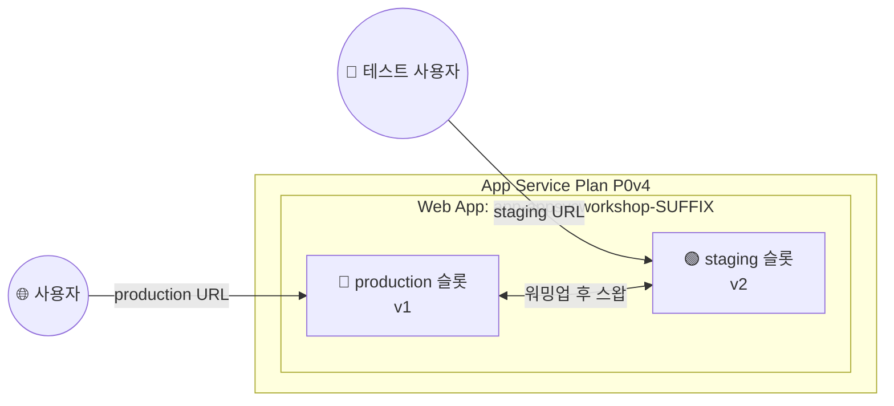
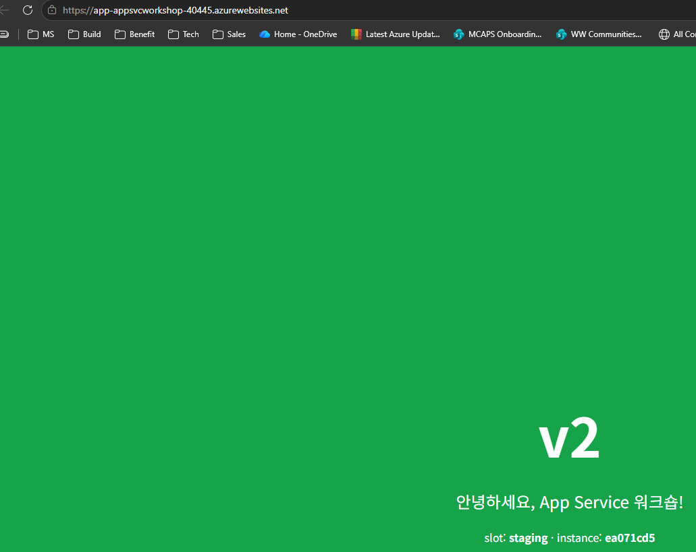

# 05. 배포 슬롯 · 무중단 스왑 · 롤백

> 🟢 **실행** = 직접 입력·수행 · 👁️ **예시** = 눈으로만(개념/발췌) · 📋 **예상 출력** = 비교용(입력 불필요) · 🖼️ **예상 화면** = 브라우저/포털 스크린샷 참고

---

## 목표

이 모듈에서는 Azure App Service **배포 슬롯(Deployment Slot)** 을 활용하여 코드를 스테이징 환경에 배포한 뒤, 프로덕션과 무중단으로 교체(스왑)하는 흐름과 즉각 롤백 방법을 실습합니다.

- 스테이징 슬롯을 생성하고 v2(초록 `#16a34a`)를 배포합니다.
- `az webapp deployment slot swap` 명령으로 프로덕션 ↔ 스테이징을 무중단 전환합니다.
- 문제 발견 가정 후 **재스왑 한 번**으로 v1(파랑 `#2563eb`)을 즉시 복원합니다.
- 모듈 종료 상태: **production = v1, staging = v2** (06 모듈에서 이 v2를 카나리로 승격합니다).

완성 후의 구조는 다음과 같습니다.



---

## 👁️ 배포 슬롯 이해

배포 슬롯은 하나의 Web App 안에 만드는 **별도의 실행 환경**입니다. 각 슬롯은 고유한 호스트 이름을 가진 실제 동작 중인 앱이므로, 새 버전을 production에 바로 배포하지 않고 staging에서 먼저 테스트할 수 있습니다.

| 구분 | production 슬롯 | staging 슬롯 |
|---|---|---|
| **역할** | 실제 사용자 트래픽을 처리하는 기본 슬롯 | 새 버전을 배포하고 검증하는 비프로덕션 슬롯 |
| **URL** | `https://app-appsvcworkshop-<SUFFIX>.azurewebsites.net` | `https://app-appsvcworkshop-<SUFFIX>-staging.azurewebsites.net` |
| **이 모듈의 최초 버전** | v1(파랑) | 생성 후 v2(초록) 배포 |

**슬롯이 공유하는 것**

- 같은 App Service Plan의 CPU·메모리와 인스턴스 수
- Plan의 최대 컴퓨트 용량과 과금
- 슬롯 자체에 대한 별도 Plan 비용은 없지만, 모든 슬롯이 같은 컴퓨트 용량을 나누어 사용

**슬롯별로 구분되는 것**

- 배포된 애플리케이션 코드와 고유 URL
- 앱 설정과 연결 문자열(스왑 가능 설정 또는 슬롯 고정 설정으로 구성)
- 배포 상태와 실행 프로세스

**스왑 시 동작**

App Service는 staging을 먼저 워밍업한 뒤 production과 라우팅을 전환합니다. 일반 앱 설정과 코드는 함께 이동하지만, `--slot-settings`로 지정한 슬롯 고정 설정은 원래 슬롯에 남습니다. 스왑 후 staging에는 이전 production 버전이 보존되므로 문제가 있으면 같은 명령으로 즉시 되돌릴 수 있습니다.

---

## 0단계 — (선택) 변수 재설정

> ⏭️ **04 모듈에서 이어서 같은 터미널로 진행 중이라면 이 단계는 건너뛰세요.**
> 새 터미널 세션을 열었거나 Cloud Shell이 재시작되어 변수가 사라진 경우에만 실행합니다.
> `SUFFIX` 는 **02 모듈에서 사용한 값과 동일하게** 입력하세요.

🟢 **실행**

```bash
# 이전 모듈의 리소스 변수를 복원하고 production과 staging URL을 구성합니다.
SUFFIX=<이전에_메모한_값>
LOC=koreacentral
RG=rg-appsvcworkshop-$SUFFIX
PLAN=plan-appsvcworkshop-$SUFFIX
APP=app-appsvcworkshop-$SUFFIX
LAW=log-appsvcworkshop-$SUFFIX
APPI=appi-appsvcworkshop-$SUFFIX
APP_URL="https://$(az webapp show -g $RG -n $APP --query defaultHostName -o tsv)"
echo "APP_URL=$APP_URL"
```

📋 **예상 출력**

```
APP_URL=https://app-appsvcworkshop-<SUFFIX>.azurewebsites.net
```

---

## 1단계 — 스테이징 슬롯 생성

🟢 **실행**

```bash
# production과 동일한 앱 구성을 가진 staging 배포 슬롯을 생성합니다.
az webapp deployment slot create -g $RG -n $APP --slot staging --configuration-source $APP
```

> 👁️ **개념 — `--configuration-source`**
>
> `--configuration-source $APP`를 지정하면 프로덕션 슬롯의 **앱 설정을 그대로 복제**하여 스테이징 슬롯을 초기화합니다. 이후 슬롯 고정 설정(`--slot-settings`)을 추가하면 스왑 후에도 해당 슬롯에만 남는 설정(예: staging 전용 DB 연결 문자열)을 분리할 수 있습니다.

---

## 2단계 — v2 소스 준비 및 스테이징 배포

🟢 **실행**

```bash
# 소스 버전을 v2로 바꾸어 배포 패키지를 만든 뒤 로컬 소스는 v1로 복원합니다.
# v2 패키지를 staging 슬롯에 배포하고 슬롯 응답을 확인합니다.
cd ~/ms-appservice-basic-workshop01/app
sed -i 's#^VERSION = "v1"#VERSION = "v2"#' app.py
grep '^VERSION' app.py   # VERSION = "v2" 확인(치환 검증 — 미치환 방지)
zip -r /tmp/app-v2.zip . -x "tests/*" -x "__pycache__/*" -x "*.pyc"
git checkout -- app.py   # 로컬 소스는 v1로 원복

az webapp deploy -g $RG -n $APP --slot staging --src-path /tmp/app-v2.zip --type zip --track-status

STG_URL="https://$(az webapp deployment slot list -g $RG -n $APP \
  --query "[?name=='staging'].defaultHostName | [0]" -o tsv)"
curl -s $STG_URL/api/info | jq '{version, slot}'
```

> 👁️ **sed 구분자 `#` 사용 이유** — 기본 구분자 `/`는 파일 경로와 충돌할 수 있습니다. `VERSION` 값에 `/`가 없더라도 `#`을 구분자로 사용하는 것이 안전한 관례입니다. `grep '^VERSION' app.py`는 치환이 실제로 적용되었는지 확인하는 안전 단계로, `VERSION = "v2"`가 출력되어야 합니다.

📋 **예상 출력**

```json
{
  "version": "v2",
  "slot": "staging"
}
```

🖼️ **예상 화면** — 브라우저에서 `$STG_URL`을 열면 **초록(`#16a34a`)** 배경의 v2 화면이, `$APP_URL`을 열면 **파랑(`#2563eb`)** 배경의 v1 화면이 표시됩니다.

---

## 3단계 — 스왑: production ← v2

> 👁️ **스왑 동작 원리**
>
> `az webapp deployment slot swap`은 코드를 재배포하지 않고 **라우팅을 교환**합니다. 전환 전 플랫폼이 대상 슬롯의 모든 인스턴스에 워밍업 요청을 보내 앱 기동을 확인한 뒤 전환하므로 다운타임이 없습니다. 롤백은 재스왑 한 번이면 충분합니다.
>
> ⚠️ **기본 워밍업은 헬스 체크가 아닙니다.** 기본 동작은 루트 경로(`/`)에 요청을 보내고 **모든 HTTP 응답 코드(500 포함)를 유효로 간주**합니다. 실제 상태 검증을 원하면 아래 앱 설정으로 워밍업 경로와 허용 상태 코드를 지정하십시오([공식 문서](https://learn.microsoft.com/azure/app-service/deploy-staging-slots#specify-custom-warm-up)).
>
> ```bash
> # (선택) 워밍업이 /health에서 200을 반환해야만 스왑이 진행되도록 강제
> az webapp config appsettings set -g $RG -n $APP \
>   --settings WEBSITE_SWAP_WARMUP_PING_PATH=/health WEBSITE_SWAP_WARMUP_PING_STATUSES=200
> ```

🟢 **실행**

```bash
# staging의 v2를 production으로 스왑하고 두 슬롯의 버전을 확인합니다.
az webapp deployment slot swap -g $RG -n $APP --slot staging --target-slot production
curl -s $APP_URL/api/info | jq -r .version    # v2 — 무중단 전환
curl -s $STG_URL/api/info | jq -r .version    # v1 — 이전 버전이 슬롯에 보존
```

📋 **예상 출력**

```
v2
v1
```

🖼️ **예상 화면** — 브라우저에서 production URL인 `$APP_URL`을 새로고침하면 초록색 v2 페이지가 표시됩니다.



---

## 4단계 — 롤백: 재스왑으로 v1 즉시 복원

> 👁️ 운영 중 문제가 발견되면 아래처럼 재스왑 한 번으로 이전 버전을 즉시 프로덕션에 복원할 수 있습니다. 별도의 재배포가 필요 없는 이유는 v1 바이너리가 이미 staging 슬롯에 보존되어 있기 때문입니다.

🟢 **실행**

```bash
# 문제 발견 가정 → 재스왑 = 즉시 롤백
az webapp deployment slot swap -g $RG -n $APP --slot staging --target-slot production
curl -s $APP_URL/api/info | jq -r .version    # v1
```

📋 **예상 출력**

```
v1
```

> 👁️ 롤백 완료 후 종료 상태: **production = v1(파랑 `#2563eb`)**, **staging = v2(초록 `#16a34a`)**. 06 모듈에서 이 v2를 카나리로 승격합니다.

---

## 개념 정리

| 개념 | 설명 |
|---|---|
| **배포 슬롯** | 같은 App Service Plan의 컴퓨트를 공유하면서 고유 URL·코드·설정을 갖는 실행 중인 앱 환경 |
| **슬롯 스왑** | 코드 재배포 없이 production ↔ staging 라우팅을 교환하는 무중단 전환; 롤백은 재스왑 한 번 |
| **sticky 설정 (슬롯 고정 설정)** | `--slot-settings`로 지정한 앱 설정은 스왑 후에도 해당 슬롯에 남음(예: staging 전용 DB 연결 문자열) |
| **워밍업** | 스왑 전 대상 슬롯이 HTTP 200 헬스 체크를 통과할 때까지 플랫폼이 대기 — 다운타임 없음 |
| **즉시 롤백** | 스왑 후 이전 버전이 반대 슬롯에 보존되므로 재스왑 한 번으로 즉각 복원 가능 |

---

## 트러블슈팅

### (1) sed 치환이 적용되지 않음

`grep '^VERSION' app.py` 출력이 `VERSION = "v1"` 그대로라면 패턴이 일치하지 않은 것입니다. 파일의 줄 끝 문자(CRLF)나 인코딩(UTF-8 BOM)을 확인하고, 패턴을 재조정합니다. `cat -A app.py | grep VERSION` 으로 숨김 문자를 확인할 수 있습니다.

### (2) 슬롯 콜드스타트 — curl 응답이 느리거나 502 오류

스테이징 슬롯을 처음 배포한 후에는 콜드스타트가 발생할 수 있습니다. 배포 완료 후 **30–60초** 대기하거나 `curl`을 재시도합니다.

### (3) 스왑 지연 — 명령이 완료되지 않음

App Service는 스왑 전 새 슬롯이 **HTTP 200**을 반환할 때까지 워밍업을 기다립니다. 앱 시작 시간이 긴 경우 수 분이 소요될 수 있습니다. Portal의 **배포 슬롯 → 슬롯 교환** 화면에서 진행 상태를 모니터링합니다.

---

이전 모듈: [04. 앱 설정·환경변수](04-app-settings.md) · 다음 모듈: [06. 트래픽 분할·카나리](06-traffic-split-canary.md)
