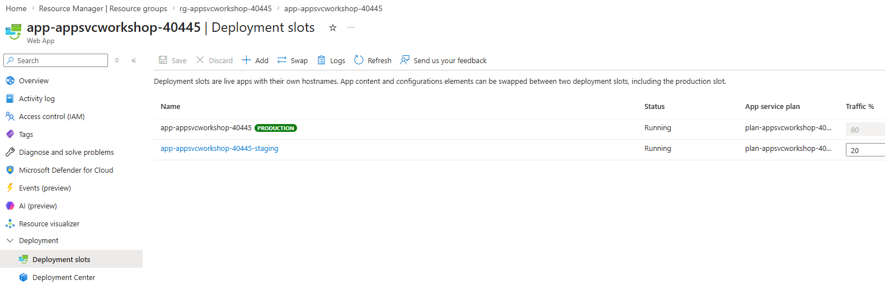

# 06. 트래픽 분할 · 카나리 배포 · 승격

> 🟢 **실행** = 직접 입력·수행 · 👁️ **예시** = 눈으로만(개념/발췌) · 📋 **예상 출력** = 비교용(입력 불필요) · 🖼️ **예상 화면** = 브라우저/포털 스크린샷 참고

---

## 목표

이 모듈에서는 Azure App Service **트래픽 라우팅(Traffic Routing)** 기능을 이용해 스테이징 슬롯에 트래픽의 일부(20%)를 분기하는 카나리 배포를 실습합니다.

- 트래픽의 20%를 staging(v2)으로 분기하고 분포를 통계적으로 측정합니다.
- `x-ms-routing-name` 쿼리 파라미터로 특정 슬롯을 강제 라우팅합니다.
- 카나리 검증 완료 후 전체 트래픽을 v2로 전환(승격)합니다.
- 모듈 종료 상태: **production = v2, staging = v1, 라우팅 0%** (07 모듈 이후 이 상태가 유지됩니다).

---

## 0단계 — (선택) 변수 재설정

> ⏭️ **05 모듈에서 이어서 같은 터미널로 진행 중이라면 이 단계는 건너뛰세요.**
> 새 터미널 세션을 열었거나 Cloud Shell이 재시작되어 변수가 사라진 경우에만 실행합니다.
> `SUFFIX` 는 **02 모듈에서 사용한 값과 동일하게** 입력하세요.

🟢 **실행**

```bash
# 이전 모듈의 리소스 변수를 복원하고 슬롯 URL을 구성합니다.
SUFFIX=<이전에_메모한_값>
LOC=koreacentral
RG=rg-appsvcworkshop-$SUFFIX
PLAN=plan-appsvcworkshop-$SUFFIX
APP=app-appsvcworkshop-$SUFFIX
LAW=log-appsvcworkshop-$SUFFIX
APPI=appi-appsvcworkshop-$SUFFIX
APP_URL="https://$(az webapp show -g $RG -n $APP --query defaultHostName -o tsv)"
STG_URL="https://$(az webapp deployment slot list -g $RG -n $APP \
  --query "[?name=='staging'].defaultHostName | [0]" -o tsv)"
echo "APP_URL=$APP_URL"
echo "STG_URL=$STG_URL"
```

📋 **예상 출력**

```
APP_URL=https://app-appsvcworkshop-<SUFFIX>.azurewebsites.net
STG_URL=https://app-appsvcworkshop-<SUFFIX>-staging.azurewebsites.net
```

---

## 1단계 — 트래픽 20% 분기 설정 및 분포 측정

> 👁️ **진입 상태** — production = v1(파랑 `#2563eb`), staging = v2(초록 `#16a34a`). 이 상태는 05 모듈에서 만들어졌습니다.

🟢 **실행**

```bash
# staging 슬롯으로 20%를 분기하는 규칙을 만들고, show로 현재 적용된 비율을 즉시 읽어옵니다.
az webapp traffic-routing set -g $RG -n $APP --distribution staging=20
az webapp traffic-routing show -g $RG -n $APP -o table

# 쿠키를 저장하지 않는 요청을 100번 보내 슬롯 고정을 피합니다.
# 각 응답에서 version만 추출한 뒤 정렬하고, 같은 값끼리 묶어 v1/v2 개수를 셉니다.
for i in $(seq 1 100); do curl -s $APP_URL/api/info | jq -r .version; done | sort | uniq -c
```

📋 **예상 출력** (`traffic-routing set`)

```json
[
  {
    "actionHostName": "app-appsvcworkshop-<SUFFIX>-staging.azurewebsites.net",
    "changeDecisionCallbackUrl": null,
    "changeIntervalInMinutes": null,
    "changeStep": null,
    "maxReroutePercentage": null,
    "minReroutePercentage": null,
    "name": "staging",
    "reroutePercentage": 20.0
  }
]
```

📋 **예상 출력** (`traffic-routing show`)

```
ActionHostName                                          Name     ReroutePercentage
------------------------------------------------------  -------  -------------------
app-appsvcworkshop-<SUFFIX>-staging.azurewebsites.net  staging  20.0
```

📋 **예상 출력** (분포 측정)

```
     79 v1
     21 v2
```

> 👁️ **확률적 분배 — 오차는 정상입니다.** Azure 트래픽 라우팅은 무작위로 분배하므로 100회 요청에서 ±10 수준의 오차가 발생할 수 있습니다. 더 많은 요청을 보낼수록 이론값(80/20)에 수렴합니다.
>
> 결과가 아래처럼 반대로 나타난다면 05 모듈의 롤백을 수행하지 않아 **production = v2, staging = v1**인 상태입니다. `20%`는 특정 버전이 아니라 **staging 슬롯으로 보내는 비율**이므로 staging에 있는 v1이 약 20%, production의 v2가 약 80%로 측정됩니다.
>
> ```
>      19 v1
>      81 v2
> ```
>
> 이 모듈의 이후 단계와 종료 상태를 맞추려면 라우팅을 지운 뒤 한 번 스왑하여 **production = v1, staging = v2**로 복원하고 20% 분기를 다시 설정합니다.
>
> ```bash
> az webapp traffic-routing clear -g $RG -n $APP
> az webapp deployment slot swap -g $RG -n $APP --slot staging --target-slot production
> az webapp traffic-routing set -g $RG -n $APP --distribution staging=20
> ```

> 👁️ **쿠키 sticky 동작 — curl과 브라우저가 다른 이유**
>
> Azure 트래픽 라우팅은 첫 번째 응답에 `x-ms-routing-name` **쿠키**를 내려보냅니다. 브라우저는 이 쿠키를 저장하므로 한 번 배정된 슬롯에 계속 연결됩니다(sticky). 위 `curl` 명령은 쿠키를 저장하지 않으므로 매 요청마다 새로 분배됩니다. 브라우저에서 버전이 바뀌지 않는 것은 정상 동작입니다.

> 👁️ CLI로 변경한 트래픽 분기 설정은 **Azure Portal 관리 콘솔**에서도 확인할 수 있습니다.
> Web App 리소스에서 **Deployment > Deployment slots**로 이동한 뒤 **Refresh**를 선택하면 **Traffic %** 열에 production `80`, staging `20`이 표시됩니다.

🖼️ **예상 화면 — Azure Portal 배포 슬롯별 트래픽 비율**



---

## 2단계 — 강제 라우팅으로 특정 슬롯 확인

> 👁️ 쿼리 파라미터 `x-ms-routing-name`을 이용하면 쿠키 없이도 특정 슬롯을 지정할 수 있습니다. 운영자가 staging 배포를 미리 검증하거나 사용자에게 선택적으로 새 버전을 노출할 때 활용합니다.

🟢 **실행**

```bash
# 라우팅 쿼리 파라미터로 staging 또는 production 슬롯을 강제 선택해 각각의 버전을 확인합니다.
curl -s "$APP_URL/?x-ms-routing-name=staging" | grep -o 'v[0-9]'   # v2 (staging 강제)
curl -s "$APP_URL/?x-ms-routing-name=self" | grep -o 'v[0-9]'      # v1 (production 강제)
```

📋 **예상 출력**

```
v2
v1
```

---

## 3단계 — 카나리 승격: 전체 트래픽을 v2로 전환

> 👁️ 카나리 기간에 오류율·응답 시간 등의 지표가 정상 범위에 있음을 확인한 후 아래 명령으로 전체 전환합니다.

> 👁️ **스왑 전 반드시 `clear`를 실행하십시오.** `clear` 없이 스왑하면 라우팅 비율(20%)이 스왑 후에도 새 production에 그대로 적용되어 트래픽의 20%가 v1(구 버전)으로 계속 분기됩니다.

🟢 **실행**

```bash
# traffic-routing clear로 분기 규칙을 지워 전체 트래픽을 다시 production 100%로 돌립니다.
# 그다음 staging의 v2를 production으로 승격하고 마지막 요청으로 최종 버전을 확인합니다.
az webapp traffic-routing clear -g $RG -n $APP
az webapp deployment slot swap -g $RG -n $APP --slot staging --target-slot production
curl -s $APP_URL/api/info | jq -r .version   # v2 — 승격 완료
```

📋 **예상 출력**

```
v2
```

> 👁️ **종료 상태** — production = v2(초록 `#16a34a`), staging = v1(파랑 `#2563eb`), 라우팅 0%. 07 모듈 이후 이 상태가 유지됩니다.

> 👁️ **ACA 대응 패턴** — Azure Container Apps는 **리비전 가중치**로 같은 카나리 패턴을 구현하고, App Service는 **슬롯 라우팅**을 사용합니다. 개념(일부 트래픽 분기 → 검증 → 전체 전환)은 동일합니다.

---

## 트러블슈팅

### (1) 분포가 0/100 — v2 요청이 전혀 없거나 v1 요청이 전혀 없음

`traffic-routing set` 직후 전파에 수십 초가 소요될 수 있습니다. `az webapp traffic-routing show -g $RG -n $APP -o table`로 설정이 반영되었는지 확인한 뒤 30초 대기 후 재시도합니다.

### (2) 브라우저에서 버전 비율이 바뀌지 않음

`x-ms-routing-name` 쿠키가 sticky로 동작하기 때문입니다. 처음 배정된 슬롯에 계속 연결되는 것이 정상입니다. 시크릿 창을 열거나 쿠키를 삭제하면 재분배됩니다.

### (3) 스왑 후에도 일부 트래픽이 구 버전으로 라우팅됨

`traffic-routing clear`를 실행하지 않고 스왑한 경우입니다. 라우팅 비율이 스왑 후에도 유지되므로, `az webapp traffic-routing clear -g $RG -n $APP`를 즉시 실행하십시오.

---

이전 모듈: [05. 배포 슬롯·무중단 스왑·롤백](05-deployment-slots-swap.md) · 다음 모듈: [07. Autoscale(CPU 규칙 기반 확장)](07-autoscale.md)
