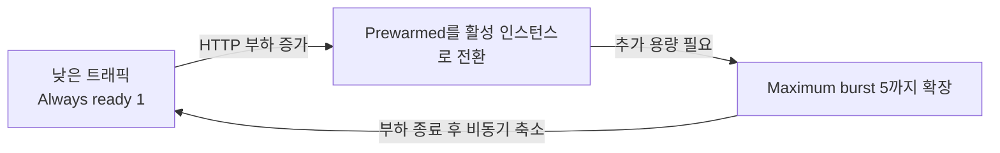

# 07. 자동 스케일(Automatic Scaling · 부하 확장/축소)

> 🟢 **실행** = 직접 입력·수행 · 👁️ **예시** = 눈으로만(개념/발췌) · 📋 **예상 출력** = 비교용(입력 불필요) · 🖼️ **예상 화면** = 브라우저/포털 스크린샷 참고

---

## 목표

이 모듈에서는 Azure App Service **Automatic Scaling**을 활성화하고, production 앱에 HTTP 부하를 보내 인스턴스가 확장되는 흐름을 `InstanceCount` 메트릭으로 관찰합니다.

- Automatic Scaling과 규칙 기반 Azure Monitor Autoscale의 차이를 이해합니다.
- Maximum burst 5, Always ready 1, Prewarmed 1을 설정합니다.
- `hey` 부하 전후의 `InstanceCount`를 비교합니다.
- 부하 종료 후 scale-in이 비동기로 진행되는 특성을 이해합니다.
- 모듈 종료 상태: **Automatic Scaling 활성, Always ready 1, Prewarmed 1, Maximum burst 5, production = v2**.

---

## 0단계 — (선택) 변수 재설정

> ⏭️ **06 모듈에서 이어서 같은 터미널로 진행 중이라면 이 단계는 건너뛰세요.**
> 새 터미널 세션을 열었거나 Cloud Shell이 재시작되어 변수가 사라진 경우에만 실행합니다.
> `SUFFIX`는 **02 모듈에서 사용한 값과 동일하게** 입력하세요.

🟢 **실행**

```bash
# 이전 모듈의 리소스 변수를 복원하고 Web App URL을 조회합니다.
SUFFIX=<이전에_메모한_값>
LOC=koreacentral
RG=rg-appsvcworkshop-$SUFFIX
PLAN=plan-appsvcworkshop-$SUFFIX
APP=app-appsvcworkshop-$SUFFIX
LAW=log-appsvcworkshop-$SUFFIX
APPI=appi-appsvcworkshop-$SUFFIX
APP_URL="https://$(az webapp show -g $RG -n $APP --query defaultHostName -o tsv)"
echo "APP_URL=$APP_URL"
```

📋 **예상 출력**

```text
APP_URL=https://app-appsvcworkshop-<SUFFIX>.azurewebsites.net
```

---

## 👁️ Automatic Scaling과 규칙 기반 Autoscale 비교

Azure App Service에서 수평 스케일을 구현하는 대표적인 두 방식은 다음과 같습니다.

| 비교 항목 | **Automatic Scaling** | **규칙 기반 Azure Monitor Autoscale** |
|---|---|---|
| 플랜 요건 | Premium v2–v4 | Standard 이상 |
| 스케일 트리거 | HTTP 요청 부하를 플랫폼이 판단 | CPU·메모리·큐 등의 메트릭 규칙 |
| 설정 방식 | 최솟값·최댓값 중심 | 임계값·증감량·쿨다운 직접 설정 |
| 콜드스타트 완화 | Prewarmed 버퍼 사용 | 새 인스턴스 워밍 시간 발생 |

> 👁️ Automatic Scaling은 HTTP 트래픽을 기준으로 동작하며 배포 슬롯 트래픽을 지원하지 않습니다. 이 모듈에서는 staging URL이 아니라 production URL인 `$APP_URL`에 부하를 보냅니다.

## 👁️ Always ready, Prewarmed, Maximum burst

| 설정 | 역할 | 이 모듈의 값 |
|---|---|---|
| Always ready | 트래픽이 없어도 유지할 앱의 최소 인스턴스 수 | 1 |
| Prewarmed | 다음 scale-out에 빠르게 투입하기 위한 워밍 버퍼 | 1 |
| Maximum burst | HTTP 부하에 따라 확장할 수 있는 최대 인스턴스 수 | 5 |



Always ready 값을 높이면 기본 처리 용량과 비용이 함께 증가합니다. Prewarmed 인스턴스는 HTTP 부하가 증가할 때 처음부터 새 인스턴스를 준비하는 지연을 줄이는 워밍 버퍼이며, 실제로 할당된 시간에는 과금됩니다.

---

## 1단계 — Automatic Scaling 활성화

> 👁️ **진입 상태** — production = v2(초록 `#16a34a`), staging = v1(파랑 `#2563eb`), 라우팅 0%. 이 상태는 06 모듈에서 만들어졌습니다.

🟢 **실행**

```bash
# P0v4 Plan과 Web App에 Automatic Scaling 설정을 적용합니다.
PLAN_ID=$(az appservice plan show -g $RG -n $PLAN --query id -o tsv)
APP_ID=$(az webapp show -g $RG -n $APP --query id -o tsv)

az rest --method patch \
  --uri "${PLAN_ID}?api-version=2024-11-01" \
  --body '{"sku":{"name":"P0v4","tier":"PremiumV4","size":"P0v4","family":"Pv4","capacity":1},"properties":{"elasticScaleEnabled":true,"maximumElasticWorkerCount":5}}' \
  --output none &&
az rest --method patch \
  --uri "${APP_ID}/config/web?api-version=2024-11-01" \
  --body '{"properties":{"minimumElasticInstanceCount":1,"preWarmedInstanceCount":1}}' \
  --output none &&
az webapp config appsettings delete -g "$RG" -n "$APP" \
  --setting-names STARTUP_DELAY_SECONDS --output none &&
echo "Automatic Scaling 설정 완료"
```

> ⚠️ 오류가 출력되거나 완료 메시지가 보이지 않으면 다음 단계로 진행하지 말고 `$RG`, `$PLAN`, `$APP`와 오류 메시지를 확인한 뒤 다시 실행합니다.

🟢 **실행 — 앱 준비 상태 확인**

```bash
# 설정 변경으로 앱이 재시작된 경우 /health가 정상화될 때까지 기다립니다.
for attempt in $(seq 1 18); do
  if curl -fsS --max-time 10 "$APP_URL/health" | jq -e '.status == "ok"'; then
    break
  fi
  if [ "$attempt" -eq 18 ]; then
    echo "Automatic Scaling 설정 후 /health 확인 실패" >&2
    false
  fi
  sleep 5
done
```

🟢 **실행 — 설정값 확인**

```bash
# Plan과 Web App에 적용된 Automatic Scaling 값을 확인합니다.
az rest --method get \
  --uri "${PLAN_ID}?api-version=2024-11-01" \
  --query "properties.{automaticScaling:elasticScaleEnabled,maximumBurst:maximumElasticWorkerCount}"

az rest --method get \
  --uri "${APP_ID}/config/web?api-version=2024-11-01" \
  --query "properties.{alwaysReady:minimumElasticInstanceCount,prewarmed:preWarmedInstanceCount}"
```

📋 **예상 출력**

```json
{
  "automaticScaling": true,
  "maximumBurst": 5
}
{
  "alwaysReady": 1,
  "prewarmed": 1
}
```

> 👁️ Azure Portal의 Web App에서 **App Service plan > Scale out**로 이동하면 **Scale out method = Automatic**, **Maximum burst = 5**, **Always ready instances = 1**을 확인할 수 있습니다. Prewarmed 값은 위 CLI 조회로 확인합니다.

🖼️ **예상 화면 — Azure Portal Automatic Scaling 설정**


> 👁️ P0v4에서 ARM REST API를 사용하는 이유: Azure CLI 2.87.0의 `az appservice plan update --elastic-scale`과 `az webapp update --minimum-elastic-instance-count`에는 Premium v2/v3만 허용하는 이전 SKU 검증 로직이 남아 있습니다. `az rest`는 같은 공식 ARM 속성을 직접 설정하여 이 CLI 제한을 우회합니다.

---

## 2단계 — hey 부하 도구 설치

> 👁️ Cloud Shell에는 Go가 사전 설치되어 있으므로 `go install`로 `hey`를 빌드합니다.

🟢 **실행**

```bash
# 동시 HTTP 요청 부하를 만들 hey 도구를 설치합니다.
go install github.com/rakyll/hey@latest
export PATH=$HOME/go/bin:$PATH
hey 2>&1 | head -1
```

📋 **예상 출력**

```text
Usage: hey [options...] <url>
```

---

## 3단계 — 부하 전 인스턴스 기준값 확인

🟢 **실행**

```bash
# 최근 10분의 Automatic Scaling 인스턴스 수를 확인합니다.
az monitor metrics list \
  --resource "$APP_ID" \
  --metric InstanceCount \
  --interval PT1M \
  --aggregation Average \
  --start-time "$(date -u -d '10 minutes ago' +%Y-%m-%dT%H:%M:%SZ)" \
  --query "value[0].timeseries[0].data[?average != null].{time:timeStamp,count:average}" \
  -o table
```

> 👁️ 부하 전 최신 값은 보통 `1`입니다. Azure Monitor의 1분 집계와 수집 지연 때문에 최신 분의 행이 아직 없을 수 있습니다.

---

## 4단계 — HTTP 부하로 scale-out 유도

🟢 **실행**

```bash
# 180초 동안 production API에 HTTP 부하를 보냅니다.
hey -z 180s -c 100 -q 10 "$APP_URL/api/info"
```

> 👁️ `-z 180s`는 실행 시간, `-c 100`은 최대 동시 worker 수, `-q 10`은 worker당 초당 요청 수입니다.

---

## 5단계 — scale-out 메트릭 확인

🟢 **실행**

```bash
# 부하가 포함된 최근 10분의 인스턴스 수 변화를 조회합니다.
az monitor metrics list \
  --resource "$APP_ID" \
  --metric InstanceCount \
  --interval PT1M \
  --aggregation Average \
  --start-time "$(date -u -d '10 minutes ago' +%Y-%m-%dT%H:%M:%SZ)" \
  --query "value[0].timeseries[0].data[?average != null].{time:timeStamp,count:average}" \
  -o table
```

> 👁️ `count`가 1보다 큰 행이 있으면 부하 중 scale-out된 것입니다. 이 값은 1분 구간의 Average이므로 `3`이 정확히 같은 시점의 인스턴스 3개를 뜻하지는 않습니다. Azure Portal에서는 **Automatic Scaling Instance Count**라는 이름으로 같은 메트릭을 확인할 수 있습니다.

---

## 6단계 — scale-in 흐름 관찰

🟢 **실행**

```bash
# 부하 종료 후 60초 간격으로 최대 5회 인스턴스 수를 확인합니다.
for attempt in $(seq 1 5); do
  echo "scale-in 관찰 ${attempt}/5"
  az monitor metrics list \
    --resource "$APP_ID" \
    --metric InstanceCount \
    --interval PT1M \
    --aggregation Average \
    --start-time "$(date -u -d '10 minutes ago' +%Y-%m-%dT%H:%M:%SZ)" \
    --query "value[0].timeseries[0].data[?average != null].{time:timeStamp,count:average}" \
    -o table
  if [ "$attempt" -lt 5 ]; then
    sleep 60
  fi
done
```

> 👁️ Automatic Scaling의 축소 판단은 보통 부하 종료 후 5~10분 이후부터 시작됩니다. 이 반복 안에 최신 값이 `1`로 내려오면 scale-in을 관찰한 것입니다. 아직 2 이상이어도 설정 실패가 아니며 다음 모듈로 진행할 수 있습니다.

---

## 트러블슈팅

### 인스턴스가 확장되지 않음

- 부하 URL이 staging `$STG_URL`이 아니라 production `$APP_URL`인지 확인합니다.
- Plan의 `automaticScaling`이 `true`, `maximumBurst`가 `5`인지 확인합니다.
- 앱의 `alwaysReady`와 `prewarmed`가 각각 `1`인지 확인합니다.
- Azure Monitor의 1분 집계와 수집 지연을 고려해 부하 종료 후 다시 조회합니다.

### hey 설치 실패

```bash
go install github.com/rakyll/hey@latest
export PATH=$HOME/go/bin:$PATH
command -v hey
```

### Premium V2/V3 SKU만 지원한다는 오류

P0v4가 지원되지 않는 것이 아니라 Azure CLI 2.87.0의 이전 SKU 검증 로직 때문에 발생합니다. 이 문서의 `az rest` 명령을 사용하고 `az appservice plan update --elastic-scale`과 `az webapp update --minimum-elastic-instance-count`는 실행하지 않습니다.

---

이전 모듈: [06. 트래픽 분할 · 카나리 배포 · 승격](06-traffic-split-canary.md) · 선택 모듈: [09. Prewarmed A/B 실험](09-prewarmed-ab.md) · 다음 코어 모듈: [08. 관찰 가능성](08-observability.md)
