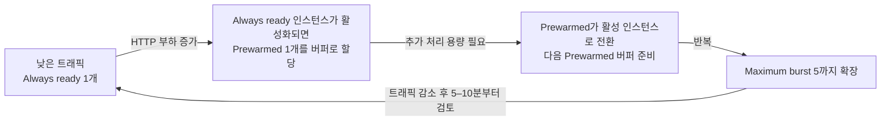

# 07. 자동 스케일(Automatic Scaling · 부하 확장/축소)

> 🟢 **실행** = 직접 입력·수행 · 👁️ **예시** = 눈으로만(개념/발췌) · 📋 **예상 출력** = 비교용(입력 불필요)

---

## 목표

이 모듈에서는 Azure App Service **Automatic scaling**(탄력 스케일)을 활성화하고, `hey` 부하 도구로 같은 앱에 순차적인 HTTP A/B 시험을 실행해 `Prewarmed instances`가 scale-out 지연을 얼마나 줄이는지 관찰합니다. 이후 부하가 사라진 뒤 다시 단일 인스턴스로 축소(scale-in)되는 기준 상태까지 확인합니다.

- App Service 플랜을 Elastic scale 모드로 전환하고 최대 5 인스턴스로 설정합니다.
- `STARTUP_DELAY_SECONDS=20`으로 앱 시작 지연을 의도적으로 키운 뒤, 같은 앱에서 `Prewarmed=0` 과 `Prewarmed=1`을 순차 비교합니다.
- `InstanceCount` 메트릭으로 시험 전 단일 인스턴스 기준 상태를 확인합니다.
- `/api/info` 응답의 실제 인스턴스 ID를 이용해 두 번째 인스턴스가 나타날 때까지 걸린 시간을 측정합니다.
- 시험 사이와 종료 후 인스턴스가 다시 1개 기준 상태로 축소됨을 확인합니다.
- **Automatic scaling** 방식과 **규칙 기반(Azure Monitor autoscale)** 방식의 개념 차이를 이해합니다.
- **Always-ready instances**와 **Prewarmed instances**의 역할과 비용 차이를 이해합니다.
- 모듈 종료 상태: **Automatic scaling 활성(Always ready 1·Prewarmed 1·Maximum burst 5), prod = v2** (이후 모듈에서 이 상태가 유지됩니다).

---

## 0단계 — (선택) 변수 재설정

> ⏭️ **06 모듈에서 이어서 같은 터미널로 진행 중이라면 이 단계는 건너뛰세요.**
> 새 터미널 세션을 열었거나 Cloud Shell이 재시작되어 변수가 사라진 경우에만 실행합니다.
> `SUFFIX` 는 **02 모듈에서 사용한 값과 동일하게** 입력하세요.

🟢 **실행**

```bash
SUFFIX=<이전에_메모한_값>
LOC=koreacentral
RG=rg-appsvcworkshop-$SUFFIX
PLAN=plan-appsvcworkshop-$SUFFIX
APP=app-appsvcworkshop-$SUFFIX
LAW=log-appsvcworkshop-$SUFFIX
APPI=appi-appsvcworkshop-$SUFFIX
APP_URL="https://$(az webapp show -g $RG -n $APP --query defaultHostName -o tsv)"
echo "APP_URL=$APP_URL"
```

📋 **예상 출력**

```
APP_URL=https://app-appsvcworkshop-<SUFFIX>.azurewebsites.net
```

---

## 👁️ Automatic scaling vs 규칙 기반 — 개념 비교

Azure App Service에서 수평 스케일(인스턴스 수 조정)을 구현하는 방법은 두 가지입니다.

| 비교 항목 | **Automatic scaling** | **규칙 기반(Azure Monitor autoscale)** |
|---|---|---|
| 플랜 요건 | **Premium v2–v4** | Standard 이상 |
| 스케일 트리거 | **HTTP 요청 부하** — 플랫폼이 자동 판단 | CPU·메모리·큐 길이 등 **메트릭 + 직접 규칙** |
| 설정 복잡도 | 최솟값·최댓값만 지정 | 규칙(임계값·방향·증감량·쿨다운) 직접 작성 |
| 관리 주체 | **플랫폼 완전 관리** | 운영자가 규칙 유지·보수 |
| 콜드스타트 방지 | Prewarmed 인스턴스를 버퍼로 준비 | 스케일아웃 후 새 인스턴스 워밍 시간 존재 |
| ACA 대응 | ACA **HTTP 스케일링**(KEDA HTTP Add-on) | ACA **사용자 정의 KEDA 스케일러** |

> 👁️ Automatic scaling은 **HTTP 트래픽**을 기준으로 동작하며 배포 슬롯으로 분기된 트래픽에는 적용되지 않습니다. 이 모듈에서는 production URL인 `$APP_URL`에 직접 부하를 보냅니다.

---

## 👁️ Always-ready와 Prewarmed 인스턴스 이해

두 설정 모두 앱 시작 지연을 줄이지만 목적과 트래픽 처리 여부가 다릅니다.

| 구분 | **Always-ready instances** | **Prewarmed instances** |
|---|---|---|
| **역할** | 앱이 항상 사용할 수 있도록 유지하는 최소 실행 인스턴스 | 다음 scale-out에 빠르게 투입하기 위한 워밍 버퍼 |
| **평상시 트래픽 처리** | 처리함 | 버퍼 상태에서는 일반 트래픽을 처리하지 않음 |
| **CLI 설정** | `--minimum-elastic-instance-count` | `--prewarmed-instance-count` |
| **기본/권장값** | 최소 1 | 기본 1, 대부분의 워크로드에서 1 권장 |
| **부하 증가 시** | 먼저 요청을 처리 | 활성 인스턴스로 전환되고 새로운 Prewarmed 버퍼가 준비됨 |
| **부하 감소 시** | 설정된 최소 수까지 유지 | 더 이상 필요하지 않으면 버퍼가 해제됨 |

이 워크숍의 설정(`Always ready = 1`, `Prewarmed = 1`)은 다음과 같이 동작합니다.



### Always-ready instances

- 앱 수준의 **최소 인스턴스 수**입니다. 트래픽이 적거나 없어도 이 수보다 아래로 축소되지 않습니다.
- 이 모듈의 `--minimum-elastic-instance-count 1`은 production 앱이 최소 한 인스턴스에서 계속 실행됨을 의미합니다.
- 값을 높이면 기본 처리 용량과 가용성은 증가하지만, 항상 실행되는 인스턴스가 늘어 비용도 증가합니다.

### Prewarmed instances

- HTTP 부하가 증가할 때 새로운 인스턴스를 처음부터 부팅하는 지연을 줄이기 위한 **워밍 버퍼**입니다.
- Always-ready 인스턴스가 트래픽을 처리하기 시작하면 Prewarmed 인스턴스가 할당됩니다. 부하가 더 증가하면 이 버퍼가 활성 인스턴스로 전환되고, 최대 확장 한도에 도달할 때까지 다음 버퍼가 준비됩니다.
- `--prewarmed-instance-count 1`은 “활성 인스턴스 외에 항상 1개를 무조건 실행”한다는 의미가 아닙니다. 앱이 유휴 상태라 Prewarmed 버퍼가 할당되지 않은 동안에는 해당 버퍼 비용이 발생하지 않습니다.
- Prewarmed 인스턴스가 실제로 할당된 시점부터는 초 단위로 과금됩니다. Maximum burst에 도달하면 그 이상 Prewarmed 또는 활성 인스턴스가 추가되지 않습니다.

### Maximum burst와의 관계

`--max-elastic-worker-count 5`는 Plan이 HTTP 부하에 따라 확장할 수 있는 **Maximum burst** 상한입니다. Always-ready와 활성화된 Prewarmed 인스턴스를 포함한 확장은 이 범위 안에서 이루어집니다. 백엔드 데이터베이스처럼 함께 확장되지 않는 의존성이 있다면 상한을 낮춰 과부하를 방지할 수 있습니다.

---

## 1단계 — Automatic scaling 활성화

> 👁️ **진입 상태** — production = v2(초록 `#16a34a`), staging = v1(파랑 `#2563eb`), 라우팅 0%. 이 상태는 06 모듈에서 만들어졌습니다.

🟢 **실행** — App Service Plan과 Web App 리소스 ID를 조회한 뒤 ARM REST API로 Automatic scaling을 설정합니다.

```bash
PLAN_ID=$(az appservice plan show -g $RG -n $PLAN --query id -o tsv)
APP_ID=$(az webapp show -g $RG -n $APP --query id -o tsv)

enable_autoscale() {
  if ! az rest --method patch \
    --uri "${PLAN_ID}?api-version=2024-11-01" \
    --body '{"sku":{"name":"P0v4","tier":"PremiumV4","size":"P0v4","family":"Pv4","capacity":1},"properties":{"elasticScaleEnabled":true,"maximumElasticWorkerCount":5}}' \
    --output none
  then
    echo "Plan PATCH에 실패했습니다. Web App PATCH는 실행하지 않았습니다. Cloud Shell은 유지한 채 1단계를 다시 실행해 plan/app ID를 다시 확인한 뒤 재시도하세요." >&2
    return 1
  fi

  if ! az rest --method patch \
    --uri "${APP_ID}/config/web?api-version=2024-11-01" \
    --body '{"properties":{"minimumElasticInstanceCount":1,"preWarmedInstanceCount":1}}' \
    --output none
  then
    echo "Plan PATCH는 적용됐지만 Web App PATCH에 실패했습니다. Cloud Shell은 유지한 채 1단계를 다시 실행해 Web App 설정을 완료하세요." >&2
    return 1
  fi
}

enable_autoscale
```

> 👁️ ARM 속성 `elasticScaleEnabled`는 Plan을 Automatic scaling 모드로 전환합니다. `maximumElasticWorkerCount`는 Maximum burst, `minimumElasticInstanceCount`는 Always-ready 최소값, `preWarmedInstanceCount`는 HTTP 확장 시 준비할 워밍 버퍼 수입니다.
> Plan PATCH의 `sku` 객체는 ARM API가 기존 P0v4 Plan을 갱신할 때 요구하는 현재 SKU 정보이며, Plan의 가격 계층을 변경하지 않습니다.
>
> Automatic scaling을 활성화하면 기존 앱의 **ARR Affinity(세션 선호도)**가 자동으로 비활성화됩니다. 특정 인스턴스에 요청을 고정하지 않아야 여러 인스턴스로 트래픽을 고르게 분산할 수 있기 때문입니다.
>
> **P0v4에서 ARM REST API를 사용하는 이유:** 공식 App Service 기능은 Premium v4를 지원하지만, Azure CLI 2.87.0의 `az appservice plan update --elastic-scale` 및 `az webapp update --minimum-elastic-instance-count` 명령에는 Premium v2/v3만 허용하는 이전 SKU 검증 로직이 남아 있습니다. `az rest`는 같은 공식 ARM 속성을 직접 설정하여 이 CLI 제한을 우회합니다.

🟢 **실행** — 설정값을 조회합니다.

```bash
az rest --method get \
  --uri "${PLAN_ID}?api-version=2024-11-01" \
  --query "properties.{automaticScaling:elasticScaleEnabled,maximumBurst:maximumElasticWorkerCount}"

az rest --method get \
  --uri "${APP_ID}/config/web?api-version=2024-11-01" \
  --query "properties.{alwaysReady:minimumElasticInstanceCount,prewarmed:preWarmedInstanceCount}"
```

📋 **예상 출력**

```json
{
  "automaticScaling": true,
  "maximumBurst": 5
}
{
  "alwaysReady": 1,
  "prewarmed": 1
}
```

---

## 2단계 — hey 부하 도구 설치

> 👁️ Cloud Shell에는 Go가 사전 설치되어 있으므로 `go install`로 hey를 빌드합니다. (`hey`의 S3 사전 빌드 바이너리 배포는 현재 접근 불가 상태입니다.)

🟢 **실행**

```bash
go install github.com/rakyll/hey@latest
export PATH=$HOME/go/bin:$PATH
```

설치가 완료되면 실행 가능한지 확인합니다(`hey`는 `--version` 플래그가 없으므로 도움말 출력으로 확인).

```bash
hey 2>&1 | head -1
```

📋 **예상 출력**

```
Usage: hey [options...] <url>
```

---

## 3단계 — Prewarmed A/B 비교 준비

이번 모듈의 관찰 포인트는 “메트릭이 늘어났는가”가 아니라 **같은 앱에서 `Prewarmed=0` 과 `Prewarmed=1`이 실제 응답 인스턴스 분산 시점에 어떤 차이를 만드는가**입니다. 먼저 `STARTUP_DELAY_SECONDS=20`으로 새 인스턴스 시작 지연을 키우고, 재사용 가능한 헬퍼 함수로 두 시험을 같은 조건에서 실행합니다.

🟢 **실행 — 기준 상태 확인과 A/B 측정용 헬퍼 정의**

```bash
latest_instance_count() {
  local start=${1:-$(date -u -d '10 minutes ago' +%Y-%m-%dT%H:%M:%SZ)}
  az monitor metrics list \
    --resource "$APP_ID" --metric InstanceCount --interval PT1M \
    --aggregation Maximum --start-time "$start" -o json |
    jq -er '
      [.value[0].timeseries[0].data[]?
       | select(.maximum != null)
       | [(.timeStamp // .timestamp), (.maximum | floor)]
      ]
      | if length == 0 then
          error("InstanceCount metric unavailable")
        else
          sort_by(.[0])[] | @tsv
        end
    '
}

wait_for_single_instance() {
  local transition_at=$1
  local transition_epoch last_timestamp="" consecutive=0 samples timestamp count sample_epoch
  transition_epoch=$(date -d "$transition_at" +%s)
  for attempt in $(seq 1 20); do
    if ! samples=$(latest_instance_count "$transition_at" 2>/dev/null); then
      echo "InstanceCount=missing"
      sleep 30
      continue
    fi
    while IFS=$'\t' read -r timestamp count; do
      [ -n "$timestamp" ] || continue
      sample_epoch=$(date -d "$timestamp" +%s 2>/dev/null) || continue
      [ "$sample_epoch" -gt "$transition_epoch" ] || continue
      [ "$timestamp" = "$last_timestamp" ] && continue
      last_timestamp=$timestamp
      if [ "$count" -eq 1 ]; then
        consecutive=$((consecutive + 1))
      else
        consecutive=0
      fi
      echo "InstanceCount=$count timestamp=$timestamp (${consecutive}/2)"
      [ "$consecutive" -ge 2 ] && return 0
    done <<< "$samples"
    sleep 30
  done
  return 1
}

wait_for_buffer_allocation() {
  local transition_at=$1
  local transition_epoch sample_epoch samples timestamp count
  transition_epoch=$(date -d "$transition_at" +%s)
  for attempt in $(seq 1 20); do
    if samples=$(latest_instance_count "$transition_at" 2>/dev/null); then
      while IFS=$'\t' read -r timestamp count; do
        [ -n "$timestamp" ] || continue
        sample_epoch=$(date -d "$timestamp" +%s 2>/dev/null) || continue
        [ "$sample_epoch" -gt "$transition_epoch" ] || continue
        echo "Prewarmed buffer signal: InstanceCount=$count timestamp=$timestamp"
        [ "$count" -ge 2 ] && return 0
      done <<< "$samples"
    else
      echo "Prewarmed buffer signal: InstanceCount=missing"
    fi
    sleep 30
  done
  return 1
}

wait_for_health() {
  local body
  for attempt in $(seq 1 18); do
    if body=$(curl -fsS --max-time 10 "$APP_URL/health") &&
      jq -e '.status == "ok"' >/dev/null <<< "$body"
    then
      printf '%s\n' "$body"
      return 0
    fi
    sleep 5
  done
  return 1
}

prepare_startup_delay() {
  if ! az webapp config appsettings set -g "$RG" -n "$APP" \
    --settings STARTUP_DELAY_SECONDS=20 --output none
  then
    if ! restore_autoscale_defaults; then
      echo "시작 지연 설정에 실패했고 복원에도 실패했습니다. 복원 helper가 끝나지 않았으므로 4단계로 진행하지 마세요." >&2
    else
      echo "시작 지연 설정에 실패했습니다. 복원 helper가 Prewarmed=1 복구 + STARTUP_DELAY_SECONDS 삭제와 /health 및 설정 검증까지 마쳤습니다. Cloud Shell은 유지한 채 여기서 멈추고, 아래 시험 명령은 실행하지 마세요. 다시 시도하려면 3단계부터 재실행하세요." >&2
    fi
    return 1
  fi

  if ! wait_for_health; then
    if ! restore_autoscale_defaults; then
      echo "시작 지연 준비 단계의 복원에 실패했습니다. 복원 helper가 끝나지 않았으므로 4단계로 진행하지 마세요." >&2
      return 1
    fi
    echo "시작 지연 준비 단계의 /health 확인이 실패했습니다. 복원 helper가 Prewarmed=1 복구 + STARTUP_DELAY_SECONDS 삭제와 /health 및 설정 검증까지 마쳤습니다. Cloud Shell은 유지한 채 여기서 멈추고, 아래 시험 명령은 실행하지 마세요. 다시 시도하려면 3단계부터 재실행하세요."
    return 1
  fi
}

restore_autoscale_defaults() {
  local status=0 settings startup_count
  if ! az rest --method patch \
    --uri "${APP_ID}/config/web?api-version=2024-11-01" \
    --body '{"properties":{"minimumElasticInstanceCount":1,"preWarmedInstanceCount":1}}' \
    --output none; then
    status=1
  fi
  if ! az webapp config appsettings delete -g "$RG" -n "$APP" \
    --setting-names STARTUP_DELAY_SECONDS --output none
  then
    status=1
  fi
  if ! wait_for_health; then
    echo "복원 후 /health 확인에 실패했습니다." >&2
    status=1
  fi
  if ! settings=$(az rest --method get \
    --uri "${APP_ID}/config/web?api-version=2024-11-01" \
    --query "properties.{alwaysReady:minimumElasticInstanceCount,prewarmed:preWarmedInstanceCount}" \
    -o json); then
    status=1
  elif ! jq -e '(.alwaysReady == 1 and .prewarmed == 1)' >/dev/null <<< "$settings"; then
    echo "복원된 Always-ready/Prewarmed 설정이 예상과 다릅니다: $settings" >&2
    status=1
  fi
  if ! startup_count=$(az webapp config appsettings list -g "$RG" -n "$APP" \
    --query "[?name=='STARTUP_DELAY_SECONDS'] | length(@)" -o tsv); then
    status=1
  elif [ "$startup_count" != "0" ]; then
    echo "STARTUP_DELAY_SECONDS가 삭제되지 않았습니다." >&2
    status=1
  fi
  return "$status"
}

measure_scale_out() {
  local label=$1
  local output_file=$2
  local result_var=$3
  local started elapsed unique_instances deadline now remaining curl_timeout instance_id

  hey -z 180s -c 100 -q 10 "$APP_URL/api/info" > "$output_file" &
  local load_pid=$!
  started=$(date +%s)
  deadline=$((started + 180))
  printf -v "$result_var" '%s' timeout

  for attempt in $(seq 1 36); do
    [ "$(date +%s)" -lt "$deadline" ] || break
    unique_instances=$(
      for i in $(seq 1 30); do
        now=$(date +%s)
        remaining=$((deadline - now))
        [ "$remaining" -gt 0 ] || break
        curl_timeout=5
        [ "$remaining" -lt "$curl_timeout" ] && curl_timeout=$remaining
        instance_id=$(
          curl --fail --silent --show-error --max-time "$curl_timeout" "$APP_URL/api/info" 2>/dev/null |
          jq -er 'if ((.instance? | type) == "string" and (.instance | length) > 0) then .instance else empty end' 2>/dev/null ||
          true
        )
        now=$(date +%s)
        [ "$now" -lt "$deadline" ] || break
        if [ -n "$instance_id" ]; then
          printf '%s\n' "$instance_id"
        fi
      done | sort -u | awk 'length($0) > 0' | wc -l
    )
    elapsed=$(( $(date +%s) - started ))
    echo "$label: ${elapsed}초, 응답 인스턴스 ${unique_instances}개"
    if [ "$unique_instances" -ge 2 ]; then
      printf -v "$result_var" '%s' "$elapsed"
      break
    fi
    sleep 5
  done

  kill "$load_pid" 2>/dev/null || true
  wait "$load_pid" 2>/dev/null || true
}
```

> 👁️ 각 `curl` 전마다 남은 시간을 다시 계산하고, deadline을 지난 응답은 집계하지 않습니다. 따라서 30회 배치가 180초를 넘기더라도 마감 이후 샘플은 인정되지 않습니다.

> 👁️ 여기서 `InstanceCount` 메트릭은 **시험 시작 전 단일 인스턴스 기준 상태를 보장하는 용도**로만 사용합니다. 실제 측정 결과는 `/api/info`가 돌려주는 **응답 인스턴스 ID가 2종류 이상으로 보이기까지 걸린 시간**입니다.
>
> `wait_for_single_instance`는 설정 변경 시각 이후의 타임스탬프가 있는 메트릭만 읽고, 서로 다른 시각의 `InstanceCount=1` 샘플이 **연속 두 번** 관찰될 때만 기준 상태로 인정합니다. 따라서 이전 시험의 `1` 값만으로 새 시험이 시작되지 않습니다. Azure Portal에서는 같은 메트릭을 **Automatic Scaling Instance Count**로 볼 수 있습니다.

🟢 **실행 — 시작 지연 설정 및 앱 준비**

```bash
prepare_startup_delay
```

> 👁️ `wait_for_health`는 제한 시간 내 `/health`가 성공하고 JSON의 `status`가 `ok`인지 확인한 뒤 실제 응답 본문(예: `{"status":"ok"}`)을 출력합니다. 실패하면 최대 18회 재시도 후 1을 반환합니다.

📋 **예상 출력**

```json
{"status":"ok"}
```

---

## 4단계 — 시험 A: Prewarmed=0

먼저 `Prewarmed`를 0으로 바꿔 워밍 버퍼 없이 scale-out이 얼마나 걸리는지 측정합니다.

🟢 **실행 — 시험 A 설정과 측정**

```bash
run_trial_a() {
  if ! az rest --method patch \
    --uri "${APP_ID}/config/web?api-version=2024-11-01" \
    --body '{"properties":{"minimumElasticInstanceCount":1,"preWarmedInstanceCount":0}}' \
    --output none
  then
    if ! restore_autoscale_defaults; then
      echo "시험 A 설정 변경에 실패했고 복원에도 실패했습니다. 복원 helper가 끝나지 않았으므로 4단계로 진행하지 마세요." >&2
    else
      echo "시험 A 설정 변경에 실패했습니다. 복원 helper가 Prewarmed=1 복구 + STARTUP_DELAY_SECONDS 삭제와 /health 및 설정 검증까지 마쳤습니다. Cloud Shell은 유지한 채 여기서 멈추고, 다시 시도하려면 3단계부터 재실행하세요." >&2
    fi
    return 1
  fi
  A_TRANSITION_AT=$(date -u +%Y-%m-%dT%H:%M:%SZ)

  if ! wait_for_single_instance "$A_TRANSITION_AT"; then
    if ! restore_autoscale_defaults; then
      echo "시험 A 기준 상태 복원에 실패했습니다. 복원 helper가 끝나지 않았으므로 4단계로 진행하지 마세요." >&2
      return 1
    fi
    echo "시험 A 시작 전 단일 인스턴스 기준 상태 확인이 실패했습니다. 복원 helper가 Prewarmed=1 복구 + STARTUP_DELAY_SECONDS 삭제와 /health 및 설정 검증까지 마쳤습니다. Cloud Shell은 유지한 채 여기서 멈추고, 다시 시도하려면 3단계부터 재실행하세요."
    return 1
  fi

  AB_DIR="${AB_DIR:-$HOME/appservice-prewarmed-ab}"
  mkdir -p "$AB_DIR"
  hey -z 60s -c 5 -q 2 "$APP_URL/api/info" > "$AB_DIR/hey-prime-0.out"
  measure_scale_out "Prewarmed=0" "$AB_DIR/hey-burst-0.out" NO_PREWARM_SECONDS
  echo "Prewarmed=0: $NO_PREWARM_SECONDS"
  if [[ ! "$NO_PREWARM_SECONDS" =~ ^[0-9]+$ ]]; then
    if ! restore_autoscale_defaults; then
      echo "시험 A timeout 후 복원에 실패했습니다. 복원 helper가 끝나지 않았으므로 시험 B를 실행하지 마세요." >&2
      return 1
    fi
    echo "시험 A가 timeout되어 시험 B를 실행하지 않습니다. 복원 helper가 Prewarmed=1 복구 + STARTUP_DELAY_SECONDS 삭제와 /health 및 설정 검증까지 마쳤습니다. Cloud Shell은 유지한 채 여기서 멈추고, 다시 시도하려면 3단계부터 재실행하세요."
    return 1
  fi
}

run_trial_a
```

📋 **예상 출력** (예시)

```text
InstanceCount=1
Prewarmed=0: 48초, 응답 인스턴스 1개
Prewarmed=0: 53초, 응답 인스턴스 2개
Prewarmed=0: 53
```

> 👁️ 마지막 숫자는 “두 번째 인스턴스가 실제 응답에 등장할 때까지 걸린 시간(초)”입니다. 환경에 따라 `timeout`이 출력될 수도 있습니다.

---

## 5단계 — scale-in 게이트 후 시험 B: Prewarmed=1

시험 B는 반드시 시험 A의 인스턴스가 정리된 뒤 시작해야 합니다. 먼저 scale-in 게이트를 통과한 다음 원래 권장값인 `Prewarmed=1`로 같은 실험을 반복합니다.

🟢 **실행 — 시험 B 시작 전 기준 상태 재확인과 측정**

```bash
run_trial_b() {
  SCALE_IN_TRANSITION_AT=$(date -u +%Y-%m-%dT%H:%M:%SZ)
  if ! wait_for_single_instance "$SCALE_IN_TRANSITION_AT"; then
    if ! restore_autoscale_defaults; then
      echo "시험 A 후 복원에 실패했습니다. 복원 helper가 끝나지 않았으므로 시험 B를 시작하지 마세요." >&2
      return 1
    fi
    echo "시험 B 시작 전 기준 상태 재확인이 실패했습니다. 복원 helper가 Prewarmed=1 복구 + STARTUP_DELAY_SECONDS 삭제와 /health 및 설정 검증까지 마쳤습니다. Cloud Shell은 유지한 채 여기서 멈추고, 3단계부터 다시 시도하세요."
    return 1
  fi

  if ! az rest --method patch \
    --uri "${APP_ID}/config/web?api-version=2024-11-01" \
    --body '{"properties":{"minimumElasticInstanceCount":1,"preWarmedInstanceCount":1}}' \
    --output none
  then
    if ! restore_autoscale_defaults; then
      echo "시험 B 설정 변경에 실패했고 복원에도 실패했습니다. 복원 helper가 끝나지 않았으므로 이 시험을 다시 시작하지 마세요." >&2
    else
      echo "시험 B 설정 변경에 실패했습니다. 복원 helper가 Prewarmed=1 복구 + STARTUP_DELAY_SECONDS 삭제와 /health 및 설정 검증까지 마쳤습니다. Cloud Shell은 유지한 채 여기서 멈추고, 3단계부터 다시 시도하세요." >&2
    fi
    return 1
  fi
  B_TRANSITION_AT=$(date -u +%Y-%m-%dT%H:%M:%SZ)

  hey -z 60s -c 5 -q 2 "$APP_URL/api/info" > "$AB_DIR/hey-prime-1.out"
  if ! wait_for_buffer_allocation "$B_TRANSITION_AT"; then
    if ! restore_autoscale_defaults; then
      echo "시험 B Prewarmed 버퍼 확인 후 복원에 실패했습니다. 복원 helper가 끝나지 않았으므로 이 시험을 다시 시작하지 마세요." >&2
      return 1
    fi
    echo "시험 B에서 설정 변경 후 신선한 InstanceCount>=2 버퍼 할당 신호를 확인하지 못했습니다. 복원 helper가 Prewarmed=1 복구 + STARTUP_DELAY_SECONDS 삭제와 /health 및 설정 검증까지 마쳤습니다. Cloud Shell은 유지한 채 여기서 멈추고, 3단계부터 다시 시도하세요."
    return 1
  fi
  measure_scale_out "Prewarmed=1" "$AB_DIR/hey-burst-1.out" PREWARM_SECONDS
  echo "Prewarmed=1: $PREWARM_SECONDS"
}

run_trial_b
```

📋 **예상 출력** (예시)

```text
InstanceCount=1
Prewarmed=1: 19초, 응답 인스턴스 1개
Prewarmed=1: 24초, 응답 인스턴스 2개
Prewarmed=1: 24
```

> 👁️ 두 시험 모두 같은 앱·같은 엔드포인트·같은 부하 함수를 쓰므로, 비교 대상은 `Prewarmed` 설정 차이뿐입니다.

---

## 6단계 — 결과 해석 및 정리

두 값이 모두 숫자라면 시간 차이를 계산합니다. 단, 아래 출력은 **설명용 예시**일 뿐이며 실제 수치는 환경, 플랫폼 판단 시점, 직전 부하 이력에 따라 달라질 수 있습니다.

🟢 **실행 — 결과 비교**

```bash
compare_results() {
  if [[ "$NO_PREWARM_SECONDS" =~ ^[0-9]+$ && "$PREWARM_SECONDS" =~ ^[0-9]+$ ]]; then
    echo "Prewarmed=0 : ${NO_PREWARM_SECONDS}초"
    echo "Prewarmed=1 : ${PREWARM_SECONDS}초"
    echo "개선         : $((NO_PREWARM_SECONDS - PREWARM_SECONDS))초"
  else
    echo "한 시험이 timeout되어 시간 차이를 계산할 수 없습니다."
    if ! restore_autoscale_defaults; then
      echo "timeout 후 복원에 실패했습니다. 복원 helper가 끝나지 않았으므로 다음 모듈로 진행하지 마세요." >&2
      return 1
    fi
    echo "timeout 상태를 확인했지만 복원 helper가 Prewarmed=1 복구 + STARTUP_DELAY_SECONDS 삭제와 /health 및 설정 검증까지 마쳤습니다. Cloud Shell은 유지한 채 여기서 멈추고, 다시 시도하려면 3단계부터 재실행하세요."
    return 1
  fi
}

compare_results
```

📋 **예상 출력** (예시)

```text
Prewarmed=0 : 53초
Prewarmed=1 : 24초
개선         : 29초
```

🟢 **실행 — 모듈 기본 상태로 복원**

```bash
restore_module_defaults() {
  if ! restore_autoscale_defaults; then
    echo "복원에 실패했습니다. 설정과 /health를 다시 확인한 뒤 다음 모듈로 진행하지 마세요." >&2
    return 1
  fi
}

restore_module_defaults
```

> 👁️ 정리 후 모듈 종료 상태는 다시 **Always ready 1 · Prewarmed 1 · Maximum burst 5**이며, `STARTUP_DELAY_SECONDS`도 제거되어 다음 모듈에 실험용 지연이 남지 않습니다.

---

## 검증

### A/B 비교 결과 확인

🟢 **실행**

```bash
echo "NO_PREWARM_SECONDS=${NO_PREWARM_SECONDS:-unset}"
echo "PREWARM_SECONDS=${PREWARM_SECONDS:-unset}"
```

- 두 값이 모두 숫자면 두 시험이 끝까지 수행된 것입니다.
- `PREWARM_SECONDS`가 더 작으면 이번 실행에서는 `Prewarmed=1`이 더 빨리 두 번째 인스턴스를 실응답에 투입한 것입니다.
- 한쪽이 `timeout`이어도 실패로 단정하지 말고 트러블슈팅을 참고해 다시 시도합니다.

### 정리 상태 확인

🟢 **실행**

```bash
az rest --method get \
  --uri "${APP_ID}/config/web?api-version=2024-11-01" \
  --query "properties.{alwaysReady:minimumElasticInstanceCount,prewarmed:preWarmedInstanceCount}"

az webapp config appsettings list -g "$RG" -n "$APP" \
  --query "[?name=='STARTUP_DELAY_SECONDS']"
```

📋 **예상 출력**

```json
{
  "alwaysReady": 1,
  "prewarmed": 1
}
[]
```

🟢 **실행 — 복원 이후 신선한 단일 인스턴스 기준 확인**

```bash
FINAL_TRANSITION_AT=$(date -u +%Y-%m-%dT%H:%M:%SZ)
wait_for_single_instance "$FINAL_TRANSITION_AT"
```

복원 이후 서로 다른 시각의 `InstanceCount=1` 샘플 두 개가 나오면 다음 모듈로 넘어갈 준비가 된 것입니다.

---

## 트러블슈팅

### (1) 한 시험이 `timeout`됨

`measure_scale_out`은 180초 동안 두 번째 인스턴스가 실제 응답에 나타나지 않으면 `timeout`을 기록합니다. 한 번의 `timeout`만으로 Automatic scaling이 실패했다고 단정하지 말고 다음을 점검합니다.

- `STARTUP_DELAY_SECONDS=20`이 적용된 뒤 앱이 `/health`에 정상 응답했는지 확인합니다.
- `hey -z 180s -c 100 -q 10` 부하가 너무 약하면 같은 명령을 다시 한 번 수행해 비교합니다.
- Portal의 **Monitoring > Metrics > Automatic Scaling Instance Count** 또는 아래 메트릭 조회로 시험 시간대 `InstanceCount` 변화를 확인합니다.

```bash
START=$(date -u -d '10 minutes ago' +%Y-%m-%dT%H:%M:%SZ)
az monitor metrics list \
  --resource "$APP_ID" \
  --metric InstanceCount \
  --interval PT1M \
  --aggregation Maximum \
  --start-time "$START" \
  --query "value[0].timeseries[0].data[?maximum != null].{time:timeStamp,instances:maximum}" \
  -o table
```

### (2) 단일 인스턴스로 축소되지 않음

시험 A 뒤 `wait_for_single_instance`가 계속 실패하면 시험 B를 실행하지 말고, 앞선 게이트 블록이 복원 helper로 **Prewarmed=1 + `STARTUP_DELAY_SECONDS` 삭제**를 먼저 적용한 뒤 멈추도록 되어 있습니다. Cloud Shell은 유지한 채 기다렸다가, 다시 시도할 때는 3단계부터 재실행하세요.

```bash
for attempt in $(seq 1 5); do
  latest_instance_count
  sleep 60
done
```

Always-ready 값이 1보다 크면 그 아래로는 줄지 않으며, 같은 Plan의 다른 앱이 추가 인스턴스를 붙잡고 있어도 지표가 늦게 내려갈 수 있습니다. 공식 동작 기준으로 축소 판단은 보통 부하 종료 후 5–10분 이후부터 시작되므로, 충분히 기다린 뒤 다시 측정합니다.

### (3) `Prewarmed=1`이 더 빠르지 않음

이 실험은 공유 플랫폼 위에서 실행되므로 매번 같은 숫자가 나오지 않습니다. `Prewarmed=1`이 항상 더 빠르다는 보장은 없으며, 다음 요인이 결과를 흔들 수 있습니다.

- 직전 시험의 scale-in이 완전히 끝나지 않음
- Azure Monitor 메트릭 적재 지연
- 플랫폼의 내부 배치/할당 타이밍
- 네트워크 지연과 `hey`/`curl` 샘플링 오차

같은 절차를 한 번 더 반복해 경향을 비교하고, 두 시험 모두에서 `/api/info`의 인스턴스 ID가 결국 2종 이상 나타나는지 함께 확인합니다.

### (4) hey 설치 실패

`go install`은 GitHub에서 소스를 받아 빌드하므로 네트워크 일시 장애일 수 있습니다. 잠시 후 재시도하고, PATH에 `$HOME/go/bin`이 포함되어 있는지 확인합니다.

```bash
go install github.com/rakyll/hey@latest
export PATH=$HOME/go/bin:$PATH
command -v hey
```

### (5) Premium V2/V3 SKU만 지원한다는 오류

```text
--number-of-workers and --elastic-scale can only be used on premium V2/V3 or workflow SKUs.
['--minimum-elastic-instance-count', '--prewarmed-instance-count'] are only supported for elastic premium V2/V3 SKUs
```

P0v4가 지원되지 않는 것이 아니라 Azure CLI의 SKU 검증 로직이 Premium v4를 아직 포함하지 않아 발생하는 오류입니다. 1단계의 `az rest` 명령을 사용하고, 기존 `az appservice plan update --elastic-scale` 및 `az webapp update --minimum-elastic-instance-count` 명령은 실행하지 않습니다.

---

이전 모듈: [06. 트래픽 분할 · 카나리 배포 · 승격](06-traffic-split-canary.md) · 다음 모듈: [08. 관찰 가능성](08-observability.md)
