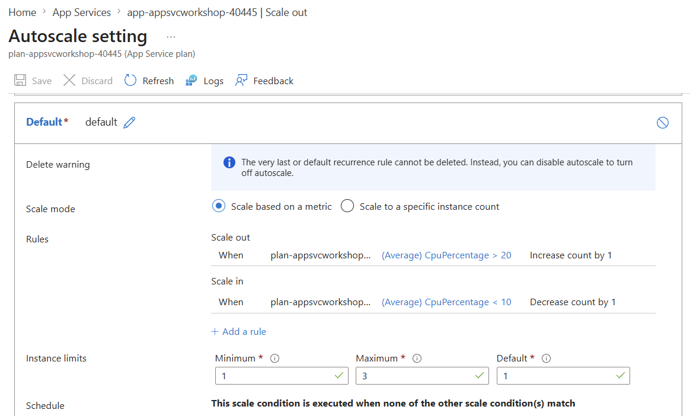

# 07. Autoscale(CPU 규칙 기반 확장)

> 🟢 **실행** = 직접 입력·수행 · 👁️ **예시** = 눈으로만(개념/발췌) · 📋 **예상 출력** = 비교용(입력 불필요)

---

## 목표

이 모듈에서는 App Service Plan에 **Azure Monitor Autoscale**을 구성하고, production 앱의 `/load`에 CPU 부하를 보내 규칙 기반 scale-out을 관찰합니다.

- Automatic Scaling을 비활성화하고 Plan 수준 Autoscale을 활성화합니다.
- minimum 1, default 1, maximum 3의 capacity를 설정합니다.
- `CpuPercentage > 20%` scale-out과 `< 10%` scale-in 규칙을 만듭니다.
- `/load?sec=20` CPU 부하 중 Plan worker 수가 1보다 커지는 것을 확인합니다.
- scale-in 규칙은 설정값만 확인하고 실제 축소 대기는 생략합니다.
- 모듈 종료 상태: **Autoscale 활성(min 1·default 1·max 3), Automatic Scaling 비활성, production = v2**.

---

## 0단계 — (선택) 변수 재설정

> ⏭️ **06 모듈에서 이어서 같은 터미널로 진행 중이라면 이 단계는 건너뛰세요.**
> 새 터미널 세션을 열었거나 Cloud Shell이 재시작된 경우 `SUFFIX`에 02에서 사용한 값을 입력합니다.

🟢 **실행**

```bash
# 이전 모듈의 리소스 변수와 Autoscale 설정 이름을 복원합니다.
SUFFIX=<이전에_메모한_값>
LOC=koreacentral
RG=rg-appsvcworkshop-$SUFFIX
PLAN=plan-appsvcworkshop-$SUFFIX
APP=app-appsvcworkshop-$SUFFIX
LAW=log-appsvcworkshop-$SUFFIX
APPI=appi-appsvcworkshop-$SUFFIX
AUTOSCALE=autoscale-appsvcworkshop-$SUFFIX
APP_URL="https://$(az webapp show -g "$RG" -n "$APP" --query defaultHostName -o tsv)"
PLAN_ID=$(az appservice plan show -g "$RG" -n "$PLAN" --query id -o tsv)
echo "APP_URL=$APP_URL"
echo "AUTOSCALE=$AUTOSCALE"
```

📋 **예상 출력**

```text
APP_URL=https://app-appsvcworkshop-<SUFFIX>.azurewebsites.net
AUTOSCALE=autoscale-appsvcworkshop-<SUFFIX>
```

---

## 👁️ Azure Monitor Autoscale

Autoscale은 App Service Plan 전체에 적용되는 규칙 기반 수평 확장 방식입니다.

| 항목 | 이번 실습 |
|---|---|
| 적용 범위 | App Service Plan 전체 |
| 트리거 | Plan의 `CpuPercentage` |
| capacity | minimum 1, default 1, maximum 3 |
| scale-out | CPU > 20%, 1분 Average, +1 |
| scale-in | CPU < 10%, 1분 Average, -1 |
| cooldown | 양방향 1분 |

20%와 10%는 짧은 워크숍에서 변화를 쉽게 관찰하기 위한 실습 전용 값입니다. 운영 환경에서는 실제 트래픽과 처리 지연을 측정하여 임계값과 평가 시간을 결정해야 합니다.

> 👁️ HTTP 트래픽을 플랫폼이 직접 판단하는 **Automatic Scaling**은 [09. Automatic Scaling · Prewarmed A/B 실험](09-prewarmed-ab.md)에서 다룹니다. App Service Plan에는 두 방식 중 하나만 활성화합니다.

---

## 1단계 — Autoscale 방식으로 전환

> 👁️ **진입 상태** — production = v2(초록 `#16a34a`), staging = v1(파랑 `#2563eb`), 라우팅 0%. 이 상태는 06 모듈에서 만들어졌습니다.

🟢 **실행**

```bash
# Automatic Scaling을 끄고 Plan을 worker 1개로 맞춥니다.
az rest --method patch \
  --uri "${PLAN_ID}?api-version=2024-11-01" \
  --body '{"sku":{"name":"P0v4","tier":"PremiumV4","size":"P0v4","family":"Pv4","capacity":1},"properties":{"elasticScaleEnabled":false}}' \
  --output none &&

# 재실행 시 중복되지 않도록 이 Plan을 대상으로 하는 기존 Autoscale 설정을 모두 제거합니다.
if ! (
  set -o pipefail
  az monitor autoscale list -g "$RG" -o json |
    jq -r --arg plan "$PLAN_ID" \
      '.[] | select(((.targetResourceUri // "") | ascii_downcase) == ($plan | ascii_downcase)) | .id' |
    xargs -r -n 1 az monitor autoscale delete --ids
); then
  echo "기존 Autoscale 설정 제거 실패" >&2
  false
else
  az webapp config appsettings delete -g "$RG" -n "$APP" \
    --setting-names STARTUP_DELAY_SECONDS --output none &&
  echo "Autoscale 전환 준비 완료"
fi
```

> ⚠️ 완료 메시지가 보이지 않으면 다음 단계로 진행하지 않습니다.

🟢 **실행 — 전환 상태 확인**

```bash
az rest --method get \
  --uri "${PLAN_ID}?api-version=2024-11-01" \
  --query "properties.{automaticScaling:elasticScaleEnabled}"

az appservice plan show -g "$RG" -n "$PLAN" \
  --query "{capacity:sku.capacity}" -o json
```

📋 **예상 출력**

```json
{
  "automaticScaling": false
}
{
  "capacity": 1
}
```

> 👁️ P0v4에서 ARM REST API를 사용하는 이유: Azure CLI 2.87.0의 `az appservice plan update --elastic-scale`에는 Premium v2/v3만 허용하는 이전 SKU 검증 로직이 남아 있습니다. `az rest`는 같은 공식 ARM 속성을 직접 설정하여 이 CLI 제한을 우회합니다.

---

## 2단계 — hey 부하 도구 설치

> 👁️ Cloud Shell에는 Go가 사전 설치되어 있으므로 `go install`로 `hey`를 빌드합니다.

🟢 **실행**

```bash
# CPU 부하를 반복 호출할 hey 도구를 설치합니다.
go install github.com/rakyll/hey@latest
export PATH=$HOME/go/bin:$PATH
hey 2>&1 | head -1
```

📋 **예상 출력**

```text
Usage: hey [options...] <url>
```

---

## 3단계 — Autoscale profile과 CPU 규칙 생성

🟢 **실행**

```bash
# Plan의 인스턴스 범위와 CPU 기반 scale-out·scale-in 규칙을 만듭니다.
az monitor autoscale create \
  -g "$RG" \
  -n "$AUTOSCALE" \
  --resource "$PLAN_ID" \
  --min-count 1 \
  --max-count 3 \
  --count 1 \
  --output none &&

az monitor autoscale rule create \
  -g "$RG" \
  --autoscale-name "$AUTOSCALE" \
  --condition "CpuPercentage > 20 avg 1m" \
  --scale out 1 \
  --cooldown 1 \
  --output none &&

az monitor autoscale rule create \
  -g "$RG" \
  --autoscale-name "$AUTOSCALE" \
  --condition "CpuPercentage < 10 avg 1m" \
  --scale in 1 \
  --cooldown 1 \
  --output none &&
echo "Autoscale profile과 CPU 규칙 생성 완료"
```

> 👁️ scale-out과 scale-in 규칙을 쌍으로 구성해야 최대 또는 최소 인스턴스 수에 도달한 뒤 한 방향으로만 고정되는 상태를 피할 수 있습니다.

> 👁️ CLI로 생성한 Autoscale profile과 CPU 규칙은 **Azure Portal 관리 콘솔**에서도 확인할 수 있습니다.
> Web App 리소스에서 **Scale out (App Service plan) > Autoscale setting**으로 이동한 뒤 **Refresh**를 선택하면, `Default` profile의 scale-out·scale-in 규칙과 Minimum `1`, Maximum `3`, Default `1` 인스턴스 제한이 표시됩니다.

🖼️ **예상 화면 — Azure Portal Autoscale 설정**



---

## 4단계 — Autoscale 설정값 확인

🟢 **실행**

```bash
# capacity와 두 CPU 규칙의 조건·방향·cooldown을 확인합니다.
az monitor autoscale show -g "$RG" -n "$AUTOSCALE" \
  --query "profiles[0].{capacity:capacity,rules:rules[].{metric:metricTrigger.metricName,operator:metricTrigger.operator,threshold:metricTrigger.threshold,timeWindow:metricTrigger.timeWindow,direction:scaleAction.direction,value:scaleAction.value,cooldown:scaleAction.cooldown}}" \
  -o json
```

📋 **예상 출력**

```json
{
  "capacity": {
    "default": "1",
    "maximum": "3",
    "minimum": "1"
  },
  "rules": [
    {
      "cooldown": "PT1M",
      "direction": "Increase",
      "metric": "CpuPercentage",
      "operator": "GreaterThan",
      "threshold": 20,
      "timeWindow": "PT1M",
      "value": "1"
    },
    {
      "cooldown": "PT1M",
      "direction": "Decrease",
      "metric": "CpuPercentage",
      "operator": "LessThan",
      "threshold": 10,
      "timeWindow": "PT1M",
      "value": "1"
    }
  ]
}
```

> ⚠️ capacity나 두 규칙이 예상값과 다르면 부하를 실행하지 말고 1단계부터 다시 수행합니다.

---

## 5단계 — 부하 전 기준 상태 확인

🟢 **실행**

```bash
# 앱 준비 상태, 현재 worker 수와 최신 CPU 평균을 확인합니다.
curl -fsS --max-time 10 "$APP_URL/health" | jq -e '.status == "ok"'

CAPACITY=$(az appservice plan show -g "$RG" -n "$PLAN" --query sku.capacity -o tsv)
CPU=$(az monitor metrics list \
  --resource "$PLAN_ID" \
  --metric CpuPercentage \
  --interval PT1M \
  --aggregation Average \
  --start-time "$(date -u -d '10 minutes ago' +%Y-%m-%dT%H:%M:%SZ)" \
  --query "value[0].timeseries[0].data[?average != null] | [-1].average" \
  -o tsv)
printf 'capacity=%s latest_cpu=%s\n' "$CAPACITY" "${CPU:-pending}"
```

📋 **예상 출력**

```text
capacity=1 latest_cpu=<값 또는 pending>
```

> 👁️ Azure Monitor 수집 지연 때문에 최신 CPU 값이 아직 없으면 `pending`으로 표시될 수 있습니다.

---

## 6단계 — CPU 부하로 scale-out 관찰

🟢 **실행**

```bash
# 약 180초 CPU 부하를 백그라운드로 보내면서 30초마다 worker 수와 CPU를 확인합니다.
LOAD_OUT="$HOME/autoscale-load-$SUFFIX.out"
hey -n 9 -c 1 -t 40 "$APP_URL/load?sec=20" > "$LOAD_OUT" &
HEY_PID=$!
SCALED_OUT=0

for attempt in $(seq 1 12); do
  CAPACITY=$(az appservice plan show -g "$RG" -n "$PLAN" --query sku.capacity -o tsv)
  CPU=$(az monitor metrics list \
    --resource "$PLAN_ID" \
    --metric CpuPercentage \
    --interval PT1M \
    --aggregation Average \
    --start-time "$(date -u -d '10 minutes ago' +%Y-%m-%dT%H:%M:%SZ)" \
    --query "value[0].timeseries[0].data[?average != null] | [-1].average" \
    -o tsv)
  printf '관찰 %02d/12 capacity=%s latest_cpu=%s\n' \
    "$attempt" "$CAPACITY" "${CPU:-pending}"

  if [ "$CAPACITY" -gt 1 ]; then
    SCALED_OUT=1
    break
  fi
  if [ "$attempt" -lt 12 ]; then
    sleep 30
  fi
done

if wait "$HEY_PID"; then
  HEY_STATUS=0
else
  HEY_STATUS=$?
fi

echo "scaled_out=$SCALED_OUT hey_exit=$HEY_STATUS"
if ! grep -Eq '^[[:space:]]+\[200\][[:space:]]+9 responses' "$LOAD_OUT" ||
  grep -q '^Error distribution:' "$LOAD_OUT"; then
  echo "9개의 HTTP 200 응답을 확인하지 못했습니다: $LOAD_OUT" >&2
  HEY_STATUS=1
fi
if [ "$SCALED_OUT" -ne 1 ] || [ "$HEY_STATUS" -ne 0 ]; then
  echo "scale-out 관찰 실패: 트러블슈팅을 확인하세요." >&2
  false
fi
```

📋 **예상 출력**

```text
관찰 01/12 capacity=1 latest_cpu=pending
...
관찰 04/12 capacity=2 latest_cpu=95.4
scaled_out=1 hey_exit=0
```

> 👁️ CPU와 worker 수는 Azure Monitor 수집 및 Autoscale 평가 지연 때문에 즉시 변하지 않을 수 있습니다. 관찰 중 capacity가 2 또는 3으로 증가하면 성공입니다.

---

## 7단계 — scale-in 규칙 확인

🟢 **실행**

```bash
# 실제 축소를 기다리지 않고 scale-in 규칙이 정확한지만 확인합니다.
az monitor autoscale show -g "$RG" -n "$AUTOSCALE" \
  --query "profiles[0].rules[?scaleAction.direction=='Decrease'].{metric:metricTrigger.metricName,operator:metricTrigger.operator,threshold:metricTrigger.threshold,timeWindow:metricTrigger.timeWindow,value:scaleAction.value,cooldown:scaleAction.cooldown}" \
  -o table
```

> 👁️ 이 핸즈온에서는 축소 완료를 기다리지 않습니다. CPU가 10% 아래로 1분 유지되면 Autoscale이 cooldown을 적용하며 최소 1까지 줄입니다.

---

## 트러블슈팅

### scale-out이 관찰되지 않음

```bash
# Autoscale 활성 상태와 전체 profile을 확인합니다.
az monitor autoscale show -g "$RG" -n "$AUTOSCALE" \
  --query "{enabled:enabled,profile:profiles[0]}" -o json

# 최근 CPU 메트릭을 확인합니다.
az monitor metrics list \
  --resource "$PLAN_ID" \
  --metric CpuPercentage \
  --interval PT1M \
  --aggregation Average \
  --start-time "$(date -u -d '15 minutes ago' +%Y-%m-%dT%H:%M:%SZ)" \
  -o table

# CPU 부하 엔드포인트가 정상 응답하는지 짧게 확인합니다.
curl -fsS "$APP_URL/load?sec=2" | jq .
```

- 최신 CPU가 20%를 넘지 않았다면 `-n 15`로 요청 수만 늘려 약 300초 부하를 한 번 재시도합니다.
- Autoscale target이 Web App이 아니라 `$PLAN_ID`인지 확인합니다.
- profile이 enabled이고 scale-out 규칙이 `CpuPercentage > 20 avg 1m`인지 확인합니다.

### Autoscale rule 생성 실패

```bash
az monitor metrics list-definitions \
  --resource "$PLAN_ID" \
  --query "[?name.value=='CpuPercentage'].{name:name.value,displayName:name.localizedValue}" \
  -o table
```

### hey 설치 실패

```bash
go install github.com/rakyll/hey@latest
export PATH=$HOME/go/bin:$PATH
command -v hey
```

---

이전 모듈: [06. 트래픽 분할 · 카나리 배포 · 승격](06-traffic-split-canary.md) · 선택 모듈: [09. Automatic Scaling · Prewarmed A/B 실험](09-prewarmed-ab.md) · 다음 코어 모듈: [08. 관찰 가능성](08-observability.md)
