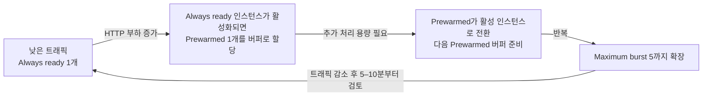

# 07. 자동 스케일(Automatic Scaling · 부하 확장/축소)

> 🟢 **실행** = 직접 입력·수행 · 👁️ **예시** = 눈으로만(개념/발췌) · 📋 **예상 출력** = 비교용(입력 불필요)

---

## 목표

이 모듈에서는 Azure App Service **Automatic scaling**(탄력 스케일)을 활성화하고, `hey` 부하와 `observe_instances.py`로 같은 앱의 새 instance가 **언제 시작되고 언제 실제 응답에 처음 투입되는지**를 관찰합니다. 단일 실행의 승패를 가르기보다 `Prewarmed=0`과 `Prewarmed=1`에서 보이는 외부 증거를 기록하고 해석합니다.

- App Service 플랜을 Elastic scale 모드로 전환하고 최대 5 인스턴스로 설정합니다.
- `STARTUP_DELAY_SECONDS=20`으로 새 프로세스의 시작 준비 시간을 눈에 보이게 만듭니다.
- `/api/info`의 `started_at`과 새 instance의 최초 관찰 시각으로 `first_response_age`를 계산합니다.
- `Prewarmed=0`과 `Prewarmed=1`의 인스턴스별 시작·투입 타임라인을 비교하되, 한 번의 실행에서 어느 쪽이 반드시 더 빠르다고 판정하지 않습니다.
- `InstanceCount` 메트릭으로 시험 전·시험 사이의 단일 인스턴스 기준 상태를 확인합니다.
- 시험 사이와 종료 후 인스턴스가 다시 1개 기준 상태로 축소됨을 확인합니다.
- **Automatic scaling** 방식과 **규칙 기반(Azure Monitor autoscale)** 방식의 개념 차이를 이해합니다.
- **Always-ready instances**와 **Prewarmed instances**의 역할과 비용 차이를 이해합니다.
- 모듈 종료 상태: **Automatic scaling 활성(Always ready 1·Prewarmed 1·Maximum burst 5), prod = v2** (이후 모듈에서 이 상태가 유지됩니다).

## 공통 상태 — 항상 실행

> 🟢 이 줄은 같은 터미널로 이어서 진행하든, 새 Cloud Shell에서 다시 시작하든 먼저 실행합니다.
> `REPO_DIR`는 `scripts/observe_instances.py`의 경로를 고정하기 위해 여기서 항상 정의합니다.

```bash
REPO_DIR="$HOME/ms-appservice-basic-workshop01"
```

---

## 0단계 — (선택) 변수 재설정

> ⏭️ **06 모듈에서 이어서 같은 터미널로 진행 중이라면 이 단계는 건너뛰세요.**
> 새 터미널 세션을 열었거나 Cloud Shell이 재시작되어 변수가 사라진 경우에만 실행합니다.
> `SUFFIX` 는 **02 모듈에서 사용한 값과 동일하게** 입력하세요.
> 이후 헬퍼는 기본 클론 경로 `~/ms-appservice-basic-workshop01`를 기준으로 동작합니다. 새 Cloud Shell은 현재 디렉터리를 보장하지 않으므로, 스크립트 경로를 고정해 둡니다.

🟢 **실행**

```bash
SUFFIX=<이전에_메모한_값>
LOC=koreacentral
RG=rg-appsvcworkshop-$SUFFIX
PLAN=plan-appsvcworkshop-$SUFFIX
APP=app-appsvcworkshop-$SUFFIX
LAW=log-appsvcworkshop-$SUFFIX
APPI=appi-appsvcworkshop-$SUFFIX
APP_URL="https://$(az webapp show -g $RG -n $APP --query defaultHostName -o tsv)"
echo "APP_URL=$APP_URL"
```

📋 **예상 출력**

```
APP_URL=https://app-appsvcworkshop-<SUFFIX>.azurewebsites.net
```

---

## 👁️ Automatic scaling vs 규칙 기반 — 개념 비교

Azure App Service에서 수평 스케일(인스턴스 수 조정)을 구현하는 방법은 두 가지입니다.

| 비교 항목 | **Automatic scaling** | **규칙 기반(Azure Monitor autoscale)** |
|---|---|---|
| 플랜 요건 | **Premium v2–v4** | Standard 이상 |
| 스케일 트리거 | **HTTP 요청 부하** — 플랫폼이 자동 판단 | CPU·메모리·큐 길이 등 **메트릭 + 직접 규칙** |
| 설정 복잡도 | 최솟값·최댓값만 지정 | 규칙(임계값·방향·증감량·쿨다운) 직접 작성 |
| 관리 주체 | **플랫폼 완전 관리** | 운영자가 규칙 유지·보수 |
| 콜드스타트 방지 | Prewarmed 인스턴스를 버퍼로 준비 | 스케일아웃 후 새 인스턴스 워밍 시간 존재 |
| ACA 대응 | ACA **HTTP 스케일링**(KEDA HTTP Add-on) | ACA **사용자 정의 KEDA 스케일러** |

> 👁️ Automatic scaling은 **HTTP 트래픽**을 기준으로 동작하며 배포 슬롯으로 분기된 트래픽에는 적용되지 않습니다. 이 모듈에서는 production URL인 `$APP_URL`에 직접 부하를 보냅니다.

---

## 👁️ Always-ready와 Prewarmed 인스턴스 이해

두 설정 모두 앱 시작 지연을 줄이지만 목적과 트래픽 처리 여부가 다릅니다.

| 구분 | **Always-ready instances** | **Prewarmed instances** |
|---|---|---|
| **역할** | 앱이 항상 사용할 수 있도록 유지하는 최소 실행 인스턴스 | 다음 scale-out에 빠르게 투입하기 위한 워밍 버퍼 |
| **평상시 트래픽 처리** | 처리함 | 버퍼 상태에서는 일반 트래픽을 처리하지 않음 |
| **CLI 설정** | `--minimum-elastic-instance-count` | `--prewarmed-instance-count` |
| **기본/권장값** | 최소 1 | 기본 1, 대부분의 워크로드에서 1 권장 |
| **부하 증가 시** | 먼저 요청을 처리 | 활성 인스턴스로 전환되고 새로운 Prewarmed 버퍼가 준비됨 |
| **부하 감소 시** | 설정된 최소 수까지 유지 | 더 이상 필요하지 않으면 버퍼가 해제됨 |

이 워크숍의 설정(`Always ready = 1`, `Prewarmed = 1`)은 다음과 같이 동작합니다.



### Always-ready instances

- 앱 수준의 **최소 인스턴스 수**입니다. 트래픽이 적거나 없어도 이 수보다 아래로 축소되지 않습니다.
- 이 모듈의 `--minimum-elastic-instance-count 1`은 production 앱이 최소 한 인스턴스에서 계속 실행됨을 의미합니다.
- 값을 높이면 기본 처리 용량과 가용성은 증가하지만, 항상 실행되는 인스턴스가 늘어 비용도 증가합니다.

### Prewarmed instances

- HTTP 부하가 증가할 때 새로운 인스턴스를 처음부터 부팅하는 지연을 줄이기 위한 **워밍 버퍼**입니다.
- Always-ready 인스턴스가 트래픽을 처리하기 시작하면 Prewarmed 인스턴스가 할당됩니다. 부하가 더 증가하면 이 버퍼가 활성 인스턴스로 전환되고, 최대 확장 한도에 도달할 때까지 다음 버퍼가 준비됩니다.
- `--prewarmed-instance-count 1`은 “활성 인스턴스 외에 항상 1개를 무조건 실행”한다는 의미가 아닙니다. 앱이 유휴 상태라 Prewarmed 버퍼가 할당되지 않은 동안에는 해당 버퍼 비용이 발생하지 않습니다.
- Prewarmed 인스턴스가 실제로 할당된 시점부터는 초 단위로 과금됩니다. Maximum burst에 도달하면 그 이상 Prewarmed 또는 활성 인스턴스가 추가되지 않습니다.

### Maximum burst와의 관계

`--max-elastic-worker-count 5`는 Plan이 HTTP 부하에 따라 확장할 수 있는 **Maximum burst** 상한입니다. Always-ready와 활성화된 Prewarmed 인스턴스를 포함한 확장은 이 범위 안에서 이루어집니다. 백엔드 데이터베이스처럼 함께 확장되지 않는 의존성이 있다면 상한을 낮춰 과부하를 방지할 수 있습니다.

---

## 1단계 — Automatic scaling 활성화

> 👁️ **진입 상태** — production = v2(초록 `#16a34a`), staging = v1(파랑 `#2563eb`), 라우팅 0%. 이 상태는 06 모듈에서 만들어졌습니다.

🟢 **실행** — App Service Plan과 Web App 리소스 ID를 조회한 뒤 ARM REST API로 Automatic scaling을 설정합니다.

```bash
PLAN_ID=$(az appservice plan show -g $RG -n $PLAN --query id -o tsv)
APP_ID=$(az webapp show -g $RG -n $APP --query id -o tsv)

az rest --method patch \
  --uri "${PLAN_ID}?api-version=2024-11-01" \
  --body '{"sku":{"name":"P0v4","tier":"PremiumV4","size":"P0v4","family":"Pv4","capacity":1},"properties":{"elasticScaleEnabled":true,"maximumElasticWorkerCount":5}}' \
  --output none &&
az rest --method patch \
  --uri "${APP_ID}/config/web?api-version=2024-11-01" \
  --body '{"properties":{"minimumElasticInstanceCount":1,"preWarmedInstanceCount":1}}' \
  --output none &&
echo "Automatic scaling 설정 완료"
```

> ⚠️ 오류가 출력되거나 `Automatic scaling 설정 완료`가 보이지 않으면 다음 단계로 진행하지 말고, `$RG`, `$PLAN`, `$APP` 값과 오류 메시지를 확인한 뒤 1단계를 다시 실행합니다.

🟢 **실행** — 설정값을 조회합니다.

```bash
az rest --method get \
  --uri "${PLAN_ID}?api-version=2024-11-01" \
  --query "properties.{automaticScaling:elasticScaleEnabled,maximumBurst:maximumElasticWorkerCount}"

az rest --method get \
  --uri "${APP_ID}/config/web?api-version=2024-11-01" \
  --query "properties.{alwaysReady:minimumElasticInstanceCount,prewarmed:preWarmedInstanceCount}"
```

📋 **예상 출력**

```json
{
  "automaticScaling": true,
  "maximumBurst": 5
}
{
  "alwaysReady": 1,
  "prewarmed": 1
}
```

> 👁️ CLI로 설정한 Automatic scaling은 **Azure Portal 관리 콘솔**에서도 확인할 수 있습니다.
> Web App 리소스에서 **App Service plan > Scale out**로 이동하면 **Scale out method = Automatic**, **Maximum burst = 5**, **Always ready instances = 1**을 확인할 수 있습니다.
> 이 화면에는 Prewarmed 값이 표시되지 않으므로 `Prewarmed = 1`은 위 CLI 조회 결과로 확인합니다.

🖼️ **예상 화면 — Azure Portal Automatic scaling 설정**


> 👁️ ARM 속성 `elasticScaleEnabled`는 Plan을 Automatic scaling 모드로 전환합니다. `maximumElasticWorkerCount`는 Maximum burst, `minimumElasticInstanceCount`는 Always-ready 최소값, `preWarmedInstanceCount`는 HTTP 확장 시 준비할 워밍 버퍼 수입니다.
> Plan PATCH의 `sku` 객체는 ARM API가 기존 P0v4 Plan을 갱신할 때 요구하는 현재 SKU 정보이며, Plan의 가격 계층을 변경하지 않습니다.
>
> Automatic scaling을 활성화하면 기존 앱의 **ARR Affinity(세션 선호도)**가 자동으로 비활성화됩니다. 특정 인스턴스에 요청을 고정하지 않아야 여러 인스턴스로 트래픽을 고르게 분산할 수 있기 때문입니다.
>
> **P0v4에서 ARM REST API를 사용하는 이유:** 공식 App Service 기능은 Premium v4를 지원하지만, Azure CLI 2.87.0의 `az appservice plan update --elastic-scale` 및 `az webapp update --minimum-elastic-instance-count` 명령에는 Premium v2/v3만 허용하는 이전 SKU 검증 로직이 남아 있습니다. `az rest`는 같은 공식 ARM 속성을 직접 설정하여 이 CLI 제한을 우회합니다.

---

## 2단계 — hey 부하 도구 설치

> 👁️ Cloud Shell에는 Go가 사전 설치되어 있으므로 `go install`로 hey를 빌드합니다. (`hey`의 S3 사전 빌드 바이너리 배포는 현재 접근 불가 상태입니다.)

🟢 **실행**

```bash
go install github.com/rakyll/hey@latest
export PATH=$HOME/go/bin:$PATH
```

설치가 완료되면 실행 가능한지 확인합니다(`hey`는 `--version` 플래그가 없으므로 도움말 출력으로 확인).

```bash
hey 2>&1 | head -1
```

📋 **예상 출력**

```
Usage: hey [options...] <url>
```

---

## 3단계 — Prewarmed A/B 비교 준비

이번 모듈의 관찰 포인트는 “어느 시험이 더 빨랐는가”가 아니라 **새 instance가 시작된 뒤 실제 응답에 처음 보일 때까지 어떤 타임라인이 관찰되는가**입니다. 먼저 `STARTUP_DELAY_SECONDS=20`으로 새 프로세스의 시작 준비 시간을 키우고, 동일한 burst 부하에서 `Prewarmed=0`과 `Prewarmed=1`의 관찰 결과를 같은 형식으로 기록합니다.

`started_at`은 20초 시작 지연 전에 기록됩니다. 따라서 `first_response_age`가 약 20초라면 시작 준비 직후 응답에 투입된 것이고, 그보다 길면 준비를 마친 뒤 실제 응답 전에 대기한 구간이 있었음을 뜻합니다. `first_seen_at`은 클라이언트 observer가 그 instance의 응답을 처음 받은 시각이지, 플랫폼 내부 라우팅이 실제로 시작된 정확한 시각은 아닙니다. 이 값은 플랫폼 내부의 active/prewarmed 라벨을 직접 조회한 것이 아니라 앱이 관찰한 외부 증거입니다.

🟢 **실행 — 시작 지연 설정과 결과 경로 준비**

> 👁️ 두 시험의 결과를 저장할 디렉터리와 JSON 파일 경로를 먼저 준비하고, 새 프로세스의 시작 지연을 관찰할 수 있도록 `STARTUP_DELAY_SECONDS=20`을 앱 설정에 추가합니다.

```bash
AB_DIR="${AB_DIR:-$HOME/appservice-prewarmed-ab}"
mkdir -p "$AB_DIR"
NO_PREWARM_OBSERVATIONS="$AB_DIR/prewarmed-0-observations.json"
PREWARM_OBSERVATIONS="$AB_DIR/prewarmed-1-observations.json"

az webapp config appsettings set -g "$RG" -n "$APP" \
  --settings STARTUP_DELAY_SECONDS=20 --output none &&
echo "STARTUP_DELAY_SECONDS=20 설정 완료"
```

> ⚠️ 오류가 출력되거나 완료 메시지가 보이지 않으면 다음 단계로 진행하지 마세요. 설정을 변경한 뒤 중단해야 한다면 6단계의 **모듈 기본 상태로 복원** 명령을 실행합니다.

🟢 **실행 — 앱 준비 상태 확인**

> 👁️ 앱 설정 변경으로 프로세스가 재시작될 수 있으므로 `/health`를 최대 18회 확인합니다. 응답 JSON의 `status`가 `ok`일 때만 다음 명령으로 진행합니다.

```bash
HEALTH_CHECK_STATUS=1
for attempt in $(seq 1 18); do
  HEALTH_BODY=$(curl -fsS --max-time 10 "$APP_URL/health" 2>/dev/null || true)
  if jq -e '.status == "ok"' >/dev/null 2>&1 <<< "$HEALTH_BODY"; then
    printf '%s\n' "$HEALTH_BODY"
    HEALTH_CHECK_STATUS=0
    break
  fi
  if [ "$attempt" -lt 18 ]; then
    sleep 5
  fi
done
if [ "$HEALTH_CHECK_STATUS" -ne 0 ]; then
  echo "/health 확인 실패: 6단계의 복원 명령을 실행하세요." >&2
  false
fi
```

📋 **예상 출력**

```json
{"status":"ok"}
```

🟢 **실행 — Automatic scaling 설정 재확인**

> 👁️ Plan에서는 Automatic scaling과 Maximum burst를, Web App에서는 Always-ready와 Prewarmed 값을 다시 조회합니다. 각각 `true`·`5`와 `1`·`1`인지 확인합니다.

```bash
az rest --method get \
  --uri "${PLAN_ID}?api-version=2024-11-01" \
  --query "properties.{automaticScaling:elasticScaleEnabled,maximumBurst:maximumElasticWorkerCount}"

az rest --method get \
  --uri "${APP_ID}/config/web?api-version=2024-11-01" \
  --query "properties.{alwaysReady:minimumElasticInstanceCount,prewarmed:preWarmedInstanceCount}"
```

📋 **예상 출력**

```json
{
  "automaticScaling": true,
  "maximumBurst": 5
}
{
  "alwaysReady": 1,
  "prewarmed": 1
}
```

> 👁️ `InstanceCount` 메트릭은 시험 시작 전·시험 사이에 단일 인스턴스 기준 상태를 확인하는 용도로만 사용합니다. 실제 관찰값은 `observe_instances.py`가 저장하는 `started_at`, `first_seen_at`, `first_response_age`입니다.


## 4단계 — 시험 A: Prewarmed=0

먼저 `Prewarmed=0`에서 새 instance가 언제 처음 응답에 투입되는지 관찰합니다.

🟢 **실행 — Prewarmed=0 설정**

> 👁️ 시험 A 조건을 만들기 위해 Always-ready는 1로 유지하고 Prewarmed만 0으로 변경합니다. PATCH 직후 같은 설정을 조회하여 `prewarmed=0`이 반영됐는지 확인합니다.

```bash
az rest --method patch \
  --uri "${APP_ID}/config/web?api-version=2024-11-01" \
  --body '{"properties":{"minimumElasticInstanceCount":1,"preWarmedInstanceCount":0}}' \
  --output none &&
az rest --method get \
  --uri "${APP_ID}/config/web?api-version=2024-11-01" \
  --query "properties.{alwaysReady:minimumElasticInstanceCount,prewarmed:preWarmedInstanceCount}"
```

📋 **예상 출력**

```json
{
  "alwaysReady": 1,
  "prewarmed": 0
}
```

🟢 **실행 — 단일 인스턴스 기준 상태 확인**

> 👁️ 최근 10분의 `InstanceCount` Maximum 값을 1분 간격으로 조회합니다. 최신 행이 `count=1`이면 이전 확장이 정리된 단일 인스턴스 기준 상태입니다.

```bash
az monitor metrics list \
  --resource "$APP_ID" \
  --metric InstanceCount \
  --interval PT1M \
  --aggregation Maximum \
  --start-time "$(date -u -d '10 minutes ago' +%Y-%m-%dT%H:%M:%SZ)" \
  --query "value[0].timeseries[0].data[?maximum != null].{time:timeStamp,count:maximum}" \
  -o table
```

> 👁️ 최신 행의 `count`가 `1`인지 확인합니다. 아직 2 이상이면 30초 정도 기다린 뒤 같은 조회 명령을 다시 실행합니다.

🟢 **실행 — 시험 A 관찰**

> 👁️ 현재 응답 중인 기준 instance를 먼저 기록한 뒤 `hey`로 180초간 부하를 보내고, observer는 기준 instance를 제외한 새 instance의 최초 응답 시점을 JSON에 저장합니다. 완료 후 observer와 `hey`의 exit code가 모두 0인지 확인합니다.

```bash
if BASELINE_INSTANCE=$(curl -fsS --max-time 10 "$APP_URL/api/info" |
  jq -er 'select((.instance | type) == "string" and (.instance | test("\\S"))) | .instance'); then
  echo "Prewarmed=0 기준 instance: $BASELINE_INSTANCE"

  hey -z 180s -c 100 -q 10 "$APP_URL/api/info" \
    > "$AB_DIR/hey-burst-0.out" &
  HEY_PID=$!

  python3 "$REPO_DIR/scripts/observe_instances.py" \
    --url "$APP_URL/api/info" \
    --baseline-instance "$BASELINE_INSTANCE" \
    --duration 180 \
    --concurrency 30 \
    --request-timeout 5 \
    --output "$NO_PREWARM_OBSERVATIONS"
  OBSERVER_STATUS=$?

  wait "$HEY_PID"
  HEY_STATUS=$?

  echo "observer exit=$OBSERVER_STATUS, hey exit=$HEY_STATUS"
  if [ "$OBSERVER_STATUS" -ne 0 ] || [ "$HEY_STATUS" -ne 0 ]; then
    echo "시험 A 실패: 다음 시험으로 진행하지 말고 6단계의 복원 명령을 실행하세요." >&2
    false
  fi
else
  echo "시험 A 기준 instance 확인 실패: 6단계의 모듈 기본 상태로 복원 명령을 실행한 뒤 3단계부터 다시 시도하세요." >&2
  false
fi
```

> ⚠️ `observer exit=0, hey exit=0`일 때만 시험 B로 진행합니다. observer가 2로 종료되면 새 instance를 관찰하지 못한 것이므로 6단계의 **모듈 기본 상태로 복원** 명령을 실행한 뒤 복원 후 3단계부터 다시 시도합니다.

📋 **예상 출력** (2026-07-21 리허설 예시)

```text
Prewarmed=0 기준 instance: 0299d35b
instance	started_at	first_seen_at	first_response_age
a2b002c6	2026-07-21T06:37:27Z	2026-07-21T06:37:49Z	22
e46cbdac	2026-07-21T06:37:04Z	2026-07-21T06:37:50Z	46
d09f4aa4	2026-07-21T06:37:20Z	2026-07-21T06:37:50Z	30
0669595a	2026-07-21T06:37:17Z	2026-07-21T06:37:50Z	33
```

> 👁️ 표에는 기준 instance를 제외한 **새 instance만** 기록됩니다. 한 시험에서 여러 새 instance가 보이면 JSON 배열과 표에 모두 남습니다.

---

## 5단계 — scale-in 게이트 후 시험 B: Prewarmed=1

시험 B는 반드시 시험 A의 부하가 끝나고 새 기준 상태가 다시 확보된 뒤 시작합니다. `Prewarmed=1`로 되돌린 뒤에도 별도의 prime 부하나 `InstanceCount>=2` 버퍼 게이트는 두지 않고, 같은 burst에서 새 instance의 최초 응답 나이를 다시 관찰합니다.

🟢 **실행 — 시험 B 시작 전 단일 인스턴스 기준 상태 확인**

> 👁️ 시험 A 부하로 늘어난 인스턴스가 scale-in됐는지 다시 확인합니다. 최신 메트릭이 `count=1`이 된 뒤에만 시험 B를 시작합니다.

```bash
az monitor metrics list \
  --resource "$APP_ID" \
  --metric InstanceCount \
  --interval PT1M \
  --aggregation Maximum \
  --start-time "$(date -u -d '10 minutes ago' +%Y-%m-%dT%H:%M:%SZ)" \
  --query "value[0].timeseries[0].data[?maximum != null].{time:timeStamp,count:maximum}" \
  -o table
```

> 👁️ 최신 행의 `count`가 `1`이 될 때까지 30초 정도 간격으로 같은 명령을 다시 실행합니다. 별도의 prime 부하나 `InstanceCount>=2` 확인은 하지 않습니다.

🟢 **실행 — Prewarmed=1 설정**

> 👁️ 시험 B 조건을 만들기 위해 Prewarmed를 1로 되돌리고 즉시 조회합니다. 출력에서 Always-ready와 Prewarmed가 모두 1인지 확인합니다.

```bash
az rest --method patch \
  --uri "${APP_ID}/config/web?api-version=2024-11-01" \
  --body '{"properties":{"minimumElasticInstanceCount":1,"preWarmedInstanceCount":1}}' \
  --output none &&
az rest --method get \
  --uri "${APP_ID}/config/web?api-version=2024-11-01" \
  --query "properties.{alwaysReady:minimumElasticInstanceCount,prewarmed:preWarmedInstanceCount}"
```

📋 **예상 출력**

```json
{
  "alwaysReady": 1,
  "prewarmed": 1
}
```

🟢 **실행 — 시험 B 관찰**

> 👁️ 시험 A와 동일하게 기준 instance를 확보한 뒤 180초 부하와 observer를 실행하며, 이번에는 새 instance 관찰 결과를 Prewarmed=1 JSON에 저장합니다. 두 프로세스의 exit code가 모두 0이어야 결과 비교를 진행합니다.

```bash
if BASELINE_INSTANCE=$(curl -fsS --max-time 10 "$APP_URL/api/info" |
  jq -er 'select((.instance | type) == "string" and (.instance | test("\\S"))) | .instance'); then
  echo "Prewarmed=1 기준 instance: $BASELINE_INSTANCE"

  hey -z 180s -c 100 -q 10 "$APP_URL/api/info" \
    > "$AB_DIR/hey-burst-1.out" &
  HEY_PID=$!

  python3 "$REPO_DIR/scripts/observe_instances.py" \
    --url "$APP_URL/api/info" \
    --baseline-instance "$BASELINE_INSTANCE" \
    --duration 180 \
    --concurrency 30 \
    --request-timeout 5 \
    --output "$PREWARM_OBSERVATIONS"
  OBSERVER_STATUS=$?

  wait "$HEY_PID"
  HEY_STATUS=$?

  echo "observer exit=$OBSERVER_STATUS, hey exit=$HEY_STATUS"
  if [ "$OBSERVER_STATUS" -ne 0 ] || [ "$HEY_STATUS" -ne 0 ]; then
    echo "시험 B 실패: 결과를 해석하지 말고 6단계의 복원 명령을 실행하세요." >&2
    false
  fi
else
  echo "시험 B 기준 instance 확인 실패: 6단계의 복원 명령을 실행한 뒤 결과를 해석하지 말고 3단계부터 다시 시도하세요." >&2
  false
fi
```

> ⚠️ `observer exit=0, hey exit=0`일 때만 결과를 해석합니다.

📋 **예상 출력** (2026-07-21 리허설 예시)

```text
Prewarmed=1 기준 instance: a2b002c6
instance	started_at	first_seen_at	first_response_age
5bef3ff3	2026-07-21T06:48:55Z	2026-07-21T06:49:18Z	23
bd29045b	2026-07-21T06:48:56Z	2026-07-21T06:49:19Z	23
```

> 👁️ 두 시험 모두 같은 앱·같은 엔드포인트·같은 burst 부하를 쓰므로, 비교 대상은 `Prewarmed` 설정 차이와 그에 따라 관찰된 instance 타임라인입니다.

---

## 6단계 — 결과 해석 및 정리

두 시험 모두에서 새 instance가 관찰되었다면, 이제 총 scale-out 시간의 승패 대신 **instance별 시작·최초 응답 타임라인**을 나란히 봅니다.

🟢 **실행 — 결과 표 출력**

> 👁️ 두 JSON 파일을 읽어 Trial A와 B의 instance별 시작·최초 응답 시각을 하나의 TSV 표로 출력합니다. 이 표는 관찰 타임라인을 비교하기 위한 것이며 단일 실행의 속도 승자를 계산하지 않습니다.

```bash
jq -r '
  ["trial","instance","started_at","first_seen_at","first_response_age"],
  (.[] | ["Prewarmed=0", .instance, .started_at, .first_seen_at, (.first_response_age | tostring)])
  | @tsv
' "$NO_PREWARM_OBSERVATIONS"

jq -r '
  .[] | ["Prewarmed=1", .instance, .started_at, .first_seen_at, (.first_response_age | tostring)] | @tsv
' "$PREWARM_OBSERVATIONS"

echo "[07] first_response_age는 관찰값이며 단일 실행의 속도 승자를 의미하지 않습니다."
```

📋 **예상 출력** (2026-07-21 리허설 예시)

```text
trial	instance	started_at	first_seen_at	first_response_age
Prewarmed=0	a2b002c6	2026-07-21T06:37:27Z	2026-07-21T06:37:49Z	22
Prewarmed=0	e46cbdac	2026-07-21T06:37:04Z	2026-07-21T06:37:50Z	46
Prewarmed=0	d09f4aa4	2026-07-21T06:37:20Z	2026-07-21T06:37:50Z	30
Prewarmed=0	0669595a	2026-07-21T06:37:17Z	2026-07-21T06:37:50Z	33
Prewarmed=1	5bef3ff3	2026-07-21T06:48:55Z	2026-07-21T06:49:18Z	23
Prewarmed=1	bd29045b	2026-07-21T06:48:56Z	2026-07-21T06:49:19Z	23
[07] first_response_age는 관찰값이며 단일 실행의 속도 승자를 의미하지 않습니다.
```

- Trial A는 22/30/33/46초, Trial B는 23/23초로 관찰되어, 이번 리허설은 **혼합된 age 증거**를 남겼습니다.
- `Prewarmed=0`과 `Prewarmed=1`의 age가 모두 보였으므로, 이 단일 실행만으로 Prewarmed의 “항상 이김”을 단정하지 않습니다.

🟢 **실행 — 모듈 기본 상태로 복원**

> 👁️ Always-ready=1과 Prewarmed=1로 되돌리고, 관찰을 위해 추가한 `STARTUP_DELAY_SECONDS`를 삭제합니다. 시험 A 또는 B가 실패했을 때도 이 복원 블록을 즉시 실행할 수 있습니다.

```bash
az rest --method patch \
  --uri "${APP_ID}/config/web?api-version=2024-11-01" \
  --body '{"properties":{"minimumElasticInstanceCount":1,"preWarmedInstanceCount":1}}' \
  --output none &&
az webapp config appsettings delete -g "$RG" -n "$APP" \
  --setting-names STARTUP_DELAY_SECONDS --output none &&
echo "Always-ready=1, Prewarmed=1 복원 및 STARTUP_DELAY_SECONDS 삭제 완료"
```

🟢 **실행 — 복원 후 앱 준비 확인**

> 👁️ 설정 복원으로 앱 프로세스가 다시 시작될 수 있으므로 `/health`를 최대 18회 확인합니다. 응답 JSON의 `status`가 `ok`가 아니면 다음 모듈로 진행하지 않습니다.

```bash
HEALTH_CHECK_STATUS=1
for attempt in $(seq 1 18); do
  HEALTH_BODY=$(curl -fsS --max-time 10 "$APP_URL/health" 2>/dev/null || true)
  if jq -e '.status == "ok"' >/dev/null 2>&1 <<< "$HEALTH_BODY"; then
    printf '%s\n' "$HEALTH_BODY"
    HEALTH_CHECK_STATUS=0
    break
  fi
  if [ "$attempt" -lt 18 ]; then
    sleep 5
  fi
done
if [ "$HEALTH_CHECK_STATUS" -ne 0 ]; then
  echo "/health 확인 실패: 다음 모듈로 진행하지 마세요." >&2
  false
fi
```

🟢 **실행 — 복원 상태 조회**

> 👁️ Plan과 Web App 설정을 차례로 조회하고 `STARTUP_DELAY_SECONDS`가 남아 있는지도 확인합니다. Automatic scaling·Maximum burst·Always-ready·Prewarmed가 종료 상태와 일치하고 설정 개수가 0이어야 합니다.

```bash
az rest --method get \
  --uri "${PLAN_ID}?api-version=2024-11-01" \
  --query "properties.{automaticScaling:elasticScaleEnabled,maximumBurst:maximumElasticWorkerCount}"
```

📋 **예상 출력**

```json
{
  "automaticScaling": true,
  "maximumBurst": 5
}
```

```bash
az rest --method get \
  --uri "${APP_ID}/config/web?api-version=2024-11-01" \
  --query "properties.{alwaysReady:minimumElasticInstanceCount,prewarmed:preWarmedInstanceCount}"
```

📋 **예상 출력**

```json
{
  "alwaysReady": 1,
  "prewarmed": 1
}
```

```bash
az webapp config appsettings list -g "$RG" -n "$APP" \
  --query "[?name=='STARTUP_DELAY_SECONDS'] | length(@)" -o tsv
```

📋 **예상 출력**

```text
0
```

> 👁️ 정리 후 모듈 종료 상태는 다시 **Always ready 1 · Prewarmed 1 · Maximum burst 5**이며, `STARTUP_DELAY_SECONDS`도 제거되어 다음 모듈에 실험용 지연이 남지 않습니다.

---

## 검증

### A/B 관찰 파일 확인

🟢 **실행**

```bash
echo "NO_PREWARM_OBSERVATIONS=${NO_PREWARM_OBSERVATIONS:-unset}"
jq 'length' "$NO_PREWARM_OBSERVATIONS"

echo "PREWARM_OBSERVATIONS=${PREWARM_OBSERVATIONS:-unset}"
jq 'length' "$PREWARM_OBSERVATIONS"
```

- 두 파일 모두 존재하고 길이가 1 이상이면, 두 시험에서 새 instance 타임라인이 기록된 것입니다.
- 한 파일이 비어 있거나 observer가 2로 종료됐다면 이번 실행에서 scale-out을 유도하지 못한 것이므로, 트러블슈팅의 재시도 절차를 따릅니다.
- 결과 판단은 숫자 승패가 아니라 표의 `started_at` / `first_seen_at` / `first_response_age` 조합으로 합니다.

---

## 트러블슈팅

### (1) 새 instance를 관찰하지 못함

`observe_instances.py`가 2로 종료되거나 JSON 배열이 비어 있으면, 이번 burst에서 새 instance를 끝내지 못한 것입니다. 한 번의 실행만으로 Automatic scaling 실패나 `Prewarmed` 무효를 단정하지 말고 다음을 점검합니다.

- 새 Cloud Shell에서 시작했다면 위 공통 상태에서 `REPO_DIR`가 `~/ms-appservice-basic-workshop01`로 고정되었는지 확인한 뒤, 0단계에서 `SUFFIX`와 Azure 리소스 변수만 다시 맞춥니다.
- `STARTUP_DELAY_SECONDS=20` 적용 후 `/health`가 정상 응답했는지 확인합니다.
- 6단계의 복원 명령을 실행한 뒤, 5단계의 단일 인스턴스 조회 명령으로 최신 행의 `count`가 `1`인지 다시 확인하고 3단계부터 재실행합니다.
- 같은 `hey -z 180s -c 100 -q 10` 부하를 다시 걸어도 결과가 같은지 확인합니다.
- Portal의 **Monitoring > Metrics > Automatic Scaling Instance Count** 또는 아래 메트릭 조회로 시험 시간대 `InstanceCount` 변화를 함께 확인합니다.

```bash
START=$(date -u -d '10 minutes ago' +%Y-%m-%dT%H:%M:%SZ)
az monitor metrics list \
  --resource "$APP_ID" \
  --metric InstanceCount \
  --interval PT1M \
  --aggregation Maximum \
  --start-time "$START" \
  --query "value[0].timeseries[0].data[?maximum != null].{time:timeStamp,instances:maximum}" \
  -o table
```

### (2) 단일 인스턴스로 축소되지 않음

시험 A 뒤 5단계의 단일 인스턴스 조회에서 최신 행의 `count`가 계속 2 이상이면 시험 B를 실행하지 말고, 6단계의 복원 명령으로 **Prewarmed=1 + `STARTUP_DELAY_SECONDS` 삭제**를 먼저 적용한 뒤 멈추세요. Cloud Shell은 유지한 채 기다렸다가, 다시 시도할 때는 3단계부터 재실행하세요.

```bash
for attempt in $(seq 1 5); do
  az monitor metrics list \
    --resource "$APP_ID" \
    --metric InstanceCount \
    --interval PT1M \
    --aggregation Maximum \
    --start-time "$(date -u -d '10 minutes ago' +%Y-%m-%dT%H:%M:%SZ)" \
    --query "value[0].timeseries[0].data[?maximum != null].{time:timeStamp,count:maximum}" \
    -o table
  sleep 60
done
```

Always-ready 값이 1보다 크면 그 아래로는 줄지 않으며, 같은 Plan의 다른 앱이 추가 인스턴스를 붙잡고 있어도 지표가 늦게 내려갈 수 있습니다. 공식 동작 기준으로 축소 판단은 보통 부하 종료 후 5–10분 이후부터 시작되므로, 충분히 기다린 뒤 다시 측정합니다.

### 새 instance의 `first_response_age`가 두 시험에서 비슷함

이는 오류가 아닙니다. 이번 실행에서는 준비된 instance가 곧바로 활성화되어 응답 전 대기 구간이 짧았을 수 있습니다. 단일 실행의 총 scale-out 시간만으로 Prewarmed 효과를 단정하지 말고, 인스턴스별 `started_at`과 `first_seen_at`을 관찰 결과로 기록합니다.

### (4) 복원 명령이 실패함

6단계의 복원 블록이 실패하면 다음 모듈로 넘어가지 말고, 아래 검증 명령으로 설정과 앱 상태를 다시 확인한 뒤 수동으로 복구합니다.

```bash
az rest --method get \
  --uri "${APP_ID}/config/web?api-version=2024-11-01" \
  --query "properties.{alwaysReady:minimumElasticInstanceCount,prewarmed:preWarmedInstanceCount}"

az webapp config appsettings list -g "$RG" -n "$APP" \
  --query "[?name=='STARTUP_DELAY_SECONDS']"

curl -fsS --max-time 10 "$APP_URL/health"
```

### (5) hey 설치 실패

`go install`은 GitHub에서 소스를 받아 빌드하므로 네트워크 일시 장애일 수 있습니다. 잠시 후 재시도하고, PATH에 `$HOME/go/bin`이 포함되어 있는지 확인합니다.

```bash
go install github.com/rakyll/hey@latest
export PATH=$HOME/go/bin:$PATH
command -v hey
```

### (6) Premium V2/V3 SKU만 지원한다는 오류

```text
--number-of-workers and --elastic-scale can only be used on premium V2/V3 or workflow SKUs.
['--minimum-elastic-instance-count', '--prewarmed-instance-count'] are only supported for elastic premium V2/V3 SKUs
```

P0v4가 지원되지 않는 것이 아니라 Azure CLI의 SKU 검증 로직이 Premium v4를 아직 포함하지 않아 발생하는 오류입니다. 1단계의 `az rest` 명령을 사용하고, 기존 `az appservice plan update --elastic-scale` 및 `az webapp update --minimum-elastic-instance-count` 명령은 실행하지 않습니다.

---

이전 모듈: [06. 트래픽 분할 · 카나리 배포 · 승격](06-traffic-split-canary.md) · 다음 모듈: [08. 관찰 가능성](08-observability.md)
