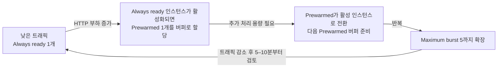

# 07. 자동 스케일(Automatic Scaling · 부하 확장/축소)

> 🟢 **실행** = 직접 입력·수행 · 👁️ **예시** = 눈으로만(개념/발췌) · 📋 **예상 출력** = 비교용(입력 불필요)

---

## 목표

이 모듈에서는 Azure App Service **Automatic scaling**(탄력 스케일)을 활성화하고, `hey` 부하 도구로 인위적인 HTTP 트래픽을 발생시켜 인스턴스가 수평 확장(scale-out)되는 과정을 관찰한 뒤, 부하를 제거하여 축소(scale-in)까지 확인합니다.

- App Service 플랜을 Elastic scale 모드로 전환하고 최대 5 인스턴스로 설정합니다.
- `hey`로 120초 동안 HTTP 부하를 생성합니다.
- `list-instances` 와 인스턴스별 응답 분포로 확장을 검증합니다.
- 부하 종료 후 인스턴스가 1개로 축소됨을 확인합니다.
- **Automatic scaling** 방식과 **규칙 기반(Azure Monitor autoscale)** 방식의 개념 차이를 이해합니다.
- **Always-ready instances**와 **Prewarmed instances**의 역할과 비용 차이를 이해합니다.
- 모듈 종료 상태: **Automatic scaling 활성(Always ready 1·Prewarmed 1·Maximum burst 5), prod = v2** (이후 모듈에서 이 상태가 유지됩니다).

---

## 0단계 — (선택) 변수 재설정

> ⏭️ **06 모듈에서 이어서 같은 터미널로 진행 중이라면 이 단계는 건너뛰세요.**
> 새 터미널 세션을 열었거나 Cloud Shell이 재시작되어 변수가 사라진 경우에만 실행합니다.
> `SUFFIX` 는 **02 모듈에서 사용한 값과 동일하게** 입력하세요.

🟢 **실행**

```bash
SUFFIX=<이전에_메모한_값>
LOC=koreacentral
RG=rg-appsvcworkshop-$SUFFIX
PLAN=plan-appsvcworkshop-$SUFFIX
APP=app-appsvcworkshop-$SUFFIX
LAW=log-appsvcworkshop-$SUFFIX
APPI=appi-appsvcworkshop-$SUFFIX
APP_URL="https://$(az webapp show -g $RG -n $APP --query defaultHostName -o tsv)"
echo "APP_URL=$APP_URL"
```

📋 **예상 출력**

```
APP_URL=https://app-appsvcworkshop-<SUFFIX>.azurewebsites.net
```

---

## 👁️ Automatic scaling vs 규칙 기반 — 개념 비교

Azure App Service에서 수평 스케일(인스턴스 수 조정)을 구현하는 방법은 두 가지입니다.

| 비교 항목 | **Automatic scaling** | **규칙 기반(Azure Monitor autoscale)** |
|---|---|---|
| 플랜 요건 | **Premium v2–v4** | Standard 이상 |
| 스케일 트리거 | **HTTP 요청 부하** — 플랫폼이 자동 판단 | CPU·메모리·큐 길이 등 **메트릭 + 직접 규칙** |
| 설정 복잡도 | 최솟값·최댓값만 지정 | 규칙(임계값·방향·증감량·쿨다운) 직접 작성 |
| 관리 주체 | **플랫폼 완전 관리** | 운영자가 규칙 유지·보수 |
| 콜드스타트 방지 | Prewarmed 인스턴스를 버퍼로 준비 | 스케일아웃 후 새 인스턴스 워밍 시간 존재 |
| ACA 대응 | ACA **HTTP 스케일링**(KEDA HTTP Add-on) | ACA **사용자 정의 KEDA 스케일러** |

> 👁️ Automatic scaling은 **HTTP 트래픽**을 기준으로 동작하며 배포 슬롯으로 분기된 트래픽에는 적용되지 않습니다. 이 모듈에서는 production URL인 `$APP_URL`에 직접 부하를 보냅니다.

---

## 👁️ Always-ready와 Prewarmed 인스턴스 이해

두 설정 모두 앱 시작 지연을 줄이지만 목적과 트래픽 처리 여부가 다릅니다.

| 구분 | **Always-ready instances** | **Prewarmed instances** |
|---|---|---|
| **역할** | 앱이 항상 사용할 수 있도록 유지하는 최소 실행 인스턴스 | 다음 scale-out에 빠르게 투입하기 위한 워밍 버퍼 |
| **평상시 트래픽 처리** | 처리함 | 버퍼 상태에서는 일반 트래픽을 처리하지 않음 |
| **CLI 설정** | `--minimum-elastic-instance-count` | `--prewarmed-instance-count` |
| **기본/권장값** | 최소 1 | 기본 1, 대부분의 워크로드에서 1 권장 |
| **부하 증가 시** | 먼저 요청을 처리 | 활성 인스턴스로 전환되고 새로운 Prewarmed 버퍼가 준비됨 |
| **부하 감소 시** | 설정된 최소 수까지 유지 | 더 이상 필요하지 않으면 버퍼가 해제됨 |

이 워크숍의 설정(`Always ready = 1`, `Prewarmed = 1`)은 다음과 같이 동작합니다.



### Always-ready instances

- 앱 수준의 **최소 인스턴스 수**입니다. 트래픽이 적거나 없어도 이 수보다 아래로 축소되지 않습니다.
- 이 모듈의 `--minimum-elastic-instance-count 1`은 production 앱이 최소 한 인스턴스에서 계속 실행됨을 의미합니다.
- 값을 높이면 기본 처리 용량과 가용성은 증가하지만, 항상 실행되는 인스턴스가 늘어 비용도 증가합니다.

### Prewarmed instances

- HTTP 부하가 증가할 때 새로운 인스턴스를 처음부터 부팅하는 지연을 줄이기 위한 **워밍 버퍼**입니다.
- Always-ready 인스턴스가 트래픽을 처리하기 시작하면 Prewarmed 인스턴스가 할당됩니다. 부하가 더 증가하면 이 버퍼가 활성 인스턴스로 전환되고, 최대 확장 한도에 도달할 때까지 다음 버퍼가 준비됩니다.
- `--prewarmed-instance-count 1`은 “활성 인스턴스 외에 항상 1개를 무조건 실행”한다는 의미가 아닙니다. 앱이 유휴 상태라 Prewarmed 버퍼가 할당되지 않은 동안에는 해당 버퍼 비용이 발생하지 않습니다.
- Prewarmed 인스턴스가 실제로 할당된 시점부터는 초 단위로 과금됩니다. Maximum burst에 도달하면 그 이상 Prewarmed 또는 활성 인스턴스가 추가되지 않습니다.

### Maximum burst와의 관계

`--max-elastic-worker-count 5`는 Plan이 HTTP 부하에 따라 확장할 수 있는 **Maximum burst** 상한입니다. Always-ready와 활성화된 Prewarmed 인스턴스를 포함한 확장은 이 범위 안에서 이루어집니다. 백엔드 데이터베이스처럼 함께 확장되지 않는 의존성이 있다면 상한을 낮춰 과부하를 방지할 수 있습니다.

---

## 1단계 — Automatic scaling 활성화

> 👁️ **진입 상태** — production = v2(초록 `#16a34a`), staging = v1(파랑 `#2563eb`), 라우팅 0%. 이 상태는 06 모듈에서 만들어졌습니다.

🟢 **실행** — App Service 플랜을 Elastic scale 모드로 전환하고 웹앱의 최솟값을 설정합니다.

```bash
az appservice plan update -g $RG -n $PLAN --elastic-scale true --max-elastic-worker-count 5
az webapp update -g $RG -n $APP --prewarmed-instance-count 1 --minimum-elastic-instance-count 1
```

> 👁️ `--elastic-scale true`는 Plan을 Automatic scaling 모드로 전환합니다. `--max-elastic-worker-count 5`는 Maximum burst, `--minimum-elastic-instance-count 1`은 Always-ready 최소값, `--prewarmed-instance-count 1`은 HTTP 확장 시 준비할 워밍 버퍼 수입니다.
>
> Automatic scaling을 활성화하면 기존 앱의 **ARR Affinity(세션 선호도)**가 자동으로 비활성화됩니다. 특정 인스턴스에 요청을 고정하지 않아야 여러 인스턴스로 트래픽을 고르게 분산할 수 있기 때문입니다.

---

## 2단계 — hey 부하 도구 설치

> 👁️ Cloud Shell에는 Go가 사전 설치되어 있으므로 `go install`로 hey를 빌드합니다. (`hey`의 S3 사전 빌드 바이너리 배포는 현재 접근 불가 상태입니다.)

🟢 **실행**

```bash
go install github.com/rakyll/hey@latest
export PATH=$HOME/go/bin:$PATH
```

설치가 완료되면 실행 가능한지 확인합니다(`hey`는 `--version` 플래그가 없으므로 도움말 출력으로 확인).

```bash
hey 2>&1 | head -1
```

📋 **예상 출력**

```
Usage: hey [options...] <url>
```

---

## 3단계 — 부하 생성 및 확장(scale-out) 관찰

🟢 **실행** — `hey`를 백그라운드로 실행하여 120초 동안 동시 100 연결로 HTTP 부하를 발생시킵니다.

```bash
hey -z 120s -c 100 -q 10 $APP_URL/api/info &
```

> 👁️ `-z 120s`는 지속 시간, `-c 100`은 동시 연결 수, `-q 10`은 초당 요청 상한, `&`는 백그라운드 실행입니다. 부하가 진행되는 동안 다음 명령으로 인스턴스 상태를 확인합니다.

🟢 **실행** — 부하 시작 후 60–90초가 지난 뒤 인스턴스 목록을 조회합니다.

```bash
# 부하 진행 중(60–90초 후) 인스턴스 확인
az webapp list-instances -g $RG -n $APP -o table
for i in $(seq 1 50); do curl -s $APP_URL/api/info | jq -r .instance; done | sort | uniq -c
```

📋 **예상 출력** (`list-instances` — 2행 이상)

```
Name                                    State    StatusCode
--------------------------------------  -------  ------------
xxxxxxxx-xxxx-xxxx-xxxx-xxxxxxxxxxxx    Ready    200
yyyyyyyy-yyyy-yyyy-yyyy-yyyyyyyyyyyy    Ready    200
```

📋 **예상 출력** (인스턴스 분포 — 2종 이상)

```
     28 xxxxxxxx-xxxx-xxxx-xxxx-xxxxxxxxxxxx
     22 yyyyyyyy-yyyy-yyyy-yyyy-yyyyyyyyyyyy
```

> 👁️ 두 가지 인스턴스 ID가 혼합되어 나타나면 요청이 여러 인스턴스로 분산되고 있음을 의미합니다. 플랫폼이 HTTP 부하를 감지하여 인스턴스를 추가로 투입한 결과입니다.

---

## 4단계 — 부하 제거 및 축소(scale-in) 관찰

> 👁️ **부하가 남아 있으면 플랫폼이 축소를 결정하지 않습니다.** 반드시 `wait`으로 `hey` 프로세스가 종료된 것을 확인한 뒤 대기합니다.

🟢 **실행**

```bash
wait   # hey 종료 대기(-z 120s 경과)
# 수 분 후
az webapp list-instances -g $RG -n $APP -o table   # 1개로 축소
```

📋 **예상 출력** (축소 완료 후)

```
Name                                    State    StatusCode
--------------------------------------  -------  ------------
xxxxxxxx-xxxx-xxxx-xxxx-xxxxxxxxxxxx    Ready    200
```

> 👁️ 축소는 확장보다 느립니다. 공식 동작 기준으로 플랫폼은 부하 증가가 멈춘 뒤 약 5–10분부터 축소 가능성을 검토하며, 인스턴스를 점진적으로 회수합니다. 환경에 따라 더 오래 걸릴 수 있습니다.

> 👁️ 앱에는 CPU를 실제로 소모하는 `/load?sec=N` 엔드포인트도 있습니다(`hey -z 60s -c 20 $APP_URL/load?sec=1` 등). HTTP 부하 외에 CPU 기반 부하를 실험하고 싶을 때 활용하십시오.

---

## 검증

### 확장(scale-out) 확인

🟢 **실행**

```bash
az webapp list-instances -g $RG -n $APP -o table
```

📋 **예상 출력** (부하 중 — 2행 이상)

```
Name                                    State    StatusCode
--------------------------------------  -------  ------------
xxxxxxxx-xxxx-xxxx-xxxx-xxxxxxxxxxxx    Ready    200
yyyyyyyy-yyyy-yyyy-yyyy-yyyyyyyyyyyy    Ready    200
```

### 축소(scale-in) 확인

🟢 **실행** (부하 제거 후 수 분 대기)

```bash
az webapp list-instances -g $RG -n $APP -o table
```

📋 **예상 출력** (축소 완료 후)

```
Name                                    State    StatusCode
--------------------------------------  -------  ------------
xxxxxxxx-xxxx-xxxx-xxxx-xxxxxxxxxxxx    Ready    200
```

부하 중 인스턴스가 2개 이상으로 확장되었다가, 부하 제거 후 1개로 축소되면 07 모듈이 완료된 것입니다.

---

## 트러블슈팅

### (1) 확장이 일어나지 않음

`-c` 값을 높여 동시 연결 수를 늘려 보십시오(예: `-c 200`). 또한 플랜에 Elastic scale이 정상 활성화되었는지 확인합니다.

```bash
az appservice plan show -g $RG -n $PLAN --query "properties.elasticScaleEnabled" -o tsv
```

값이 `true`가 아닌 경우 1단계 명령을 재실행합니다.

### (2) 축소가 일어나지 않음

백그라운드에 `hey` 프로세스가 잔존하는 경우 플랫폼이 부하가 지속된다고 판단하여 축소하지 않습니다. `jobs` 명령으로 잔존 프로세스를 확인하고 종료합니다.

```bash
jobs
# 잔존 프로세스가 있으면
kill %1
```

Always-ready 값이 1보다 크면 해당 수 아래로는 축소되지 않습니다. 또한 같은 Plan에 여러 앱이 있으면 Plan은 앱별 Always-ready 요구사항 가운데 가장 높은 값과 기존 할당 인스턴스를 고려하므로, 현재 앱의 설정값보다 Plan 인스턴스 수가 많아 보일 수 있습니다.

### (3) hey 설치 실패

`go install`은 GitHub에서 소스를 받아 빌드하므로 네트워크 일시 장애일 수 있습니다. 잠시 후 재시도하고, PATH에 `$HOME/go/bin`이 포함되어 있는지 확인합니다.

```bash
go install github.com/rakyll/hey@latest
export PATH=$HOME/go/bin:$PATH
command -v hey
```

---

이전 모듈: [06. 트래픽 분할 · 카나리 배포 · 승격](06-traffic-split-canary.md) · 다음 모듈: [08. 관찰 가능성](08-observability.md)
