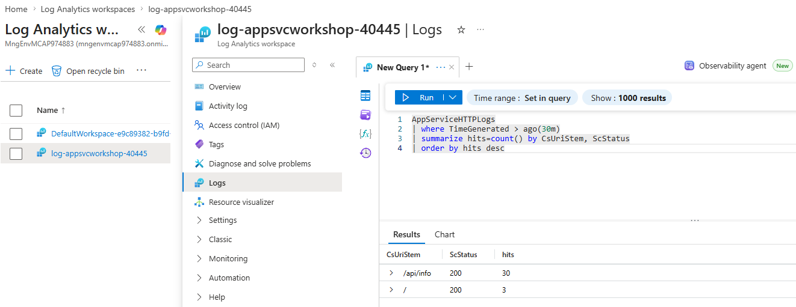
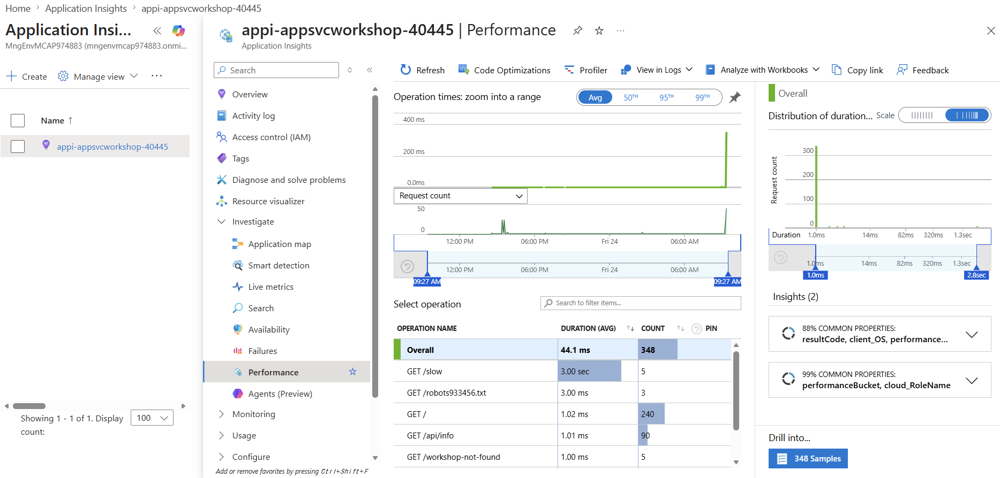
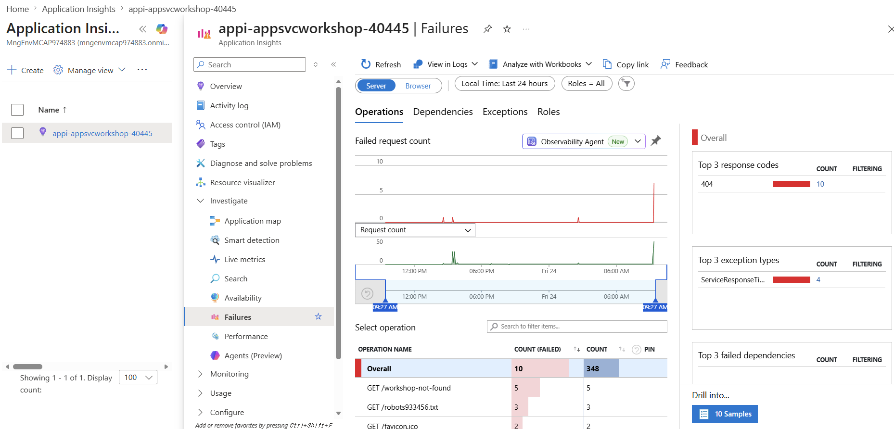
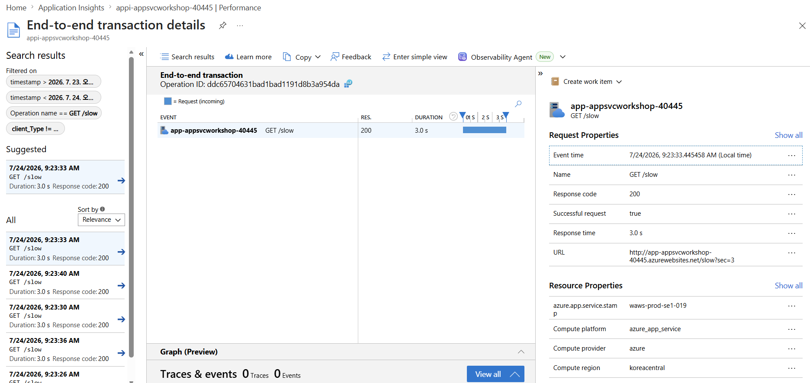
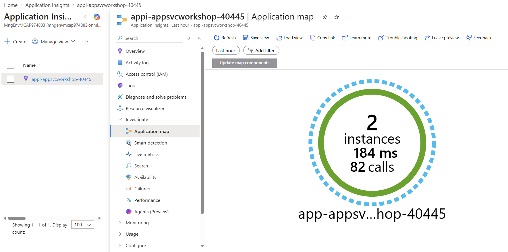

# 08. 관찰 가능성(진단 설정 → KQL · App Insights 연결)

> 🟢 **실행** = 직접 입력·수행 · 👁️ **예시** = 눈으로만(개념/발췌) · 📋 **예상 출력** = 비교용(입력 불필요) · 🖼️ **예상 화면** = 브라우저/포털 스크린샷 참고

---

## 목표

이 모듈에서는 Azure App Service의 **진단 설정**을 구성하여 플랫폼 로그를 Log Analytics 워크스페이스(LAW)로 전송하고, KQL 쿼리로 HTTP 액세스 패턴을 분석합니다. 이어서 Azure CLI로 **App Service 관리형 Application Insights**를 활성화하여 앱 코드 변경 없이 Flask 요청 텔레메트리를 수집합니다.

- App Service 진단 설정을 구성하여 HTTP 로그·콘솔 로그·플랫폼 로그를 LAW로 전송합니다.
- 인위적인 HTTP 트래픽을 발생시키고 KQL로 액세스 패턴을 분석합니다.
- App Service 관리형 Python 에이전트를 활성화하여 Flask 요청을 자동 계측합니다.
- workspace 기반 `AppRequests` 테이블 KQL로 애플리케이션 텔레메트리를 확인합니다.
- 진단 설정(플랫폼 로그)과 App Insights(앱 텔레메트리)의 역할 차이를 이해합니다.
- 모듈 종료 상태: **진단 설정 활성, App Service 관리형 Application Insights 활성**.

---

## 0단계 — (선택) 변수 재설정

> ⏭️ **07 모듈에서 이어서 같은 터미널로 진행 중이라면 이 단계는 건너뛰세요.**
> 새 터미널 세션을 열었거나 Cloud Shell이 재시작되어 변수가 사라진 경우에만 실행합니다.
> `SUFFIX` 는 **02 모듈에서 사용한 값과 동일하게** 입력하세요.

🟢 **실행**

```bash
SUFFIX=<이전에_메모한_값>
LOC=koreacentral
RG=rg-appsvcworkshop-$SUFFIX
PLAN=plan-appsvcworkshop-$SUFFIX
APP=app-appsvcworkshop-$SUFFIX
LAW=log-appsvcworkshop-$SUFFIX
APPI=appi-appsvcworkshop-$SUFFIX
APP_URL="https://$(az webapp show -g $RG -n $APP --query defaultHostName -o tsv)"
echo "APP_URL=$APP_URL"
```

📋 **예상 출력**

```
APP_URL=https://app-appsvcworkshop-<SUFFIX>.azurewebsites.net
```

---

## 👁️ 진단 설정 vs App Insights — 역할 구분

Azure에서 웹앱 가시성을 확보하는 경로는 두 가지입니다.

| 비교 항목 | **진단 설정(플랫폼 로그)** | **App Insights(앱 텔레메트리)** |
|---|---|---|
| 수집 주체 | **Azure 플랫폼** | **App Service 관리형 Python 에이전트** |
| 주요 데이터 | HTTP 액세스·콘솔·플랫폼 이벤트 | 요청·의존성·예외·트레이스·커스텀 메트릭 |
| 저장 위치 | Log Analytics 워크스페이스 | Application Insights 리소스 |
| 활성화 방법 | 진단 설정 구성 | 앱 설정 2개로 App Service 자동 계측 활성화 |
| Linux Python 제약 | 없음 | Python 3.9–3.13 Deploy as Code 지원, 사용자 지정 컨테이너 미지원 |

> 👁️ 이 워크숍은 Linux App Service의 Python 3.12 Deploy as Code 환경이므로 관리형 자동 계측 지원 범위에 해당합니다. 앱 코드에는 Application Insights SDK를 포함하지 않으며, App Service가 Flask 요청을 자동 계측합니다. 외부 의존성이 없으므로 **Application map은 단일 노드가 정상**입니다.

---

## 1단계 — 진단 설정 구성

🟢 **실행** — 웹앱 및 LAW 리소스 ID를 조회한 뒤 진단 설정을 생성합니다.

```bash
WEBAPP_ID=$(az webapp show -g $RG -n $APP --query id -o tsv)
LAW_ID=$(az monitor log-analytics workspace show -g $RG -n $LAW --query id -o tsv)
az monitor diagnostic-settings create --name appsvc-diag --resource $WEBAPP_ID \
  --workspace $LAW_ID \
  --logs '[{"category":"AppServiceHTTPLogs","enabled":true},{"category":"AppServiceConsoleLogs","enabled":true},{"category":"AppServicePlatformLogs","enabled":true}]' \
  --metrics '[{"category":"AllMetrics","enabled":true}]'
```

> 👁️ `AppServiceHTTPLogs`는 HTTP 액세스 로그, `AppServiceConsoleLogs`는 앱 표준 출력, `AppServicePlatformLogs`는 배포·스케일 이벤트를 수집합니다. **설정을 켰다 ≠ 데이터가 흐른다** — 진단 설정 활성화 후 첫 요청이 도달해야 로그가 생성되며, LAW 적재까지 5–10분의 지연이 있습니다.

---

## 2단계 — 트래픽 생성 및 적재 대기

🟢 **실행** — 30회 요청을 전송하여 HTTP 로그를 생성합니다.

```bash
# 트래픽 생성 후 적재 대기(5–10분 — "설정을 켰다 ≠ 데이터가 흐른다")
for i in $(seq 1 30); do curl -s $APP_URL/api/info > /dev/null; done
```

> 👁️ 명령 실행 직후 KQL 결과가 0건이더라도 정상입니다. LAW 적재 지연이 원인이므로 **5분 이상 대기** 후 다음 단계를 진행하십시오.

---

## 3단계 — KQL로 HTTP 로그 조회

🟢 **실행** — 01 모듈에서 설치한 `log-analytics` 확장을 사용해 LAW 워크스페이스 ID를 조회하고 KQL 쿼리를 실행합니다.

```bash
LAW_CID=$(az monitor log-analytics workspace show -g $RG -n $LAW --query customerId -o tsv)
az monitor log-analytics query -w $LAW_CID --analytics-query \
  'AppServiceHTTPLogs | where TimeGenerated > ago(30m)
   | summarize hits=count() by CsUriStem, ScStatus | order by hits desc' -o table
```

📋 **예상 출력** (예시 — 실제 값은 다를 수 있음)

```
CsUriStem      ScStatus    TableName      Hits
-------------  ----------  -------------  ------
/api/info      200         PrimaryResult  30
/              200         PrimaryResult  5
```

> 👁️ `TableName(PrimaryResult)` 열은 CLI가 자동으로 붙이는 결과 테이블 이름으로, 무시해도 됩니다.

> 👁️ `CsUriStem`은 요청 경로, `ScStatus`는 HTTP 상태 코드입니다. `az monitor log-analytics query` 명령은 `log-analytics` 확장이 필요합니다. 확장이 없으면 아래 트러블슈팅 §(3)을 참조하십시오.

🖼️ **예상 화면** — Azure Portal → Log Analytics 워크스페이스(`log-appsvcworkshop-$SUFFIX`) → **Logs** 블레이드에 아래 쿼리를 붙여 넣고 **Run**을 클릭합니다. 결과가 0건이면 **Time range**를 60분 또는 24시간으로 늘려 재시도하십시오.

```
AppServiceHTTPLogs
| where TimeGenerated > ago(30m)
| summarize hits=count() by CsUriStem, ScStatus
| order by hits desc
```



---

## 4단계 — App Service 관리형 Application Insights 활성화

🟢 **실행** — 01 모듈에서 설치한 `application-insights` 확장으로 커넥션 스트링을 조회하고, Linux용 App Service 관리형 Python 에이전트(`~3`)를 함께 활성화합니다.

```bash
AI_CONN=$(az monitor app-insights component show \
  -g $RG --app $APPI --query connectionString -o tsv)

az webapp config appsettings set -g $RG -n $APP \
  --settings \
    APPLICATIONINSIGHTS_CONNECTION_STRING="$AI_CONN" \
    ApplicationInsightsAgent_EXTENSION_VERSION=~3
```

🟢 **실행** — 커넥션 스트링 값은 출력하지 않고, 두 필수 설정이 존재하는지만 확인합니다.

```bash
AI_SETTINGS_OK=$(az webapp config appsettings list -g $RG -n $APP \
  --query "[?name=='APPLICATIONINSIGHTS_CONNECTION_STRING' && value!='' ||
             name=='ApplicationInsightsAgent_EXTENSION_VERSION' && value=='~3'] |
            length(@)" -o tsv)

if [ "$AI_SETTINGS_OK" -ne 2 ]; then
  echo "Application Insights 관리형 에이전트 설정 확인 실패" >&2
  false
fi
```

> 👁️ `APPLICATIONINSIGHTS_CONNECTION_STRING`은 대상 리소스를 지정하고, `ApplicationInsightsAgent_EXTENSION_VERSION=~3`은 App Service Python 자동 계측을 켭니다. 앱 설정 변경은 앱을 자동 재시작합니다. `/health`가 다시 정상 응답한 뒤에만 트래픽을 생성합니다.

🟢 **실행** — 앱 재시작 완료를 확인합니다.

```bash
HEALTH_CHECK_STATUS=1
for attempt in $(seq 1 18); do
  if curl -fsS --max-time 10 "$APP_URL/health" |
    jq -e '.status == "ok"' > /dev/null
  then
    HEALTH_CHECK_STATUS=0
    break
  fi
  if [ "$attempt" -lt 18 ]; then sleep 5; fi
done

if [ "$HEALTH_CHECK_STATUS" -ne 0 ]; then
  echo "앱 재시작 후 /health 확인 실패: 트래픽을 생성하지 마세요." >&2
  false
fi
```

🟢 **실행** — 정상·느린·실패 요청을 구분하여 생성합니다.

```bash
for i in $(seq 1 20); do
  curl -fsS "$APP_URL/api/info" > /dev/null
done
for i in $(seq 1 5); do
  curl -fsS "$APP_URL/slow?sec=3" > /dev/null
done
for i in $(seq 1 5); do
  STATUS=$(curl -sS -o /dev/null -w '%{http_code}' \
    "$APP_URL/workshop-not-found")
  if [ "$STATUS" != "404" ]; then
    echo "예상하지 못한 상태 코드: $STATUS" >&2
    false
  fi
done
```

> 👁️ `/api/info`는 정상 기준, `/slow?sec=3`은 성능 병목, `/workshop-not-found`는 의도한 404 실패를 만듭니다. App Service Metrics의 전체 요청 수·평균 응답 시간과 달리 Application Insights에서는 이 요청들을 operation별로 구분해 조사할 수 있습니다.

🟢 **실행** — 같은 LAW의 workspace 기반 App Insights 테이블인 `AppRequests`를 최대 5분간 확인합니다. Cloud Shell에서는 `api.applicationinsights.io` audience가 지원되지 않을 수 있으므로 `az monitor app-insights query` 대신 3단계와 같은 `az monitor log-analytics query`를 사용합니다.

```bash
LAW_CID=$(az monitor log-analytics workspace show -g $RG -n $LAW --query customerId -o tsv)
APPI_ID=$(az monitor app-insights component show -g $RG --app $APPI --query id -o tsv)

APP_REQUEST_COUNT=0
for attempt in $(seq 1 10); do
  APP_REQUEST_COUNT=$(az monitor log-analytics query \
    -w "$LAW_CID" \
    --analytics-query \
    "AppRequests
     | where TimeGenerated > ago(30m)
     | where _ResourceId =~ '$APPI_ID'
     | where Name == 'GET /api/info'
     | summarize request_count=sum(ItemCount)" \
    --query "[0].request_count" -o tsv 2>/dev/null || true)

  if [ "${APP_REQUEST_COUNT:-0}" -gt 0 ] 2>/dev/null; then
    break
  fi
  if [ "$attempt" -lt 10 ]; then sleep 30; fi
done

if [ "${APP_REQUEST_COUNT:-0}" -le 0 ] 2>/dev/null; then
  echo "AppRequests 적재 확인 실패: 트러블슈팅 (2)를 확인하세요." >&2
  false
fi

az monitor log-analytics query -w $LAW_CID --analytics-query \
  "AppRequests
   | where TimeGenerated > ago(30m)
   | where _ResourceId =~ '$APPI_ID'
   | where Name in ('GET /api/info', 'GET /slow', 'GET /workshop-not-found')
   | summarize
       requests=sum(ItemCount),
       avg_ms=round(avg(DurationMs), 1),
       p95_ms=round(percentile(DurationMs, 95), 1)
     by Name, ResultCode, Success
   | order by avg_ms desc" -o table
```

📋 **예상 출력** (예시)

```
Name                    ResultCode    Success    Requests    Avg_ms    P95_ms
----------------------  ------------  ---------  ----------  --------  --------
GET /slow               200           true       5           3002.1    3003.4
GET /api/info            200           true       20          3.2       5.1
GET /workshop-not-found  404           false      5           2.8       4.0
```

> 👁️ App Service Python 자동 계측은 **Live Metrics를 지원하지 않습니다**. 요청 데이터가 `AppRequests`에 적재된 뒤 Azure Portal의 App Service → **Application Insights**에서 `Enabled` 상태를 확인하고, 연결된 Application Insights 리소스의 조사 메뉴를 사용합니다.

### Application Insights에서 추가로 확인할 내용

1. **Performance** — **Investigate > Performance**에서 `GET /slow`을 선택하고 `GET /api/info`보다 약 3초 긴 duration과 요청 sample을 확인합니다.

   

2. **Failures** — **Investigate > Failures**에서 `GET /workshop-not-found`와 HTTP 404를 확인합니다. 의도한 실패이므로 워크숍 앱 장애가 아닙니다.

   

3. **Transaction search** — 느린 요청 sample을 열어 **End-to-end transaction details**의 duration, result code, operation ID와 속성을 확인합니다.

   

4. **Application map** — 외부 HTTP·데이터베이스 dependency가 없으므로 앱 **단일 노드**만 표시되는 것이 정상입니다.

   

---

## 트러블슈팅

### (1) KQL 결과가 0건

진단 설정 활성화 후 LAW로 데이터가 적재되기까지 **5–10분**이 소요됩니다. `ago(30m)` 범위를 `ago(1h)` 또는 `ago(24h)`로 늘려 재시도하십시오.

```bash
az monitor log-analytics query -w $LAW_CID --analytics-query \
  'AppServiceHTTPLogs | where TimeGenerated > ago(1h) | take 10' -o table
```

### (2) `AppRequests` 테이블이 0건

다음 순서로 확인합니다.

1. 다음 명령으로 커넥션 스트링이 비어 있지 않고 관리형 에이전트 버전이 `~3`인지 확인합니다.

   ```bash
   az webapp config appsettings list -g $RG -n $APP \
     --query "[?starts_with(name, 'APPLICATIONINSIGHTS') ||
                name=='ApplicationInsightsAgent_EXTENSION_VERSION'].[name,value]" \
     -o table
   ```

   `APPLICATIONINSIGHTS_CONNECTION_STRING`과 `ApplicationInsightsAgent_EXTENSION_VERSION` 두 항목이 모두 필요합니다.
2. `az webapp restart -g $RG -n $APP` 으로 앱을 재시작합니다.
3. 트래픽을 추가로 발생시킨 뒤 최소 2–3분 대기 후 재조회합니다.

### (3) `az monitor log-analytics query` 명령 없음

`log-analytics` 확장이 설치되지 않은 경우입니다.

```bash
az extension add --name log-analytics --upgrade --only-show-errors
```

설치 후 3단계 명령을 재실행합니다.

### (4) Cloud Shell credential problem 또는 MSI token audience 오류

`az monitor app-insights query`는 `https://api.applicationinsights.io` 토큰을 요청하지만 Cloud Shell에서는 **지원하지 않는 MSI token audience**일 수 있습니다. 오류 메시지의 `az logout`과 대화형 `az login`을 실행하지 말고, 4단계의 LAW 기반 `AppRequests` 쿼리를 사용합니다.

```bash
LAW_CID=$(az monitor log-analytics workspace show -g $RG -n $LAW --query customerId -o tsv)
APPI_ID=$(az monitor app-insights component show -g $RG --app $APPI --query id -o tsv)
az monitor log-analytics query -w $LAW_CID --analytics-query \
  "AppRequests
   | where TimeGenerated > ago(1h)
   | where _ResourceId =~ '$APPI_ID'
   | summarize count=sum(ItemCount) by name=Name" -o table
```

### (5) `az monitor app-insights component show` 명령 없음

`application-insights` 확장이 설치되지 않았거나 손상된 경우입니다. 아래 명령으로 재설치한 뒤 4단계를 다시 실행합니다.

```bash
az extension add --name application-insights --upgrade --only-show-errors
```

---

이전 모듈: [07. 자동 스케일](07-autoscale.md) · 다음 모듈: [09. (선택) Easy Auth](09-easy-auth.md) 또는 [12. 정리](12-cleanup.md)
