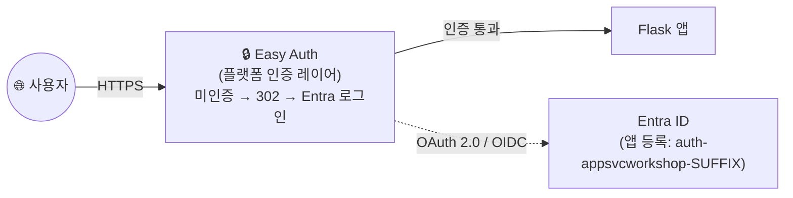
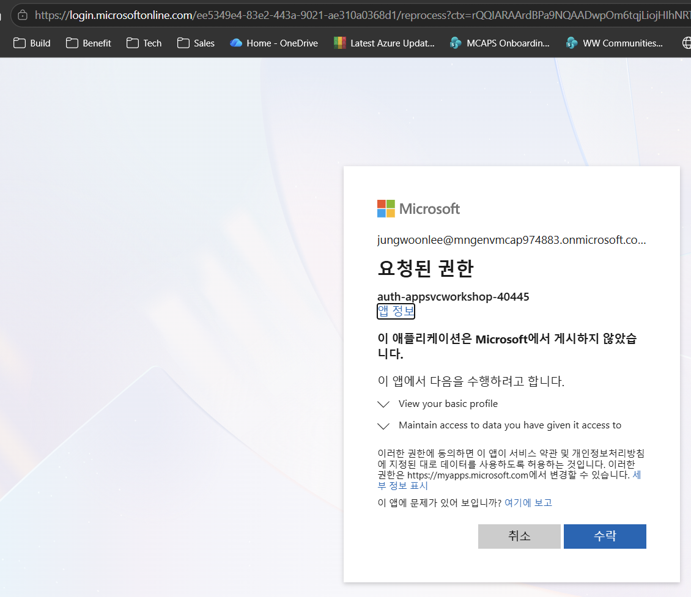

# 09. (선택) Easy Auth(Entra ID 로그인 게이트)

> 🟢 **실행** = 직접 입력·수행 · 👁️ **예시** = 눈으로만(개념/발췌) · 📋 **예상 출력** = 비교용(입력 불필요) · 🖼️ **예상 화면** = 브라우저/포털 스크린샷 참고

---

## 목표

이 모듈은 **선택 모듈**입니다. Azure App Service의 **Easy Auth** 기능을 구성하여 코드 수정 없이 Entra ID(구 Azure AD) 로그인 게이트를 활성화합니다. Entra 앱 등록을 생성하고 OAuth 2.0 / OpenID Connect 설정을 App Service에 연결한 뒤, 브라우저에서 인증 흐름을 확인합니다. 건너뛰어도 이후 모듈(10·11·12) 진행에 지장이 없습니다.

- Entra 앱 등록(`CLIENT_ID`)을 생성하고 리디렉션 URI를 구성합니다.
- `authV2` 확장으로 Easy Auth를 활성화하여 미인증 요청을 로그인 페이지로 리디렉션합니다.
- `/.auth/me` 내장 엔드포인트에서 클레임 JSON을 확인합니다.
- **코드 수정 없이** 플랫폼이 앞단에서 인증을 처리하는 Easy Auth 구조를 이해합니다.
- 모듈 종료 상태: **Entra 로그인 게이트 활성**.

완성 후의 구조는 다음과 같습니다.



> ⚠️ **이후 선택 모듈(10·11)은 curl 검증을 위해 첫머리에서 Easy Auth를 일시 비활성화합니다.** 해당 모듈 안내에 따라 auth를 껐다 켜십시오. 이 모듈을 마친 뒤에는 [12. 정리](12-cleanup.md)에서 **Entra 앱 등록 삭제 단계(모듈 09 수행자만)**를 잊지 마세요.

---

## 0단계 — (선택) 변수 재설정

> ⏭️ **08 모듈에서 이어서 같은 터미널로 진행 중이라면 이 단계는 건너뛰세요.**
> 새 터미널 세션을 열었거나 Cloud Shell이 재시작되어 변수가 사라진 경우에만 실행합니다.
> `SUFFIX` 는 **02 모듈에서 사용한 값과 동일하게** 입력하세요.

🟢 **실행**

```bash
SUFFIX=<이전에_메모한_값>
LOC=koreacentral
RG=rg-appsvcworkshop-$SUFFIX
PLAN=plan-appsvcworkshop-$SUFFIX
APP=app-appsvcworkshop-$SUFFIX
APP_URL="https://$(az webapp show -g $RG -n $APP --query defaultHostName -o tsv)"
echo "APP_URL=$APP_URL"
```

📋 **예상 출력**

```
APP_URL=https://app-appsvcworkshop-<SUFFIX>.azurewebsites.net
```

> 👁️ **1단계 완료 후 세션이 끊긴 경우 — `CLIENT_SECRET` 재발급**: `CLIENT_SECRET`은 생성 시점 이후 재조회가 불가능합니다. 세션이 끊겼다면 아래 명령으로 앱을 다시 찾고 시크릿을 재발급하여 진행하십시오.
> ```bash
> CLIENT_ID=$(az ad app list --display-name "auth-appsvcworkshop-$SUFFIX" --query "[0].appId" -o tsv)
> CLIENT_SECRET=$(az ad app credential reset --id $CLIENT_ID --query password -o tsv)
> ```

---

## 👁️ Easy Auth 구조 이해

Easy Auth는 App Service 플랫폼이 앱 앞단에서 인증을 처리하는 기능입니다.

| 항목 | 설명 |
|---|---|
| **코드 수정** | **0** — 앱 코드는 그대로, 플랫폼이 인증 레이어를 추가 |
| **내장 엔드포인트** | `/.auth/login/aad`, `/.auth/logout`, `/.auth/me` |
| **시크릿 저장** | `MICROSOFT_PROVIDER_AUTHENTICATION_SECRET` 앱 설정에 자동 주입 |
| **인증 흐름** | 미인증 요청 → 302 리디렉션 → Entra 로그인 → 콜백 → 원래 경로 |

> 👁️ `/.auth/me` 엔드포인트는 로그인 후 사용자 클레임(이름, 이메일, 그룹 등)을 JSON으로 반환합니다. 앱 코드에서는 `X-MS-CLIENT-PRINCIPAL-*` 헤더를 통해 클레임에 접근할 수 있습니다.

---

## 1단계 — Entra 앱 등록 및 시크릿 생성

🟢 **실행** — `authV2` 확장이 최신 버전인지 확인한 뒤, 테넌트 ID를 조회하고 앱 등록을 생성합니다.

```bash
# 2단계에서 Easy Auth v2 명령을 사용하기 위한 CLI 확장을 준비합니다.
az extension add --name authV2 --upgrade --only-show-errors

# 현재 로그인한 Entra 테넌트 ID를 조회합니다.
TENANT_ID=$(az account show --query tenantId -o tsv)

# 사용자 로그인을 받을 웹앱의 App Registration을 생성합니다.
# Easy Auth 콜백 URI와 단일 테넌트 범위를 지정하고,
# Application(Client) ID를 CLIENT_ID에 저장합니다.
CLIENT_ID=$(az ad app create --display-name "auth-appsvcworkshop-$SUFFIX" \
  --web-redirect-uris "$APP_URL/.auth/login/aad/callback" \
  --sign-in-audience AzureADMyOrg --query appId -o tsv)

# Easy Auth가 로그인 사용자 클레임을 받을 수 있도록
# OpenID Connect ID 토큰 발급을 허용합니다.
az ad app update --id $CLIENT_ID --enable-id-token-issuance true

# Easy Auth가 Entra ID에 애플리케이션 자신을 증명할 Client Secret을 생성합니다.
# 사용자는 이 시크릿이 아니라 자신의 Entra 계정으로 로그인합니다.
# Managed Identity를 생성하거나 활성화하는 단계가 아닙니다.
CLIENT_SECRET=$(az ad app credential reset --id $CLIENT_ID --display-name easyauth \
  --query password -o tsv)

# 12 정리에서 App Registration을 삭제할 수 있도록 Client ID를 출력합니다.
echo "CLIENT_ID=$CLIENT_ID"   # ⚠️ 12 정리에서 필요 — 메모
```

> ⚠️ **`CLIENT_ID` 값을 반드시 메모하십시오.** 모듈 12(정리)에서 Entra 앱 등록을 삭제할 때 이 값이 필요합니다.

> 👁️ `--sign-in-audience AzureADMyOrg`는 이 테넌트 계정만 로그인을 허용합니다. `--enable-id-token-issuance true`는 **필수 설정**입니다 — client secret이 구성된 Easy Auth는 하이브리드 플로(`response_type=code id_token`)를 사용하므로([공식 문서](https://learn.microsoft.com/azure/app-service/overview-authentication-authorization#client-type-and-oauth-flow-behavior)), 앱 등록에서 ID 토큰 발급이 꺼져 있으면 로그인 시 `AADSTS700054` 오류가 발생합니다.

> 👁️ 운영 환경에서는 **배포 슬롯마다 별도의 Entra 앱 등록**을 사용하는 것이 권장됩니다(환경 간 권한 공유 방지). 이 워크숍에서는 production 슬롯에만 Easy Auth를 구성합니다.

---

## 2단계 — Easy Auth 구성 및 활성화

🟢 **실행** — Microsoft 공급자를 구성한 뒤 Easy Auth를 활성화합니다.

```bash
az webapp auth config-version upgrade -g $RG -n $APP
az webapp auth microsoft update -g $RG -n $APP \
  --client-id $CLIENT_ID --client-secret "$CLIENT_SECRET" \
  --issuer "https://login.microsoftonline.com/$TENANT_ID/v2.0" --yes
az webapp auth update -g $RG -n $APP --enabled true \
  --action RedirectToLoginPage --redirect-provider azureActiveDirectory
```

> 👁️ `az webapp auth config-version upgrade`는 새 Web App의 기본 인증 설정(v1)을 authV2 스키마로 업그레이드합니다. 이 명령 없이 `az webapp auth microsoft update`를 실행하면 `Cannot use auth v2 commands when the app is using auth v1` 오류가 발생합니다. `--action RedirectToLoginPage`는 미인증 요청을 자동으로 로그인 페이지로 리디렉션합니다. `--redirect-provider azureActiveDirectory`는 여러 공급자 중 기본 공급자를 Entra ID로 지정합니다. 설정이 App Service에 전파되기까지 수십 초가 소요될 수 있습니다.

🟢 **실행** — 설정 전파 후 HTTP 상태 코드를 확인합니다(전파가 완료되지 않았으면 30초 대기 후 재시도).

```bash
curl -s -o /dev/null -w "%{http_code}\n" $APP_URL/
curl -s -o /dev/null -w "%{http_code}\n" -H "User-Agent: Mozilla/5.0" $APP_URL/
```

📋 **예상 출력**

```
401
302
```

> 👁️ Easy Auth는 요청의 `User-Agent`를 보고 응답을 구분합니다 — 브라우저(예: `Mozilla/5.0`)에는 `302`(Entra 로그인 페이지로 리디렉션)를, curl 같은 API 클라이언트에는 `401`을 반환합니다. 전파 직후에는 둘 다 `200`이 반환될 수 있으므로, 30초–1분 대기 후 재시도하십시오.

---

## 3단계 — 브라우저 검증

🟢 **브라우저에서 `$APP_URL`에 접속**합니다(변수 값으로 치환하여 입력).

🖼️ **예상 화면** — 브라우저가 `login.microsoftonline.com` 로그인 페이지로 리디렉션됩니다. 워크숍 계정으로 로그인하고 권한 동의 화면에서 **수락**을 클릭합니다.



> 👁️ 동의 화면의 "View your basic profile" 권한은 Easy Auth가 `/.auth/me`에서 사용자 클레임을 표시하기 위해 필요한 최소 권한입니다. "이 애플리케이션은 Microsoft에서 게시하지 않았습니다" 문구는 방금 생성한 워크숍용 앱 등록이므로 정상입니다.

🖼️ **예상 화면** — 로그인 후 `$APP_URL`의 Flask 앱 페이지가 정상 표시됩니다.


> 👁️ 화면의 버전(v1/v2)과 배경색은 모듈 진행 상태에 따라 다를 수 있습니다. 로그인 게이트를 통과해 앱 페이지가 표시되는 것이 검증 포인트입니다.

🟢 **브라우저에서 아래 URL에 접속**하여 클레임 JSON을 확인합니다.

```
$APP_URL/.auth/me
```

🖼️ **예상 화면** — `user_id`, `id_token`, `user_claims` 배열(이름·이메일·테넌트 ID 등)이 포함된 JSON이 브라우저에 반환됩니다.

---

## 검증

### HTTP 상태 코드 확인

🟢 **실행**

```bash
curl -s -o /dev/null -w "%{http_code}\n" $APP_URL/
curl -s -o /dev/null -w "%{http_code}\n" -H "User-Agent: Mozilla/5.0" $APP_URL/
```

📋 **예상 출력**

```
401
302
```

### Easy Auth 활성 상태 확인

🟢 **실행**

```bash
az webapp auth show -g $RG -n $APP \
  --query "{enabled:properties.platform.enabled,action:properties.globalValidation.unauthenticatedClientAction}" -o table
```

📋 **예상 출력**

```
Enabled    Action
---------  --------------------
True       RedirectToLoginPage
```

curl로 `401`/`302`가 확인되면 Easy Auth가 정상 활성화된 것입니다.

🖼️ **예상 화면** — 브라우저에서 `$APP_URL`에 접속하면 Entra 로그인 화면으로 리디렉션되고, 로그인 후 `$APP_URL/.auth/me`에서 사용자 클레임 JSON을 확인할 수 있습니다.

---

## 트러블슈팅

### (1) curl이 401/302가 아닌 200을 반환

Easy Auth 설정이 아직 전파 중입니다. 30초–1분 대기 후 재시도하거나, 현재 활성 상태를 확인합니다.

```bash
az webapp auth show -g $RG -n $APP \
  --query "{enabled:properties.platform.enabled,action:properties.globalValidation.unauthenticatedClientAction}" -o table
```

`enabled`가 `true`이고 `action`이 `RedirectToLoginPage`인지 확인합니다. 값이 올바르면 추가 대기 후 curl을 재시도합니다.

### (2) AADSTS 오류 — 리디렉션 URI 불일치

Entra 앱 등록의 리디렉션 URI가 실제 앱 URL과 다를 때 발생합니다. `APP_URL` 변수가 올바른지 확인한 뒤 앱 등록을 업데이트합니다.

```bash
echo $APP_URL
az ad app update --id $CLIENT_ID \
  --web-redirect-uris "$APP_URL/.auth/login/aad/callback"
```

업데이트 후 브라우저 캐시를 지우고 다시 접속합니다.

### (3) 앱 등록 생성 실패 — 권한 부족

테넌트 정책에 의해 일반 사용자의 앱 등록이 제한될 수 있습니다.

- Azure Portal → **Microsoft Entra ID** → **사용자 설정** → **앱 등록** 항목을 확인합니다.
- 앱 등록이 제한된 경우 테넌트 관리자에게 권한 부여 또는 앱 등록 직접 생성을 요청합니다.

### (4) `az webapp auth microsoft update` 명령 없음

`authV2` 확장이 설치되지 않은 경우입니다. 모듈 01에서 설치했으나 Cloud Shell 세션 초기화 시 누락될 수 있습니다.

```bash
az extension add --name authV2 --upgrade --only-show-errors
```

설치 후 2단계 명령을 재실행합니다.

---

이전 모듈: [08. 관찰 가능성](08-observability.md) · 다음 모듈: [10. Sidecar(선택)](10-sidecar-option.md) 또는 [12. 정리](12-cleanup.md)
