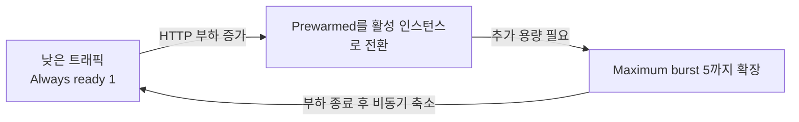
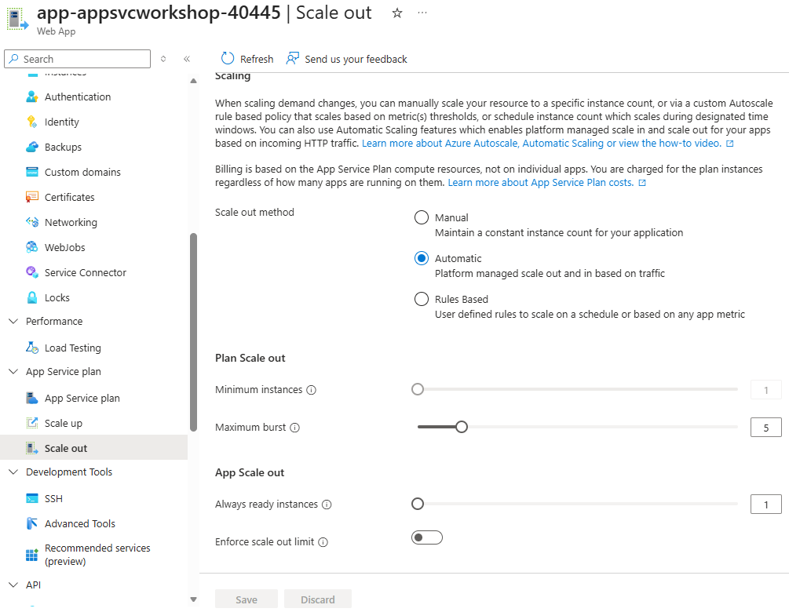

# 09. (선택) Automatic Scaling · Prewarmed A/B 실험

> 🔬 **선택 심화 모듈** — [07. Autoscale](07-autoscale.md)을 완료한 뒤 수행하는 것을 권장합니다. 이 모듈은 07의 규칙 기반 Autoscale을 제거하고 App Service Automatic Scaling으로 전환한 뒤 Prewarmed 0/4를 비교합니다.

> 🟢 **실행** = 직접 입력·수행 · 👁️ **예시** = 눈으로만(개념/발췌) · 📋 **예상 출력** = 비교용(입력 불필요)

---

## 목표

이 선택 심화 모듈에서는 07의 Azure Monitor Autoscale을 **Automatic Scaling**으로 전환하고, `hey`와 두 Python observer를 사용하여 부하 시작 뒤 새 instance가 **언제 실제 응답에 처음 투입되는지**를 관찰합니다. 단일 실행의 승패를 가르기보다 `Prewarmed=0`과 `Prewarmed=4`에서 보이는 외부 증거를 기록하고 해석합니다.

- 07의 Autoscale 설정을 제거하고 Automatic Scaling(Maximum burst 5, Always ready 1, Prewarmed 1)을 활성화합니다.
- `STARTUP_DELAY_SECONDS=60`으로 새 프로세스의 시작 준비 시간을 눈에 보이게 만듭니다.
- `hey` 부하 시작 시각과 새 instance의 최초 관찰 시각으로 `load_to_first_response_seconds`를 계산합니다.
- `/api/info`의 `started_at`으로 계산한 `first_response_age`는 60초 시작 지연이 적용됐는지 확인하는 보조 지표로 유지합니다.
- `Prewarmed=0`과 `Prewarmed=4`의 인스턴스별 시작·투입 타임라인을 비교하되, 한 번의 실행에서 어느 쪽이 반드시 더 빠르다고 판정하지 않습니다.
- `InstanceCount` 메트릭으로 시험 전·시험 사이의 단일 인스턴스 기준 상태를 확인합니다.
- 종료 전에 Prewarmed를 기본값 1로 되돌리고 실험용 시작 지연을 삭제합니다.
- 모듈 종료 상태: **Automatic scaling 활성(Always ready 1·Prewarmed 1·Maximum burst 5), prod = v2** (이후 모듈에서 이 상태가 유지됩니다).

## 0단계 — (선택) 변수 재설정

> ⏭️ **07 모듈에서 이어서 같은 터미널로 진행 중이라면 이 단계는 건너뛰세요.**
> 새 터미널 세션을 열었거나 Cloud Shell이 재시작되어 변수가 사라진 경우에만 실행합니다.
> `SUFFIX` 는 **02 모듈에서 사용한 값과 동일하게** 입력하세요.

🟢 **실행**

```bash
# 이전 모듈의 기본 리소스 변수를 복원합니다.
SUFFIX=<이전에_메모한_값>
LOC=koreacentral
RG=rg-appsvcworkshop-$SUFFIX
PLAN=plan-appsvcworkshop-$SUFFIX
APP=app-appsvcworkshop-$SUFFIX
LAW=log-appsvcworkshop-$SUFFIX
APPI=appi-appsvcworkshop-$SUFFIX
```

---

## 공통 상태 — 항상 실행

> 🟢 0단계를 건너뛰었더라도 아래 블록은 반드시 실행합니다. 관찰 스크립트 경로와 이 모듈에서 처음 사용하는 Autoscale 이름·리소스 ID를 항상 구성합니다.

🟢 **실행**

```bash
# 관찰 스크립트 경로와 Automatic Scaling 전환에 필요한 파생 변수를 구성합니다.
REPO_DIR="$HOME/ms-appservice-basic-workshop01"
AUTOSCALE=autoscale-appsvcworkshop-$SUFFIX
APP_URL="https://$(az webapp show -g "$RG" -n "$APP" --query defaultHostName -o tsv)"
PLAN_ID=$(az appservice plan show -g "$RG" -n "$PLAN" --query id -o tsv)
APP_ID=$(az webapp show -g "$RG" -n "$APP" --query id -o tsv)
echo "APP_URL=$APP_URL"
```

📋 **예상 출력**

```
APP_URL=https://app-appsvcworkshop-<SUFFIX>.azurewebsites.net
```

---

## 👁️ Autoscale과 Automatic Scaling

Microsoft Learn은 한 App Service Plan에 **Autoscale과 Automatic Scaling 중 하나만 활성화**하도록 안내합니다.

| 항목 | Azure Monitor Autoscale | App Service Automatic Scaling |
|---|---|---|
| 적용 범위 | App Service Plan 전체 | Plan 활성화 + Web App별 설정 |
| 트리거 | CPU·메모리·큐·일정 규칙 | HTTP 트래픽을 플랫폼이 판단 |
| 주요 설정 | capacity, rules, cooldown | Maximum burst, Always ready, Prewarmed |
| 이 워크숍 | 07 | 09 |

### Always ready, Prewarmed, Maximum burst

| 적용 범위 | 설정 | 역할 | 이 실험의 기준값 |
|---|---|---|---|
| App Service Plan | Maximum burst | HTTP 부하에 따라 확장할 수 있는 최대 인스턴스 수 | 5 |
| Web App | Always ready | 트래픽이 없어도 유지할 최소 인스턴스 수 | 1 |
| Web App | Prewarmed | 다음 HTTP scale-out에 준비할 워밍 버퍼 수 | Trial A 0 / Trial B 4 |



Always ready를 높이면 트래픽이 적을 때도 유지하는 기본 용량과 비용이 함께 증가합니다. Prewarmed는 HTTP 부하가 증가하고 활성 인스턴스가 사용되기 시작할 때 할당되는 rolling 워밍 버퍼입니다. 할당된 Prewarmed 인스턴스도 초 단위로 과금되지만, 앱이 유휴 상태일 때 설정값만큼 항상 실행되는 것은 아닙니다.

뒤의 A/B 실험에서는 다른 Automatic Scaling 값은 유지한 채 `Prewarmed`만 0과 4로 변경하여, 부하 시작 뒤 새 instance가 실제 응답에 투입되는 시점에서 관찰되는 차이를 비교합니다. 기본값 1은 대부분의 운영 시나리오에 권장되며, 4는 워크숍에서 대비를 키우기 위한 일시적인 실험값입니다.

---

## 1단계 — Autoscale 제거 및 Automatic Scaling 활성화

🟢 **실행**

```bash
# 07의 Autoscale을 제거하고 App Service Automatic Scaling으로 전환합니다.
# 뒤의 Trial A/B에서 부하 생성기 `hey`를 바로 찾을 수 있도록 Go 설치 경로를 PATH에 포함합니다.
export PATH=$HOME/go/bin:$PATH
# `hey`가 없으면 실험 단계가 실행되지 않으므로, 전환 작업을 더 진행하기 전에 선행 설치 누락을 즉시 중단합니다.
if ! command -v hey >/dev/null 2>&1; then
  echo "hey가 없습니다. 07의 hey 설치 단계를 먼저 수행하세요." >&2
  false
fi

if [ "$(az monitor autoscale list -g "$RG" --query "length([?name=='$AUTOSCALE'])" -o tsv)" != "0" ] &&
  ! az monitor autoscale delete -g "$RG" -n "$AUTOSCALE"; then
  echo "Plan의 Autoscale 설정 제거 실패" >&2
  false
else
  # P0v4(Premium v4)는 az CLI의 elastic 설정 플래그가 아직 지원하지 않아 az rest를 사용합니다(트러블슈팅 (7) 참고).
  # Plan 리소스 수준에서 Automatic Scaling을 켜고, burst 시 최대로 늘릴 worker 수를 5로 고정합니다.
  az rest --method patch \
    --uri "${PLAN_ID}?api-version=2024-11-01" \
    --body '{"sku":{"name":"P0v4","tier":"PremiumV4","size":"P0v4","family":"Pv4","capacity":1},"properties":{"elasticScaleEnabled":true,"maximumElasticWorkerCount":5}}' \
    --output none &&

  # Web App config 수준에서 Always-ready 1개와 Prewarmed 1개를 설정합니다. 이 값들은 위 Plan 설정과 별도입니다.
  az rest --method patch \
    --uri "${APP_ID}/config/web?api-version=2024-11-01" \
    --body '{"properties":{"minimumElasticInstanceCount":1,"preWarmedInstanceCount":1}}' \
    --output none &&

  az webapp config appsettings delete -g "$RG" -n "$APP" \
    --setting-names STARTUP_DELAY_SECONDS --output none &&
  echo "Automatic Scaling 전환 완료"
fi
```

> ⚠️ 완료 메시지가 보이지 않으면 A/B 준비로 진행하지 않습니다.

🟢 **실행 — 앱 준비와 전환 상태 확인**

```bash
# 전환 직후 재시작된 앱이 다시 healthy 상태가 될 때까지 최대 18회, 5초 간격으로 확인합니다.
for attempt in $(seq 1 18); do
  if curl -fsS --max-time 10 "$APP_URL/health" | jq -e '.status == "ok"'; then
    break
  fi
  if [ "$attempt" -eq 18 ]; then
    echo "Automatic Scaling 전환 후 /health 확인 실패" >&2
    false
  fi
  sleep 5
done

# Plan 상태만 az rest로 조회합니다. CLI 조회는 Premium v4의 elastic 속성을 반환하지 않습니다.
PLAN_SCALE=$(az rest --method get \
  --uri "${PLAN_ID}?api-version=2024-11-01" \
  --query "properties.{automaticScaling:elasticScaleEnabled,maximumBurst:maximumElasticWorkerCount}" -o json)
APP_SCALE=$(az webapp show -g "$RG" -n "$APP" \
  --query "siteConfig.{alwaysReady:minimumElasticInstanceCount,prewarmed:preWarmedInstanceCount}" -o json)
AUTOSCALE_COUNT=$(az monitor autoscale list -g "$RG" \
  --query "length([?name=='$AUTOSCALE'])" -o tsv)

printf '%s\n%s\n' "$PLAN_SCALE" "$APP_SCALE"
echo "Autoscale setting count=$AUTOSCALE_COUNT"

# Plan에서 Automatic Scaling=true와 maximumBurst=5, Web App에서 Always-ready=1과 Prewarmed=1, Plan 대상 Autoscale 0개를 모두 만족해야 전환 완료입니다.
if ! jq -e '.automaticScaling == true and .maximumBurst == 5' \
    >/dev/null <<< "$PLAN_SCALE" ||
  ! jq -e '.alwaysReady == 1 and .prewarmed == 1' \
    >/dev/null <<< "$APP_SCALE" ||
  [ "$AUTOSCALE_COUNT" != "0" ]; then
  echo "Automatic Scaling 전환 상태 불일치" >&2
  false
fi
```

📋 **예상 출력**

```text
{
  "automaticScaling": true,
  "maximumBurst": 5
}
{
  "alwaysReady": 1,
  "prewarmed": 1
}
Autoscale setting count=0
```

🖼️ **예상 화면 — Azure Portal Automatic Scaling 설정**



---

## 2단계 — Prewarmed A/B 비교 준비

이번 모듈의 주 관찰 포인트는 **부하를 시작한 뒤 새 instance 응답이 처음 보이기까지 얼마나 걸렸는가**입니다. `STARTUP_DELAY_SECONDS=60`으로 cold-start 부담을 노이즈보다 크게 만들고, 동일한 burst 부하에서 `Prewarmed=0`과 `Prewarmed=4`의 관찰 결과를 같은 형식으로 기록합니다.

`load_to_first_response_seconds`는 `hey` 시작 직전 기록한 `load_started_at`부터 observer가 새 instance 응답을 처음 받은 `first_seen_at`까지의 시간입니다. 이것이 Prewarmed의 주 비교 지표입니다. `started_at`은 60초 시작 지연 전에 기록되므로 `first_response_age`는 약 60초의 준비 하한이 실제로 적용됐는지 보는 보조 지표입니다. `first_seen_at`은 플랫폼 내부의 정확한 activation 시각이 아니라 클라이언트가 처음 관찰한 외부 증거입니다.

🟢 **실행 — 시작 지연 설정과 결과 경로 준비**

> 👁️ 두 시험의 결과를 저장할 디렉터리와 JSON 파일 경로를 먼저 준비하고, cold-start 차이를 분명히 볼 수 있도록 `STARTUP_DELAY_SECONDS=60`을 앱 설정에 추가합니다.

```bash
# A/B 결과 파일 경로를 준비하고 앱 시작 지연을 적용합니다.
# AB_DIR는 두 Trial의 hey 출력과 observer JSON을 한곳에 모으는 공통 작업 디렉터리입니다.
AB_DIR="${AB_DIR:-$HOME/appservice-prewarmed-ab}"
mkdir -p "$AB_DIR"
# Trial A에서 새 instance 응답 타임라인을 저장할 JSON 경로입니다.
NO_PREWARM_OBSERVATIONS="$AB_DIR/prewarmed-0-observations.json"
# Trial B에서 새 instance 응답 타임라인을 저장할 JSON 경로입니다.
PREWARM_OBSERVATIONS="$AB_DIR/prewarmed-4-observations.json"
# Trial A의 InstanceCount 시계열을 저장할 JSON 경로입니다.
NO_PREWARM_METRICS="$AB_DIR/prewarmed-0-instance-count.json"
# Trial B의 InstanceCount 시계열을 저장할 JSON 경로입니다.
PREWARM_METRICS="$AB_DIR/prewarmed-4-instance-count.json"

# cold-start worker와 rolling warm buffer의 차이를 분명히 보기 위해 앱 시작 지연을 60초로 키웁니다.
az webapp config appsettings set -g "$RG" -n "$APP" \
  --settings STARTUP_DELAY_SECONDS=60 --output none &&
echo "STARTUP_DELAY_SECONDS=60 설정 완료"
```

> ⚠️ 오류가 출력되거나 완료 메시지가 보이지 않으면 다음 단계로 진행하지 마세요. 설정을 변경한 뒤 중단해야 한다면 트러블슈팅 (5)의 **실패 후 기본 상태 복구** 명령을 실행합니다.

🟢 **실행 — 앱 준비 상태 확인**

> 👁️ 앱 설정 변경으로 프로세스가 재시작될 수 있으므로 `/health`를 최대 18회 확인합니다. 응답 JSON의 `status`가 `ok`일 때만 다음 명령으로 진행합니다.

```bash
# 앱 재시작 후 /health가 정상화될 때까지 기다립니다.
# 성공 전제로 시작하지 않고, 첫 정상 응답을 보기 전까지는 실패 상태를 유지합니다.
HEALTH_CHECK_STATUS=1
# 최대 18회까지 5초 간격으로 readiness를 polling합니다.
for attempt in $(seq 1 18); do
  HEALTH_BODY=$(curl -fsS --max-time 10 "$APP_URL/health" 2>/dev/null || true)
  if jq -e '.status == "ok"' >/dev/null 2>&1 <<< "$HEALTH_BODY"; then
    printf '%s\n' "$HEALTH_BODY"
    # `/health`가 정상화되면 상태를 0으로 바꾸고 더 이상 기다리지 않습니다.
    HEALTH_CHECK_STATUS=0
    break
  fi
  if [ "$attempt" -lt 18 ]; then
    # 마지막 시도 전까지는 5초 쉬어 재시작 중인 앱에 준비 시간을 줍니다.
    sleep 5
  fi
done
# 끝까지 정상 응답이 없으면 이후 Trial을 막고 복구 안내와 함께 명시적으로 실패시킵니다.
if [ "$HEALTH_CHECK_STATUS" -ne 0 ]; then
  echo "/health 확인 실패: 트러블슈팅 (5)의 복구 명령을 실행하세요." >&2
  false
fi
```

📋 **예상 출력**

```json
{"status":"ok"}
```

> 👁️ `InstanceCount`는 시험 시작 전·시험 사이의 단일 인스턴스 기준 상태 확인과 각 시험 중의 capacity 변화 관찰에 사용합니다. 시험 중에는 30초마다 조회해 1분 단위 값을 별도 JSON으로 저장합니다. `observe_instances.py`는 `load_started_at`, 새 instance의 `first_seen_at`, 주 지표 `load_to_first_response_seconds`, 보조 지표 `started_at`·`first_response_age`를 기록합니다.


## 3단계 — 시험 A: Prewarmed=0

먼저 `Prewarmed=0`에서 새 instance가 언제 처음 응답에 투입되는지 관찰합니다.

🟢 **실행 — Prewarmed=0 설정**

> 👁️ 시험 A 조건을 만들기 위해 Always-ready는 1로 유지하고 Prewarmed만 0으로 변경합니다. PATCH 직후 같은 설정을 조회하여 `prewarmed=0`이 반영됐는지 확인합니다.

```bash
# 시험 A를 위해 Prewarmed 인스턴스를 0으로 설정합니다.
az rest --method patch \
  --uri "${APP_ID}/config/web?api-version=2024-11-01" \
  --body '{"properties":{"minimumElasticInstanceCount":1,"preWarmedInstanceCount":0}}' \
  --output none &&
az webapp show -g "$RG" -n "$APP" \
  --query "siteConfig.{alwaysReady:minimumElasticInstanceCount,prewarmed:preWarmedInstanceCount}"
```

📋 **예상 출력**

```json
{
  "alwaysReady": 1,
  "prewarmed": 0
}
```

🟢 **실행 — 단일 인스턴스 기준 상태 확인**

> 👁️ 이 명령을 시작한 뒤 수집된 `InstanceCount` 1분 Average가 연속 두 번 1이 될 때까지 30초 간격으로 최대 30회(약 15분) 확인합니다. 07의 Autoscale에서 늘어난 worker가 아직 축소 중이면 여기서 기다리므로 이전 instance가 Trial A에 섞이지 않습니다.

```bash
# Trial A 전에 새 메트릭 두 개가 연속으로 단일 인스턴스 상태인지 확인합니다.
# 게이트 시작 시각 이후의 메트릭만 조회해 Trial A 이전에 쌓인 오래된 샘플을 제외합니다.
GATE_START_TIME=$(date -u +%Y-%m-%dT%H:%M:%SZ)
SINGLE_INSTANCE_READY=0
# 최대 30회, 30초 간격으로 fresh 1분 Average 샘플이 두 번 연속 1인지 확인합니다.
for attempt in $(seq 1 30); do
  # GATE_START_TIME 이후에 수집된 fresh InstanceCount 1분 Average 마지막 두 값을 TSV로 가져옵니다.
  LAST_TWO_COUNTS=$(az monitor metrics list \
    --resource "$APP_ID" \
    --metric InstanceCount \
    --interval PT1M \
    --aggregation Average \
    --start-time "$GATE_START_TIME" \
    --query "(value[0].timeseries[0].data[?average != null].average)[-2:]" \
    -o tsv | xargs)
  printf 'Trial A single-instance gate %02d/30 counts=[%s]\n' \
    "$attempt" "${LAST_TWO_COUNTS:-pending}"

  # 마지막 두 샘플이 모두 1이어야 바로 직전 두 집계 구간이 연속으로 단일 인스턴스였음을 뜻합니다.
  if [ "$LAST_TWO_COUNTS" = "1.0 1.0" ]; then
    SINGLE_INSTANCE_READY=1
    break
  fi
  if [ "$attempt" -lt 30 ]; then
    # 아직 기준 상태가 아니면 다음 30초 polling 지점까지 기다립니다.
    sleep 30
  fi
done

# 30번 안에 최신 두 샘플이 모두 1이 되지 않으면 Trial A를 시작하지 않고 실패합니다.
if [ "$SINGLE_INSTANCE_READY" -ne 1 ]; then
  echo "Trial A 최신 단일 인스턴스 메트릭 2회 연속 확인 실패" >&2
  false
fi
```

📋 **예상 출력**

```text
Trial A single-instance gate 01/30 counts=[pending]
Trial A single-instance gate 03/30 counts=[1.0]
Trial A single-instance gate 05/30 counts=[1.0 1.0]
```

🟢 **실행 — 시험 A 관찰**

> 👁️ **시험 A 명령 흐름**
>
> 1. `curl`과 `jq`로 `/api/info` 응답에서 현재 기준 instance ID를 가져옵니다. ID를 얻지 못하면 `if`의 `else`로 이동하므로 부하와 observer는 시작되지 않습니다.
> 2. `observe_scaling_metric.py`는 Web App에서 지원되는 `InstanceCount`를 30초마다 최대 240초 관찰합니다. 180초 부하가 끝난 뒤에도 Azure Monitor 수집 지연을 위해 최대 60초 더 기다리며, 화면과 `$NO_PREWARM_METRICS` JSON에 기록합니다.
> 3. `hey` 직전에 `NO_PREWARM_LOAD_STARTED_AT`을 UTC로 기록합니다. 이 시각이 부하 시작 기준이며 observer JSON에도 함께 저장됩니다.
> 4. `hey -z 180s -c 100 -q 10`은 180초 동안 최대 100개 동시 worker를 사용하고 worker당 초당 10개 요청으로 `/api/info`에 부하를 보냅니다. `&`로 백그라운드 실행하며 요약 결과는 `$AB_DIR/hey-burst-0.out`에 저장합니다.
> 5. `METRIC_PID=$!`와 `HEY_PID=$!`는 각 백그라운드 프로세스의 PID를 저장합니다. 뒤의 `wait`가 정확한 프로세스의 완료와 종료 상태를 확인할 때 사용합니다.
> 6. `observe_instances.py`는 `--load-started-at`으로 같은 기준 시각을 받아 새 instance의 부하 기준 최초 응답 지연을 계산하고 `$NO_PREWARM_OBSERVATIONS` JSON에 저장합니다.
> 7. instance observer가 끝나면 `hey`와 metric observer를 차례로 기다리고 `OBSERVER_STATUS`, `HEY_STATUS`, `METRIC_STATUS`를 확인합니다. 세 exit code가 모두 0일 때만 시험 A를 성공으로 보고 시험 B로 진행합니다.

```bash
# 시험 A의 부하, 인스턴스 관찰, InstanceCount 메트릭 수집을 동시에 실행합니다.
# 현재 응답 중인 기준 instance를 먼저 확보해야 observer가 이후에 보이는 "새 instance"만 분리해 기록할 수 있습니다.
if BASELINE_INSTANCE=$(curl -fsS --max-time 10 "$APP_URL/api/info" |
  jq -er 'select((.instance | type) == "string" and (.instance | test("\\S"))) | .instance'); then
  echo "Prewarmed=0 기준 instance: $BASELINE_INSTANCE"

  # metric observer를 먼저 백그라운드 시작해 이 시점부터의 trial_started_at과 InstanceCount 변화를 Trial A 전용 JSON에 기록합니다.
  python3 "$REPO_DIR/scripts/observe_scaling_metric.py" \
    --resource "$APP_ID" \
    --duration 240 \
    --poll-interval 30 \
    --output "$NO_PREWARM_METRICS" &
  # METRIC_PID는 Trial A metric observer를 독립적으로 wait하고 종료 코드를 따로 받기 위한 PID입니다.
  METRIC_PID=$!

  # hey 실행 직전 UTC 시각을 기록해 "부하 시작 → 새 instance 최초 응답"의 공통 기준으로 사용합니다.
  NO_PREWARM_LOAD_STARTED_AT=$(date -u +%Y-%m-%dT%H:%M:%SZ)
  echo "Prewarmed=0 load_started_at: $NO_PREWARM_LOAD_STARTED_AT"

  # hey는 동일한 Trial A burst 부하를 독립 백그라운드 작업으로 보내고 요약 출력은 전용 .out 파일에 남깁니다.
  hey -z 180s -c 100 -q 10 "$APP_URL/api/info" \
    > "$AB_DIR/hey-burst-0.out" &
  # HEY_PID는 observer 실패 시 hey·metric observer를 각 PID로 정리할 때 hey 프로세스를 지정하고, 나중에 hey exit code를 정확히 wait하기 위한 PID입니다.
  HEY_PID=$!

  # instance observer는 foreground에서 새 instance의 started_at/first_seen_at을 수집하고, 위 두 백그라운드 작업과 동시에 독립적으로 진행됩니다.
  if python3 "$REPO_DIR/scripts/observe_instances.py" \
    --url "$APP_URL/api/info" \
    --baseline-instance "$BASELINE_INSTANCE" \
    --load-started-at "$NO_PREWARM_LOAD_STARTED_AT" \
    --duration 180 \
    --concurrency 30 \
    --request-timeout 5 \
    --output "$NO_PREWARM_OBSERVATIONS"
  then
    OBSERVER_STATUS=0
  else
    OBSERVER_STATUS=$?
    # foreground observer가 실패하면 남아 있는 hey와 metric observer를 각 PID로 정리해 Trial A 산출물이 어긋나지 않게 합니다.
    kill "$HEY_PID" "$METRIC_PID" 2>/dev/null || true
  fi

  # 먼저 hey 종료를 기다려 부하 생성 성공 여부의 exit code를 별도로 캡처합니다.
  if wait "$HEY_PID"; then HEY_STATUS=0; else HEY_STATUS=$?; fi
  # 그다음 metric observer 종료를 기다려 메트릭 수집 성공 여부의 exit code를 별도로 캡처합니다.
  if wait "$METRIC_PID"; then METRIC_STATUS=0; else METRIC_STATUS=$?; fi

  # observer·hey·metric 세 프로세스가 모두 0이어야 같은 Trial A 창의 응답/부하/메트릭 결과가 모두 유효합니다.
  echo "observer exit=$OBSERVER_STATUS, hey exit=$HEY_STATUS, metric exit=$METRIC_STATUS"
  if [ "$OBSERVER_STATUS" -ne 0 ] || [ "$HEY_STATUS" -ne 0 ] || [ "$METRIC_STATUS" -ne 0 ]; then
    echo "시험 A 실패: 세 결과를 비교하지 말고 트러블슈팅 (5)의 복구 명령을 실행하세요." >&2
    false
  fi
else
  echo "시험 A 기준 instance 확인 실패: 트러블슈팅 (5)의 복구 명령을 실행한 뒤 2단계부터 다시 시도하세요." >&2
  false
fi
```

> ⚠️ `observer exit=0, hey exit=0, metric exit=0`일 때만 시험 B로 진행합니다. observer가 2로 종료되거나 metric observer가 1 또는 2로 종료되면 트러블슈팅 (5)의 **실패 후 기본 상태 복구** 명령을 실행한 뒤 2단계부터 다시 시도합니다.

📋 **예상 출력 형식** (시각과 값은 실행마다 달라집니다)

```text
metric_timestamp	observed_at	instance_count
instance	load_started_at	first_seen_at	load_to_first_response_seconds	started_at	first_response_age
2026-07-25T07:52:00Z	2026-07-25T07:52:45Z	1
2026-07-25T07:53:00Z	2026-07-25T07:53:17Z	1
d09f4aa4	2026-07-25T07:52:43Z	2026-07-25T07:53:34Z	51	2026-07-25T07:52:57Z	37
c0b2201f	2026-07-25T07:52:43Z	2026-07-25T07:53:43Z	60	2026-07-25T07:53:07Z	36
dbaea6a9	2026-07-25T07:52:43Z	2026-07-25T07:53:51Z	68	2026-07-25T07:53:14Z	37
5bef3ff3	2026-07-25T07:52:43Z	2026-07-25T07:53:51Z	68	2026-07-25T07:53:18Z	33
2026-07-25T07:55:00Z	2026-07-25T07:55:23Z	5
[2]+  Done                    hey -z 180s -c 100 -q 10 "$APP_URL/api/info" > "$AB_DIR/hey-burst-0.out"
2026-07-25T07:56:00Z	2026-07-25T07:56:26Z	5
[1]+  Done                    python3 "$REPO_DIR/scripts/observe_scaling_metric.py" --resource "$APP_ID" --duration 240 --poll-interval 30 --output "$NO_PREWARM_METRICS"
observer exit=0, hey exit=0, metric exit=0
```

> 👁️ 세 exit code가 모두 0이므로 유효한 시험 A 결과입니다. 기준 instance를 제외한 새 instance 4개가 기록됐고, `InstanceCount`는 이후 5까지 증가했습니다. metric과 instance 행의 출력 순서는 실행마다 달라질 수 있습니다. `PT1M` Average와 수집 지연 때문에 중간 metric timestamp가 생략되거나, 새 instance의 `first_seen_at`보다 count 증가가 늦게 출력돼도 오류가 아닙니다. `[1]`, `[2]` 작업 번호도 셸 실행마다 달라질 수 있습니다.

---

## 4단계 — 단일 인스턴스 기준선 확보 후 시험 B: Prewarmed=4

시험 B는 반드시 시험 A의 부하가 끝나고 새 기준 상태가 다시 확보된 뒤 시작합니다. 이 게이트는 scale-in 자체를 관찰하려는 것이 아니라, 시험 A로 늘어난 인스턴스가 남아 있으면 시험 B에서 scale-out이 일어나지 않아 비교가 무효가 되므로 **두 시험이 같은 단일 인스턴스 기준선에서 시작하도록 보장하는 통제 장치**입니다. 기준선을 확보한 뒤 Prewarmed를 4로 설정하고, 같은 burst에서 부하 시작 기준 최초 응답 지연을 다시 관찰합니다.

🟢 **실행 — 시험 B 시작 전 단일 인스턴스 기준 상태 확인**

> 👁️ 이 명령을 시작한 뒤 수집된 `InstanceCount` 1분 Average가 연속 두 번 1이 될 때까지 30초 간격으로 최대 30회(약 15분) 확인합니다. 시험 A 부하로 늘어난 인스턴스가 축소된 뒤에만 Trial B를 시작합니다.

```bash
# Trial B 전에 새 메트릭 두 개가 연속으로 단일 인스턴스 상태인지 확인합니다.
# 게이트 시작 시각 이후의 메트릭만 조회해 Trial A에서 남은 오래된 샘플을 Trial B 판단에서 제외합니다.
GATE_START_TIME=$(date -u +%Y-%m-%dT%H:%M:%SZ)
SINGLE_INSTANCE_READY=0
# 최대 30회, 30초 간격으로 fresh 1분 Average 샘플이 두 번 연속 1인지 확인합니다.
for attempt in $(seq 1 30); do
  # GATE_START_TIME 이후에 수집된 fresh InstanceCount 1분 Average 마지막 두 값을 TSV로 가져옵니다.
  LAST_TWO_COUNTS=$(az monitor metrics list \
    --resource "$APP_ID" \
    --metric InstanceCount \
    --interval PT1M \
    --aggregation Average \
    --start-time "$GATE_START_TIME" \
    --query "(value[0].timeseries[0].data[?average != null].average)[-2:]" \
    -o tsv | xargs)
  printf 'Trial B single-instance gate %02d/30 counts=[%s]\n' \
    "$attempt" "${LAST_TWO_COUNTS:-pending}"

  # 마지막 두 샘플이 모두 1이어야 Trial A 부하가 끝난 뒤 다시 단일 인스턴스로 돌아왔다고 판단합니다.
  if [ "$LAST_TWO_COUNTS" = "1.0 1.0" ]; then
    SINGLE_INSTANCE_READY=1
    break
  fi
  if [ "$attempt" -lt 30 ]; then
    # 아직 기준 상태가 아니면 다음 30초 polling 지점까지 기다립니다.
    sleep 30
  fi
done

# 30번 안에 최신 두 샘플이 모두 1이 되지 않으면 Trial B를 시작하지 않고 실패합니다.
if [ "$SINGLE_INSTANCE_READY" -ne 1 ]; then
  echo "Trial B 최신 단일 인스턴스 메트릭 2회 연속 확인 실패" >&2
  false
fi
```

📋 **예상 출력**

```text
Trial B single-instance gate 01/30 counts=[pending]
...
Trial B single-instance gate 09/30 counts=[1.0 1.0]
```

> 👁️ 별도의 prime 부하나 `InstanceCount>=2` 확인은 하지 않습니다.

🟢 **실행 — Prewarmed=4 설정**

> 👁️ 시험 B의 대비를 키우기 위해 Prewarmed를 4로 설정하고 즉시 조회합니다. 이 설정은 유휴 상태에서 4개를 항상 실행하는 값이 아니라 HTTP 부하가 시작된 뒤 유지할 rolling buffer 크기입니다. 할당된 Prewarmed 인스턴스는 초 단위 과금 대상이므로 시험이 끝나면 5단계에서 1로 되돌립니다.

```bash
# 시험 B를 위해 Prewarmed rolling buffer를 4로 설정합니다.
az rest --method patch \
  --uri "${APP_ID}/config/web?api-version=2024-11-01" \
  --body '{"properties":{"minimumElasticInstanceCount":1,"preWarmedInstanceCount":4}}' \
  --output none &&
az webapp show -g "$RG" -n "$APP" \
  --query "siteConfig.{alwaysReady:minimumElasticInstanceCount,prewarmed:preWarmedInstanceCount}"
```

📋 **예상 출력**

```json
{
  "alwaysReady": 1,
  "prewarmed": 4
}
```

🟢 **실행 — 시험 B 관찰**

> 👁️ **시험 B 명령 흐름**
>
> 1. 시험 A와 같은 순서로 `curl`과 `jq`를 사용해 현재 기준 instance ID를 확보합니다. 차이는 앞 단계에서 Prewarmed=4로 설정했다는 점이며, ID 확보 실패 시 부하를 시작하지 않습니다.
> 2. `observe_scaling_metric.py`는 시험 A와 동일하게 `InstanceCount`를 30초마다 최대 240초 관찰하고 `$PREWARM_METRICS` JSON에 저장합니다.
> 3. `hey` 직전에 `PREWARM_LOAD_STARTED_AT`을 UTC로 기록하여 Trial A와 같은 부하 시작 기준을 만듭니다.
> 4. `hey -z 180s -c 100 -q 10`으로 시험 A와 동일한 180초 부하를 백그라운드 실행합니다. 출력 파일은 `$AB_DIR/hey-burst-4.out`을 사용합니다.
> 5. `METRIC_PID=$!`와 `HEY_PID=$!`에 Trial B의 백그라운드 프로세스 PID를 저장하여 뒤의 `wait`가 각 완료와 종료 상태를 정확히 확인하도록 합니다.
> 6. `observe_instances.py`는 같은 `PREWARM_LOAD_STARTED_AT`을 받아 새 instance의 부하 기준 최초 응답 지연을 `$PREWARM_OBSERVATIONS` JSON에 저장합니다.
> 7. observer, `hey`, metric observer의 세 exit code가 모두 0인지 확인합니다. 하나라도 0이 아니면 세 결과를 비교하지 않고 트러블슈팅 (5)의 복구 명령을 실행합니다.

```bash
# 시험 B에 시험 A와 동일한 부하와 관찰 조건을 적용합니다.
# Trial B에서도 현재 기준 instance를 먼저 읽어 이후 observer 결과를 "새 instance"로 한정합니다.
if BASELINE_INSTANCE=$(curl -fsS --max-time 10 "$APP_URL/api/info" |
  jq -er 'select((.instance | type) == "string" and (.instance | test("\\S"))) | .instance'); then
  echo "Prewarmed=4 기준 instance: $BASELINE_INSTANCE"

  # metric observer를 먼저 백그라운드 시작해 이 시점부터의 trial_started_at과 InstanceCount 변화를 Trial B 전용 JSON에 기록합니다.
  python3 "$REPO_DIR/scripts/observe_scaling_metric.py" \
    --resource "$APP_ID" \
    --duration 240 \
    --poll-interval 30 \
    --output "$PREWARM_METRICS" &
  # METRIC_PID는 Trial B metric observer를 독립적으로 wait하고 종료 코드를 따로 받기 위한 PID입니다.
  METRIC_PID=$!

  # hey 실행 직전 UTC 시각을 기록해 Trial B의 부하 시작 기준으로 사용합니다.
  PREWARM_LOAD_STARTED_AT=$(date -u +%Y-%m-%dT%H:%M:%SZ)
  echo "Prewarmed=4 load_started_at: $PREWARM_LOAD_STARTED_AT"

  # hey는 Trial B의 동일한 burst 부하를 독립 백그라운드 작업으로 보내고 출력은 별도 .out 파일에 남깁니다.
  hey -z 180s -c 100 -q 10 "$APP_URL/api/info" \
    > "$AB_DIR/hey-burst-4.out" &
  # HEY_PID는 observer 실패 시 hey·metric observer를 각 PID로 정리할 때 hey 프로세스를 지정하고, 나중에 hey exit code를 정확히 wait하기 위한 PID입니다.
  HEY_PID=$!

  # instance observer는 foreground에서 새 instance 타임라인을 수집하며 hey·metric observer와 동시에 독립적으로 실행됩니다.
  if python3 "$REPO_DIR/scripts/observe_instances.py" \
    --url "$APP_URL/api/info" \
    --baseline-instance "$BASELINE_INSTANCE" \
    --load-started-at "$PREWARM_LOAD_STARTED_AT" \
    --duration 180 \
    --concurrency 30 \
    --request-timeout 5 \
    --output "$PREWARM_OBSERVATIONS"
  then
    OBSERVER_STATUS=0
  else
    OBSERVER_STATUS=$?
    # foreground observer가 실패하면 남아 있는 hey와 metric observer를 각 PID로 정리합니다.
    kill "$HEY_PID" "$METRIC_PID" 2>/dev/null || true
  fi

  # 먼저 hey 종료를 기다려 Trial B 부하 생성 성공 여부의 exit code를 따로 캡처합니다.
  if wait "$HEY_PID"; then HEY_STATUS=0; else HEY_STATUS=$?; fi
  # 이어서 metric observer 종료를 기다려 Trial B 메트릭 수집 성공 여부의 exit code를 따로 캡처합니다.
  if wait "$METRIC_PID"; then METRIC_STATUS=0; else METRIC_STATUS=$?; fi

  # 세 exit code가 모두 0이어야 Trial B의 observer·hey·metric 결과를 서로 비교할 수 있습니다.
  echo "observer exit=$OBSERVER_STATUS, hey exit=$HEY_STATUS, metric exit=$METRIC_STATUS"
  if [ "$OBSERVER_STATUS" -ne 0 ] || [ "$HEY_STATUS" -ne 0 ] || [ "$METRIC_STATUS" -ne 0 ]; then
    echo "시험 B 실패: 세 결과를 비교하지 말고 트러블슈팅 (5)의 복구 명령을 실행하세요." >&2
    false
  fi
else
  echo "시험 B 기준 instance 확인 실패: 트러블슈팅 (5)의 복구 명령을 실행한 뒤 결과를 해석하지 말고 2단계부터 다시 시도하세요." >&2
  false
fi
```

> ⚠️ `observer exit=0, hey exit=0, metric exit=0`일 때만 결과를 해석합니다.

📋 **예상 출력 형식** (시각과 값은 실행마다 달라집니다)

```text
metric_timestamp	observed_at	instance_count
instance	load_started_at	first_seen_at	load_to_first_response_seconds	started_at	first_response_age
2026-07-25T08:10:00Z	2026-07-25T08:10:37Z	1
69e069d8	2026-07-25T08:10:35Z	2026-07-25T08:11:29Z	54	2026-07-25T08:10:50Z	39
8e0e812d	2026-07-25T08:10:35Z	2026-07-25T08:11:29Z	54	2026-07-25T08:10:53Z	36
5d90b391	2026-07-25T08:10:35Z	2026-07-25T08:11:29Z	54	2026-07-25T08:10:50Z	39
3122a953	2026-07-25T08:10:35Z	2026-07-25T08:11:36Z	61	2026-07-25T08:10:59Z	37
2026-07-25T08:11:00Z	2026-07-25T08:11:41Z	1
2026-07-25T08:13:00Z	2026-07-25T08:13:15Z	5
[2]+  Done                    hey -z 180s -c 100 -q 10 "$APP_URL/api/info" > "$AB_DIR/hey-burst-4.out"
2026-07-25T08:14:00Z	2026-07-25T08:14:19Z	5
```

> 👁️ 이 출력에서는 기준 instance를 제외한 새 instance 4개가 기록됐고 `InstanceCount`도 최종 5까지 증가했으므로 scale-out 관찰은 성립합니다. 신규 4개 중 3개가 부하 시작 54초 뒤 같은 시각에 처음 응답했고, 마지막 instance도 61초에 응답했습니다. `InstanceCount`가 08:11에 아직 1로 보이다가 08:13에 5로 나타나는 것은 `PT1M` Average와 Azure Monitor 게시 지연 때문이며 오류가 아닙니다.
>
> ⚠️ 위 발췌는 metric observer가 끝나기 전까지의 출력입니다. 이어서 metric observer의 `Done` 줄과 `observer exit=0, hey exit=0, metric exit=0`이 나오는지 확인한 뒤에만 유효한 시험 B 결과로 해석합니다.
>
> ⚠️ 이 실행의 `first_response_age`는 36–39초입니다. 이는 설정값은 60초지만 Azure에 이전 버전 앱의 30초 상한이 배포된 상태와 일치합니다. 이 경우 A/B 비교 자체는 동일한 30초 조건에서 수행됐으므로 참고할 수 있지만, 의도한 60초 실험은 아닙니다. 60초 조건으로 다시 실행하려면 최신 저장소의 `app/app.py`를 프로덕션 앱에 재배포한 뒤 2단계부터 반복합니다.
>
> 👁️ 두 시험 모두 같은 앱·같은 엔드포인트·같은 burst 부하를 쓰므로, 비교 대상은 `Prewarmed` 설정 차이와 부하 시작 뒤 관찰된 새 instance 응답 타임라인입니다.

---

## 5단계 — 실험 설정 복원 및 결과 해석

먼저 확인할 것은 **Automatic Scaling의 scale-out 자체가 두 시험 모두에서 동작했다는 사실**입니다. 각 시험에서 burst 부하에 따라 `InstanceCount`가 1에서 Maximum burst 5까지 증가했고, 기준 instance 외 새 instance 4개가 실제 응답에 투입됐습니다. 이 scale-out 성공을 전제로, 이제 총 scale-out 시간의 승패 대신 **instance별 시작·최초 응답 타임라인**을 나란히 봅니다.

🟢 **실행 — 실험 설정 복원**

> ⚠️ Prewarmed 4는 HTTP 부하 중 할당된 인스턴스만큼 추가 과금될 수 있습니다. 결과 해석보다 먼저 Prewarmed를 기본값 1로 되돌리고 인위적인 시작 지연을 삭제합니다.

```bash
# Prewarmed를 운영 권장 기본값 1로 되돌린 뒤 실험 전용 시작 지연을 제거합니다.
RESTORE_STATUS=0
if ! az rest --method patch \
  --uri "${APP_ID}/config/web?api-version=2024-11-01" \
  --body '{"properties":{"minimumElasticInstanceCount":1,"preWarmedInstanceCount":1}}' \
  --output none
then
  echo "Prewarmed=1 복원 실패" >&2
  RESTORE_STATUS=1
fi
if ! az webapp config appsettings delete -g "$RG" -n "$APP" \
  --setting-names STARTUP_DELAY_SECONDS --output none
then
  echo "STARTUP_DELAY_SECONDS 삭제 실패" >&2
  RESTORE_STATUS=1
fi
if [ "$RESTORE_STATUS" -ne 0 ]; then
  echo "실험 설정 복원 실패: 트러블슈팅 (5)의 복구 명령을 실행하세요." >&2
  false
fi
echo "Prewarmed=1, STARTUP_DELAY_SECONDS 삭제 완료"
```

📋 **예상 출력**

```text
Prewarmed=1, STARTUP_DELAY_SECONDS 삭제 완료
```

🟢 **실행 — InstanceCount 타임라인 출력**

> 👁️ `trial_started_at`은 metric observer를 시작한 시험 orchestration 시각입니다. 각 `metric_timestamp`는 Azure Monitor의 1분 집계 구간이고, `instance_count`는 그 구간의 Average 값이며, `observed_at`은 해당 값을 CLI에서 처음 확인한 시각입니다. 이 시각들을 다음 instance 표의 `first_seen_at`과 나란히 비교합니다.

```bash
# 두 시험의 InstanceCount 타임라인을 같은 형식으로 출력합니다.
# 첫 줄은 두 JSON 결과를 한 표로 이어 붙일 때 공통으로 사용할 탭 구분 헤더입니다.
printf 'trial\ttrial_started_at\tmetric_timestamp\tobserved_at\tinstance_count\n'
# Trial A metric JSON에는 시험 이름 필드가 없으므로, 출력 시점에 "Prewarmed=0" 라벨을 붙여 TSV 행으로 만듭니다.
jq -r --arg trial "Prewarmed=0" '
  .trial_started_at as $started |
  .samples[] |
  [$trial, $started, .metric_timestamp, .observed_at, (.instance_count | tostring)] |
  @tsv
' "$NO_PREWARM_METRICS"
# Trial B도 같은 열 순서로 출력해 두 파일의 InstanceCount 타임라인을 한 표에서 직접 비교할 수 있게 합니다.
jq -r --arg trial "Prewarmed=4" '
  .trial_started_at as $started |
  .samples[] |
  [$trial, $started, .metric_timestamp, .observed_at, (.instance_count | tostring)] |
  @tsv
' "$PREWARM_METRICS"
```

📋 **예상 출력 형식** (시각과 count는 실행마다 달라지는 예시)

```text
trial	trial_started_at	metric_timestamp	observed_at	instance_count
Prewarmed=0	2026-07-22T01:02:03Z	2026-07-22T01:02:00Z	2026-07-22T01:02:34Z	1
Prewarmed=0	2026-07-22T01:02:03Z	2026-07-22T01:03:00Z	2026-07-22T01:03:35Z	4
Prewarmed=4	2026-07-22T01:12:10Z	2026-07-22T01:12:00Z	2026-07-22T01:12:40Z	2
Prewarmed=4	2026-07-22T01:12:10Z	2026-07-22T01:13:00Z	2026-07-22T01:13:41Z	5
```

🟢 **실행 — 결과 표 출력**

> 👁️ 두 JSON 파일을 읽어 Trial A와 B의 부하 시작·최초 응답·프로세스 시작 시각을 하나의 TSV 표로 출력합니다. `load_to_first_response_seconds`가 주 비교 지표이고 `first_response_age`는 60초 시작 지연을 확인하는 보조 지표입니다.

```bash
# 두 시험에서 관찰된 인스턴스별 부하 시작·최초 응답·프로세스 시작 시각을 출력합니다.
# observer JSON의 top-level load_started_at과 observations 배열을 한 행으로 결합합니다.
jq -r '
  (
    ["trial","instance","load_started_at","first_seen_at","load_to_first_response_seconds","started_at","first_response_age"],
    (.load_started_at as $load_started_at |
     .observations[] |
     ["Prewarmed=0", .instance, $load_started_at, .first_seen_at,
      (.load_to_first_response_seconds | tostring), .started_at,
      (.first_response_age | tostring)])
  ) | @tsv
' "$NO_PREWARM_OBSERVATIONS"

# 두 번째 jq는 같은 열 순서를 유지한 채 Trial B 행만 이어 붙입니다.
jq -r '
  .load_started_at as $load_started_at |
  .observations[] |
  ["Prewarmed=4", .instance, $load_started_at, .first_seen_at,
   (.load_to_first_response_seconds | tostring), .started_at,
   (.first_response_age | tostring)] |
  @tsv
' "$PREWARM_OBSERVATIONS"

echo "[09] load_to_first_response_seconds가 주 비교 지표이며 단일 실행의 우위를 보장하지 않습니다."
```

📋 **예상 출력 형식**

```text
trial	instance	load_started_at	first_seen_at	load_to_first_response_seconds	started_at	first_response_age
Prewarmed=0	d09f4aa4	2026-07-25T07:52:43Z	2026-07-25T07:53:34Z	51	2026-07-25T07:52:57Z	37
Prewarmed=0	c0b2201f	2026-07-25T07:52:43Z	2026-07-25T07:53:43Z	60	2026-07-25T07:53:07Z	36
Prewarmed=0	dbaea6a9	2026-07-25T07:52:43Z	2026-07-25T07:53:51Z	68	2026-07-25T07:53:14Z	37
Prewarmed=0	5bef3ff3	2026-07-25T07:52:43Z	2026-07-25T07:53:51Z	68	2026-07-25T07:53:18Z	33
Prewarmed=4	69e069d8	2026-07-25T08:10:35Z	2026-07-25T08:11:29Z	54	2026-07-25T08:10:50Z	39
Prewarmed=4	8e0e812d	2026-07-25T08:10:35Z	2026-07-25T08:11:29Z	54	2026-07-25T08:10:53Z	36
Prewarmed=4	5d90b391	2026-07-25T08:10:35Z	2026-07-25T08:11:29Z	54	2026-07-25T08:10:50Z	39
Prewarmed=4	3122a953	2026-07-25T08:10:35Z	2026-07-25T08:11:36Z	61	2026-07-25T08:10:59Z	37
[09] load_to_first_response_seconds가 주 비교 지표이며 단일 실행의 우위를 보장하지 않습니다.
```

🟢 **실행 — 관찰 범위 요약**

> 👁️ 두 JSON의 `load_to_first_response_seconds`를 시험별로 정렬하여 표본 수, 최솟값, 평균, 최댓값, 범위를 계산합니다. 최솟값은 첫 새 instance 응답, 최댓값은 마지막 새 instance 응답, 범위는 신규 capacity가 응답에 투입된 시점의 분산을 보여줍니다.

```bash
# A/B의 부하 시작 기준 응답 지연을 한 줄씩 요약해 비교합니다.
# `jq -s`는 Trial A/B 두 JSON 파일을 한 번에 slurp해 trial별 부하 기준 지연을 집계합니다.
jq -s -r '
  ["trial","samples","min_load_delay","avg_load_delay","max_load_delay","range"],
  (to_entries[] |
    .key as $trial_index |
    (.value.observations | map(.load_to_first_response_seconds) | sort) as $delays |
    ($delays | add / length) as $average |
    [
      (if $trial_index == 0 then "Prewarmed=0" else "Prewarmed=4" end),
      ($delays | length),
      $delays[0],
      (($average * 10 | round) / 10),
      $delays[-1],
      ($delays[-1] - $delays[0])
    ]
  ) | @tsv
' "$NO_PREWARM_OBSERVATIONS" "$PREWARM_OBSERVATIONS"
```

📋 **예상 출력 형식**

```text
trial	samples	min_load_delay	avg_load_delay	max_load_delay	range
Prewarmed=0	4	51	61.8	68	17
Prewarmed=4	4	54	55.8	61	7
```

### 관찰된 효과

- **첫 응답:** 최솟값은 51초에서 54초로 3초 늘었습니다. 따라서 Prewarmed=4에서 모든 새 instance가 더 빨랐다고 해석할 수는 없습니다.
- **평균·최악 지연:** 평균은 61.8초에서 55.8초로 약 6초, 최댓값은 68초에서 61초로 7초 줄었습니다.
- **응답 시점의 분산:** 범위는 17초에서 7초로 좁아졌고, Trial B에서는 신규 4개 중 3개가 같은 54초에 처음 응답했습니다.

이번 실행에서 관찰된 핵심은 개별 instance가 항상 빨라진 것이 아니라, **새 capacity의 응답 투입이 더 조밀해지고 최악 지연이 낮아졌다는 점**입니다.

### 동작 원리

Microsoft Learn의 [Automatic scaling in Azure App Service](https://learn.microsoft.com/azure/app-service/manage-automatic-scaling)는 Prewarmed instance를 HTTP scale·activation에 사용하는 **warmed capacity buffer**로 설명합니다. 앱이 유휴 상태일 때 설정값만큼 항상 실행해 두는 방식이 아니라, HTTP 요청으로 활성 instance가 사용되기 시작하면 buffer를 할당하고 활성 capacity가 증가할 때 다시 채우는 rolling 방식입니다.

따라서 이 실험은 “설정한 4개가 부하 전에 모두 대기했는가”가 아니라, 부하가 들어온 뒤 신규 capacity가 실제 응답에 얼마나 빠르고 고르게 투입됐는지를 비교합니다. 할당된 Prewarmed instance는 초 단위 과금 대상이므로 실험 후 기본값 1로 복원합니다.

### 해석 시 주의사항

- **비교 전제:** 두 시험 모두 기준 instance를 제외한 신규 instance 4개가 기록됐을 때 평균·최댓값·범위를 직접 비교합니다. 표본 수가 다르거나 4보다 적으면 관찰 누락일 수 있으며, 적게 관찰된 것 자체는 capacity 효율 향상을 뜻하지 않습니다.
- **주 지표:** `load_to_first_response_seconds`로 부하 시작부터 각 새 instance의 최초 응답까지 걸린 시간을 비교합니다.
- **실험 조건 확인:** `first_response_age`가 약 60초면 의도한 시작 지연이 적용된 것입니다. 두 시험 모두 약 30–40초라면 A/B 조건은 같지만 이전 30초 상한 앱으로 실행된 것이므로 최신 앱 재배포 후 반복합니다.
- **보조 지표:** Azure Portal의 **Automatic Scaling Instance Count**와 REST API의 `InstanceCount`는 최종 capacity가 5까지 증가했는지 확인하는 데 사용합니다. `PT1M` Average와 게시 지연이 있으므로 정확한 activation 시각이나 개별 instance의 active/Prewarmed 상태를 판정할 수는 없습니다.
- **단일 실행의 한계:** 플랫폼 내부 할당 시점, 부하 분산, 관찰 시점에 따라 차이가 작거나 반대로 나타날 수 있습니다. 이번 결과는 Prewarmed가 항상 우수하다는 증명이 아니라, 해당 실행에서 확인한 외부 관찰값입니다.

---

## 트러블슈팅

### (1) 새 instance를 관찰하지 못함

`observe_instances.py`가 2로 종료되거나 JSON의 `observations` 배열이 비어 있으면, 이번 burst에서 새 instance를 관찰하지 못한 것입니다. 한 번의 실행만으로 Automatic scaling 실패나 `Prewarmed` 무효를 단정하지 말고 다음을 점검합니다.

- 새 Cloud Shell에서 시작했다면 먼저 0단계에서 `SUFFIX`와 Azure 리소스 변수를 다시 맞춘 뒤, 공통 상태에서 `REPO_DIR`가 `~/ms-appservice-basic-workshop01`로 고정되었는지 확인합니다.
- `STARTUP_DELAY_SECONDS=60` 적용 후 `/health`가 정상 응답했는지 확인합니다.
- 트러블슈팅 (5)의 복구 명령을 실행한 뒤, 4단계의 단일 인스턴스 게이트에서 새 1분 메트릭 두 개가 연속으로 `1`인지 다시 확인하고 2단계부터 재실행합니다.
- 같은 `hey -z 180s -c 100 -q 10` 부하를 다시 걸어도 결과가 같은지 확인합니다.
- Portal의 **Monitoring > Metrics > Automatic Scaling Instance Count** 또는 아래 메트릭 조회로 시험 시간대 `InstanceCount` 변화를 함께 확인합니다.

```bash
# 최근 10분의 InstanceCount 1분 Average만 표로 뽑아, 방금 시험 시간대에 scale-out 흔적이 있었는지 빠르게 진단합니다.
START=$(date -u -d '10 minutes ago' +%Y-%m-%dT%H:%M:%SZ)
az monitor metrics list \
  --resource "$APP_ID" \
  --metric InstanceCount \
  --interval PT1M \
  --aggregation Average \
  --start-time "$START" \
  --query "value[0].timeseries[0].data[?average != null].{time:timeStamp,instances:average}" \
  -o table
```

### (2) 단일 인스턴스로 축소되지 않음

시험 A 뒤 4단계의 단일 인스턴스 게이트가 약 15분 안에 통과하지 못하면 시험 B를 실행하지 말고, 트러블슈팅 (5)의 복구 명령으로 **Prewarmed=1 + `STARTUP_DELAY_SECONDS` 삭제**를 먼저 적용한 뒤 멈추세요. Cloud Shell은 유지한 채 기다렸다가, 다시 시도할 때는 2단계부터 재실행하세요.

```bash
# 1분 Average가 늦게 내려갈 수 있으므로, 같은 최근 10분 진단 조회를 1분 간격으로 5번 반복해 scale-in 진행 여부를 추적합니다.
for attempt in $(seq 1 5); do
  az monitor metrics list \
    --resource "$APP_ID" \
    --metric InstanceCount \
    --interval PT1M \
    --aggregation Average \
    --start-time "$(date -u -d '10 minutes ago' +%Y-%m-%dT%H:%M:%SZ)" \
    --query "value[0].timeseries[0].data[?average != null].{time:timeStamp,count:average}" \
    -o table
  sleep 60
done
```

Always-ready 값이 1보다 크면 그 아래로는 줄지 않으며, 같은 Plan의 다른 앱이 추가 인스턴스를 붙잡고 있어도 지표가 늦게 내려갈 수 있습니다. 공식 동작 기준으로 축소 판단은 보통 부하 종료 후 5–10분 이후부터 시작되므로, 충분히 기다린 뒤 다시 측정합니다.

### (3) `load_to_first_response_seconds`가 두 시험에서 비슷함

이는 오류가 아닙니다. Prewarmed는 내부 할당·라우팅 시점과 부하 패턴에 따라 단일 실행에서 차이가 작을 수 있습니다. `first_response_age`가 약 60초인지 먼저 확인하고, 부하 기준 최솟값·최댓값·범위를 반복 실행의 관찰값으로 기록합니다.

### (4) `first_response_age`가 60초보다 짧음

두 시험의 `first_response_age`가 모두 약 30–40초라면 App Service 앱 설정은 60이지만, Azure에 배포된 `app.py`가 시작 지연을 최대 30초로 제한하는 이전 버전일 가능성이 높습니다. GitHub 저장소 업데이트는 이미 배포된 Web App 코드를 자동으로 바꾸지 않습니다.

```bash
# 최신 저장소 코드가 시작 지연을 60초까지 허용하는지 확인한 뒤 프로덕션 앱에 다시 배포합니다.
if ! grep -q '_clamp(value, 60)' "$REPO_DIR/app/app.py"; then
  echo "현재 저장소의 app.py가 60초 시작 지연을 지원하지 않습니다. git pull 후 다시 확인하세요." >&2
  false
fi
cd "$REPO_DIR/app" &&
zip -r /tmp/app-module09.zip . -x "tests/*" -x "__pycache__/*" -x "*.pyc" &&
az webapp deploy -g "$RG" -n "$APP" \
  --src-path /tmp/app-module09.zip --type zip --track-status
```

배포가 완료되면 트러블슈팅 (5)의 복구 명령으로 현재 실험 설정을 정리하고, 2단계부터 다시 실행합니다. `first_response_age`가 약 60초로 관찰될 때 의도한 실험 조건이 성립합니다.

### (5) 실패 후 기본 상태 복구

Trial A 또는 B가 중간에 실패했거나 5단계의 실험 설정 정리가 완료되지 않았다면 다음 모듈로 넘어가지 말고 아래 복구 명령을 실행합니다. 이 명령은 현재 상태와 관계없이 Prewarmed를 1로 맞추고 실험용 시작 지연을 삭제합니다.

```bash
# 새 Cloud Shell에서도 복구할 수 있도록 변수와 리소스 ID를 다시 조회합니다.
SUFFIX=<이전에_메모한_값>
RG=rg-appsvcworkshop-$SUFFIX
PLAN=plan-appsvcworkshop-$SUFFIX
APP=app-appsvcworkshop-$SUFFIX
AUTOSCALE=autoscale-appsvcworkshop-$SUFFIX
APP_URL="https://$(az webapp show -g "$RG" -n "$APP" --query defaultHostName -o tsv)"
PLAN_ID=$(az appservice plan show -g "$RG" -n "$PLAN" --query id -o tsv)
APP_ID=$(az webapp show -g "$RG" -n "$APP" --query id -o tsv)

# 남아 있는 Autoscale 설정을 제거하고 Automatic Scaling을 다시 활성화합니다.
if [ "$(az monitor autoscale list -g "$RG" --query "length([?name=='$AUTOSCALE'])" -o tsv)" != "0" ] &&
  ! az monitor autoscale delete -g "$RG" -n "$AUTOSCALE"; then
  echo "Plan의 Autoscale 설정 제거 실패" >&2
  false
else
  # P0v4(Premium v4)는 az CLI의 elastic 설정 플래그가 아직 지원하지 않아 az rest를 사용합니다(트러블슈팅 (7) 참고).
  az rest --method patch \
    --uri "${PLAN_ID}?api-version=2024-11-01" \
    --body '{"sku":{"name":"P0v4","tier":"PremiumV4","size":"P0v4","family":"Pv4","capacity":1},"properties":{"elasticScaleEnabled":true,"maximumElasticWorkerCount":5}}' \
    --output none
fi

# Web App 설정 복원과 시작 지연 삭제는 서로 독립적으로 실행합니다.
# Plan-level Automatic Scaling(ON, burst 5) 복원과 별도로 Web App-level Always-ready/Prewarmed를 다시 써 두 계층을 독립적으로 정상화합니다.
az rest --method patch \
  --uri "${APP_ID}/config/web?api-version=2024-11-01" \
  --body '{"properties":{"minimumElasticInstanceCount":1,"preWarmedInstanceCount":1}}' \
  --output none

az webapp config appsettings delete -g "$RG" -n "$APP" \
  --setting-names STARTUP_DELAY_SECONDS --output none

# 복구 명령이 오류 없이 끝나면 5단계의 결과 해석으로 돌아갑니다.
```

### (6) hey 설치 실패

`go install`은 GitHub에서 소스를 받아 빌드하므로 네트워크 일시 장애일 수 있습니다. 잠시 후 재시도하고, PATH에 `$HOME/go/bin`이 포함되어 있는지 확인합니다.

```bash
go install github.com/rakyll/hey@latest
export PATH=$HOME/go/bin:$PATH
command -v hey
```

### (7) Premium V2/V3 SKU만 지원한다는 오류

```text
--number-of-workers and --elastic-scale can only be used on premium V2/V3 or workflow SKUs.
['--minimum-elastic-instance-count', '--prewarmed-instance-count'] are only supported for elastic premium V2/V3 SKUs
```

P0v4가 지원되지 않는 것이 아니라 Azure CLI의 SKU 검증 로직이 Premium v4를 아직 포함하지 않아 발생하는 오류입니다. 이 모듈 1단계의 `az rest` 명령을 사용하고, 기존 `az appservice plan update --elastic-scale` 및 `az webapp update --minimum-elastic-instance-count` 명령은 실행하지 않습니다.

---

권장 이전 모듈: [07. Autoscale(CPU 규칙 기반 확장)](07-autoscale.md) · 다음 코어 모듈: [08. 관찰 가능성](08-observability.md)
