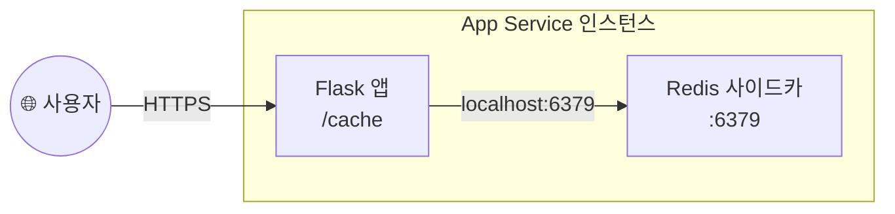

# 10. (선택) Redis 사이드카 컨테이너

> 🟢 **실행** = 직접 입력·수행 · 👁️ **예시** = 눈으로만(개념/발췌) · 📋 **예상 출력** = 비교용(입력 불필요)

> ⚠️ **(선택) 모듈 — 건너뛰어도 12 정리에 지장 없음.** 이 모듈을 건너뛰려면 [12. 정리](12-cleanup.md)로 직접 이동하십시오.

---

## 목표

이 모듈에서는 App Service **sitecontainers** 기능을 사용하여 기존 코드 기반(code-based) 앱에 Redis 사이드카 컨테이너를 부착합니다. 앱 코드는 변경하지 않고, 플랫폼이 같은 앱 인스턴스 안에서 Redis 컨테이너를 함께 실행합니다.

- `/cache` 엔드포인트로 사이드카 부착 전후 동작 차이를 확인합니다.
- `az webapp sitecontainers create` 명령으로 Redis 사이드카를 부착합니다.
- 사이드카 개념(localhost 공유, 활용 예)과 Azure Container Apps(ACA) 대응 패턴을 이해합니다.
- 모듈 종료 상태: **Redis 사이드카 부착·`/cache` 동작 중** (모듈 09 수행자는 Easy Auth 비활성 상태)

완성 후의 구조는 다음과 같습니다.



---

## 0단계 — (선택) 변수 재설정

> ⏭️ **이전 모듈(08 또는 09)에서 이어서 같은 터미널로 진행 중이라면 이 단계는 건너뛰세요.**
> 새 터미널 세션을 열었거나 Cloud Shell이 재시작되어 변수가 사라진 경우에만 실행합니다.
> `SUFFIX` 는 **02 모듈에서 사용한 값과 동일하게** 입력하세요.

🟢 **실행**

```bash
SUFFIX=<이전에_메모한_값>
LOC=koreacentral
RG=rg-appsvcworkshop-$SUFFIX
PLAN=plan-appsvcworkshop-$SUFFIX
APP=app-appsvcworkshop-$SUFFIX
APP_URL="https://$(az webapp show -g $RG -n $APP --query defaultHostName -o tsv)"
echo "APP_URL=$APP_URL"
```

📋 **예상 출력**

```
APP_URL=https://app-appsvcworkshop-<SUFFIX>.azurewebsites.net
```

---

## 👁️ 사이드카 컨테이너 개념

사이드카(sidecar)는 주 앱 컨테이너와 **같은 앱 인스턴스 안**에서 실행되는 보조 컨테이너입니다. 주 앱과 네트워크 네임스페이스를 공유하므로 앱 코드에서 `localhost:<포트>`로 직접 접근합니다.

| 항목 | 설명 |
|---|---|
| **네트워크 공유** | 주 앱과 사이드카는 `localhost`를 공유 — 앱 코드는 `localhost:6379`만 알면 됨 |
| **코드 수정** | 앱 코드에 Redis 주소가 이미 `localhost:6379`로 설정되어 있으면 변경 불필요 |
| **수명 주기** | 사이드카는 주 앱과 함께 시작·중지·확장 — **인스턴스마다 독립된 사이드카**가 실행됨 |
| **주요 활용 예** | 캐시(Redis), 리버스 프록시(Nginx), AI 에이전트 사이드카 |
| **ACA 대응** | Azure Container Apps도 동일 패턴의 사이드카 지원 — 패턴이 이식 가능 |

> 👁️ 이 워크숍 앱의 `/cache` 엔드포인트는 `REDIS_HOST` 앱 설정 값을 사용하며 기본값은 `localhost`입니다. Redis가 없으면 `{"cache":"unavailable"}`을 반환하고, Redis가 정상 동작하면 방문 횟수(`visits`)를 증가시켜 반환합니다.

> ⚠️ **Redis 사이드카는 영속성이 없습니다.** 데이터가 컨테이너 메모리에만 저장되므로 앱 재시작·재배포·스케일 이벤트 시 `visits` 카운터가 초기화됩니다. 또한 인스턴스마다 독립된 Redis가 실행되므로 인스턴스 간에 데이터가 공유되지 않습니다. 영속·공유 캐시가 필요한 프로덕션 워크로드에는 [Azure Managed Redis](https://learn.microsoft.com/azure/redis/overview)를 사용하십시오(기존 Azure Cache for Redis는 퇴역이 예고되어 신규 워크로드에 권장되지 않습니다).

---

## 1단계 — Easy Auth 일시 비활성화(모듈 09 수행자만)

> ⏭️ **모듈 09(선택)를 건너뛰었다면 이 단계도 건너뛰고 2단계로 이동하세요.**

모듈 09에서 Easy Auth를 활성화한 경우, curl로 `/cache` 엔드포인트를 테스트하려면 인증 게이트를 일시적으로 해제해야 합니다.

🟢 **실행**

```bash
# curl 검증을 위해 Easy Auth 일시 비활성화
az webapp auth update -g $RG -n $APP --enabled false
```

---

## 2단계 — 사이드카 부착 전 `/cache` 동작 확인

🟢 **실행** — Redis가 없는 상태에서 `/cache` 응답을 확인합니다.

```bash
# 사이드카 부착 전: /cache는 우아하게 실패
curl -s $APP_URL/cache | jq
```

📋 **예상 출력**

```json
{
  "cache": "unavailable",
  "hint": "Redis 사이드카가 없습니다. 모듈 10을 참고하세요.",
  "redis_host": "localhost"
}
```

> 👁️ Redis가 없으면 앱이 오류를 발생시키지 않고 `"cache": "unavailable"` JSON을 반환합니다. 이것이 **우아한 실패(graceful degradation)** 패턴입니다.

---

## 3단계 — Redis 사이드카 부착

🟢 **실행** — `az webapp sitecontainers create` 명령으로 MCR 미러 Redis 이미지를 사이드카로 부착하고 앱을 재시작합니다.

```bash
az webapp sitecontainers create -g $RG -n $APP --container-name redis \
  --image mcr.microsoft.com/mirror/docker/library/redis:7.2 --is-main false
az webapp restart -g $RG -n $APP
```

> 👁️ `--is-main false`는 이 컨테이너가 보조(사이드카) 컨테이너임을 지정합니다. `az webapp restart` 후 Redis 컨테이너와 앱 컨테이너가 함께 기동되기까지 **60초 내외** 소요됩니다.

> ⚠️ **`az webapp sitecontainers` 명령이 없는 경우** — `az version`을 확인하고 최신 버전으로 업그레이드하십시오. 업그레이드 후에도 명령이 없으면 트러블슈팅 섹션의 `az rest` 대체 경로를 참고하십시오.

🟢 **실행** — 사이드카 목록을 확인합니다.

```bash
az webapp sitecontainers list -g $RG -n $APP -o table
```

📋 **예상 출력**

```
Name    Image                                                      IsMain
------  ---------------------------------------------------------  --------
redis   mcr.microsoft.com/mirror/docker/library/redis:7.2         False
```

---

## 4단계 — 사이드카 동작 검증

> ⚠️ **인스턴스 수 확인** — 인스턴스마다 독립된 Redis 사이드카가 실행되므로, 모듈 07의 자동 스케일로 인스턴스가 2개 이상이면 curl 요청이 분산되어 `visits` 값이 단조 증가하지 않을 수 있습니다(예: `1, 1, 2, …`). 아래 명령으로 인스턴스가 1개인지 확인한 후 진행하십시오. 1개가 아니라면 트래픽 감소 후 자동 축소(5–10분)를 기다립니다.

🟢 **실행** — 인스턴스 수 확인

```bash
az webapp list-instances -g $RG -n $APP -o table
```

🟢 **실행** — 60초 대기 후 `/cache`를 두 번 호출하여 `visits` 값이 단조 증가하는지 확인합니다.

```bash
# 60초 후
curl -s $APP_URL/cache | jq
curl -s $APP_URL/cache | jq   # visits 증가 확인
```

📋 **예상 출력 — 첫 번째 호출**

```json
{
  "cache": "ok",
  "redis_host": "localhost",
  "visits": 1
}
```

📋 **예상 출력 — 두 번째 호출**

```json
{
  "cache": "ok",
  "redis_host": "localhost",
  "visits": 2
}
```

> 👁️ `"cache": "ok"`는 Redis가 정상 동작 중임을 의미합니다. `visits` 값이 호출마다 증가하면 사이드카가 앱과 정상 통신하고 있는 것입니다.

---

## 5단계 — Easy Auth 재활성화 안내(모듈 09 수행자만)

> 👁️ Easy Auth를 다시 활성화하려면 아래 명령을 실행하십시오. **다음 모듈 11(선택)로 진행하는 경우 11 첫머리에서 다시 비활성화하므로 지금 재활성화를 생략해도 됩니다.** 모듈 09를 건너뛴 참가자는 이 단계도 건너뛰세요.

```bash
az webapp auth update -g $RG -n $APP --enabled true
```

---

## 검증

### 사이드카 목록 확인

🟢 **실행**

```bash
az webapp sitecontainers list -g $RG -n $APP -o table
```

📋 **예상 출력**

```
Name    Image                                                      IsMain
------  ---------------------------------------------------------  --------
redis   mcr.microsoft.com/mirror/docker/library/redis:7.2         False
```

### /cache 동작 확인

🟢 **실행**

```bash
curl -s $APP_URL/cache | jq
curl -s $APP_URL/cache | jq
```

📋 **예상 출력 — 첫 번째 호출**

```json
{
  "cache": "ok",
  "redis_host": "localhost",
  "visits": 1
}
```

📋 **예상 출력 — 두 번째 호출**

```json
{
  "cache": "ok",
  "redis_host": "localhost",
  "visits": 2
}
```

`visits`가 호출마다 단조 증가하면(인스턴스 1개 기준) Redis 사이드카가 정상 동작하는 것입니다.

---

## 트러블슈팅

### (1) 사이드카 부착 후 `/cache`가 계속 `unavailable` 반환

Redis 컨테이너가 아직 기동 중이거나 앱이 재시작 중입니다.

- `az webapp sitecontainers list`로 컨테이너 상태를 확인합니다.
- 60초를 더 기다린 뒤 재시도합니다.
- 계속 실패하면 `az webapp restart`를 다시 실행하고 대기합니다.

### (2) 이미지 pull 실패 또는 컨테이너 기동 오류

MCR 미러 이미지 경로 또는 태그가 잘못되었을 수 있습니다.

```bash
# 태그 목록 확인
curl -s https://mcr.microsoft.com/v2/mirror/docker/library/redis/tags/list | jq '.tags | .[-5:]'
```

태그를 확인한 뒤 올바른 태그로 사이드카를 다시 생성합니다.

### (3) `az webapp sitecontainers` 명령 없음

`az version`을 확인하고 Azure CLI를 최신 버전으로 업그레이드합니다.

```bash
az upgrade --only-show-errors
```

업그레이드 후에도 명령이 없으면 REST API로 직접 생성합니다.

```bash
az rest --method put \
  --url "https://management.azure.com/subscriptions/$(az account show --query id -o tsv)/resourceGroups/$RG/providers/Microsoft.Web/sites/$APP/sitecontainers/redis?api-version=2024-04-01" \
  --body '{"properties":{"image":"mcr.microsoft.com/mirror/docker/library/redis:7.2","isMain":false}}'
```

---

이전 모듈: [09. (선택) Easy Auth](09-easy-auth.md) · 다음 모듈: [11. Auto Heal(선택)](11-autoheal-option.md) 또는 [12. 정리](12-cleanup.md)
